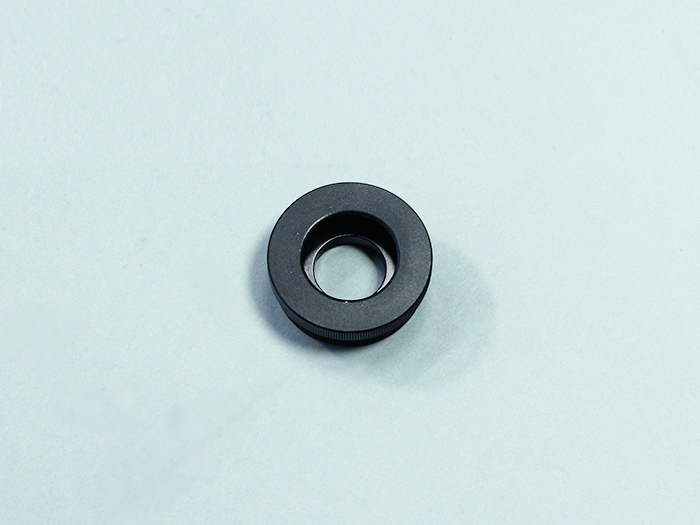
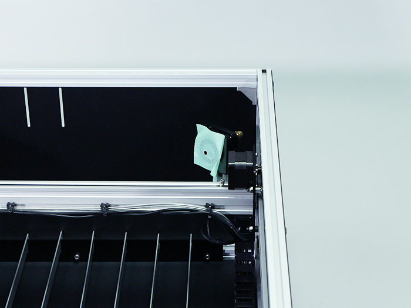
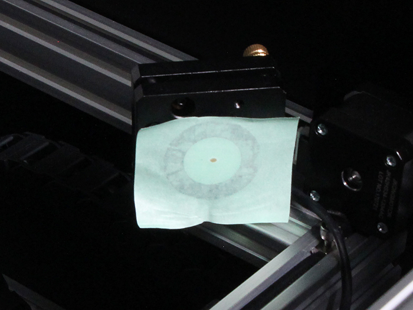
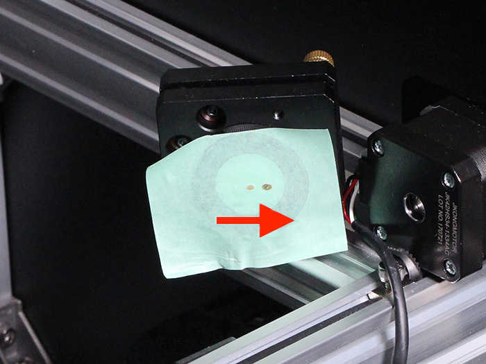

<table class="packing-list">
    <tbody>
        <tr>
            <td>部品名</td>
            <td>備考</td>
            <td class="packing-img">画像</td>
            <td>個数</td>
        </tr>
        <tr>
            <td>反射ミラー</td>
            <td>Φ25mm</td>
            <td></td>
            <td>1</td>
        </tr>
    </tbody>
</table>

## 工程手順

### 第1反射ミラー調整
第1ミラー用アルミフレームに取り付けたミラーマウントの前面部分を取り外します。

ミラーマウントから取り外したレンズマウント内にミラー固定リングがありますので取り外します。※手で取れない場合は、マイナスドライバーなどを使って回して取り外してください。

反射ミラーを写真を参考に入れます。
※写真上反射ミラーは裏側が見えております。

ミラー固定用リングを取り付けます。反射ミラーがガタつかないように取り付けてください。

反射ミラーが写真のように取り付いていることを確認してください。取付時に指等で触れて汚れた場合には、汚れをふき取ってください。

ミラーマウントには2箇所合計4個の調整ネジがあります。ミラーの傾きの微調整を行います。 青で囲んだネジは2枚のプレートの間を縮める方向に、赤で囲んだネジは広げる方向に作用します。使い方としては「青を緩めて赤で押し出す」方法と、「赤を緩めて青で縮める」方法があります。レーザー光の傾きによって使い分けます。
※調整ネジを使った具体的な調整例は、本工程の後段階で説明します。

ミラーマウント固定用のネジにネジロックを付けることで調整後のがたつきを防止することが出来ます。

第1ミラーにマスキングを貼った後、周囲および自身の安全を確認した上で、レーザーを瞬間的に照射します。写真では右側にずれているのでミラーマウント自体を写真右側に中心からずれている分移動します（ミラーマウントとアルミフレームとを固定しているネジを少し緩めて移動します）。

光軸がミラーマウントの中心になるように調整してください。

調整後、第1ミラーマウントに反射ミラーを取り付けてください。

インナーカバーのレーザー光路穴にマスキングテープを貼り、レーザーを照射してください。

中心から横方向にずれている場合はミラーマウントの傾きを調整してください。少しの傾きで大きく移動します。いきなり大きく調整してしまうと危険ですので少しずつ調整してください。

インナーカバーのレーザー光路穴の中心になるように調整します。

一度本体の電源を切ります。

第2ミラーマウントが第1ミラーマウントと最も近い位置に来るようにXY軸ユニットを動かします。※XY軸ユニットを移動させる際には、絶対のレーザーを照射させないでください。

第2ミラーの位置が遠い場合、中心から大きく外れてしまうことが考えられますのでまずは近い距離から試してください。
※この時点で大きくずれている場合は、傾き調整を行ってから下に進んでください。

次にY軸方向の加工エリア真ん中あたりでもう一度照射します。※この時点で大きくずれている場合は、傾き調整を行ってから下に進んでください。

下の写真の例だと左方向に第1ミラーが傾いているのが分かります。ミラーマウントの調整ネジを使用して少しずつ傾きを修正していきます。

ミラーマウントの調整ネジを動かした場合のレーザー光の傾き変化の例を以下に示します。以下の写真に写るレーザー光のスポットを基準とします。

赤で囲んだネジを押し出します。

横軸方向左側に傾きます。引っ張った場合は右方向に傾きます。

縦軸方向に傾ける場合は、もう1つのネジを動かします。赤で囲んだネジを押し出すと上側に傾きます。逆に、引っ張った場合は下方向に傾きます。

Y軸方向の手前と奥の位置でレーザーを照射しても横方向のズレが少なくなるように調整していきます（縦軸のずれも同じくミラーマウントの調整ネジを使用して調整してください）。

前工程の調整を行い手前と奥で光軸のズレがなくなった後に、写真のように第2ミラーへの照射位置がミラー中心からずれている場合があります。その場合は第１ミラー用アルミフレーム自体を動かしてください。

その場合は第1ミラーをアルミフレームごと横方向に少しずつ動かし調整します。アルミフレームは平行に動かしてください。
※第1ミラー用アルミフレームが傾いたりしますと大幅に光軸がずれますので注意してください。

再度、レーザー光がミラーの中心に来ているかY軸の手前と奥でレーザー照射を行って確認します。

