<table class="packing-list">
    <tbody>
        <tr>
            <td>部品名</td>
            <td>備考</td>
            <td class="packing-img">画像</td>
            <td>個数</td>
        </tr>
        <tr>
            <td>反射ミラー</td>
            <td>Φ25mm</td>
            <td></td>
            <td>2</td>
        </tr>
        <tr>
            <td>集光レンズ</td>
            <td>Φ20m</td>
            <td></td>
            <td>1</td>
        </tr>
    </tbody>
</table>

## 工程手順

### 第2/第3反射ミラー調整
反射ミラーをミラーマウントへ取り付けます。
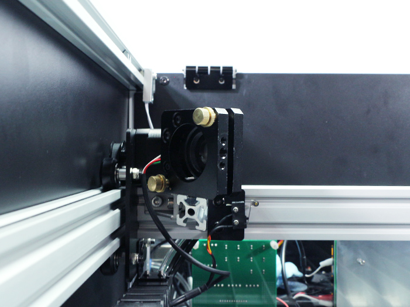

第3反射ミラーへ照射します。第2ミラーへ照射した時と同様に近い位置からはじめてください。
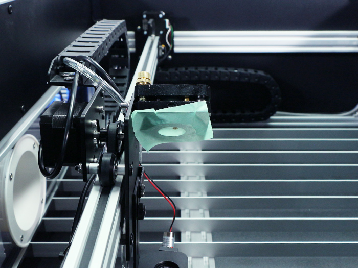

続けて、X軸の真ん中付近で照射してください。
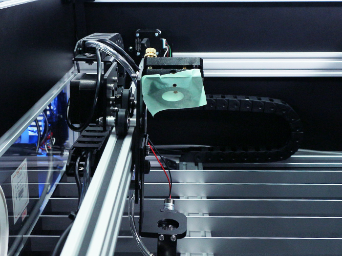

生じたズレに応じて、第2ミラーマウントを調整します。
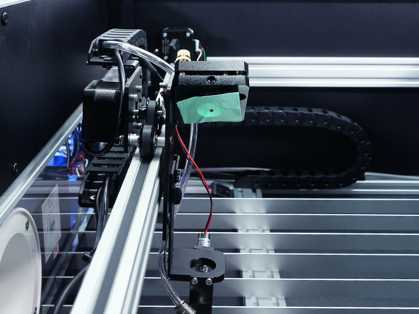

縦方向に大きくずれている場合は、第2ミラーマウントを固定しているアルミフレーム自体を写真のように少しずつ回して調整します。微調整はミラーマウントの調整ネジにて調整してください。近い距離、遠い距離でそれぞれ照射したときのずれを小さく修正していきます。
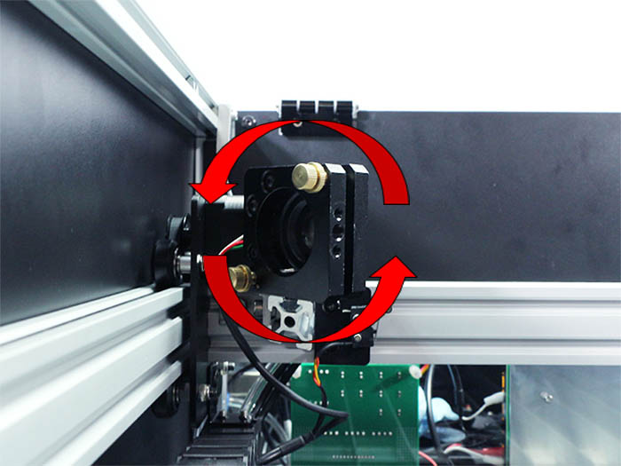

上の写真のように、横方向に大きくずれている場合は、第2ミラーマウントを写真のように少しずつ回して調整します。
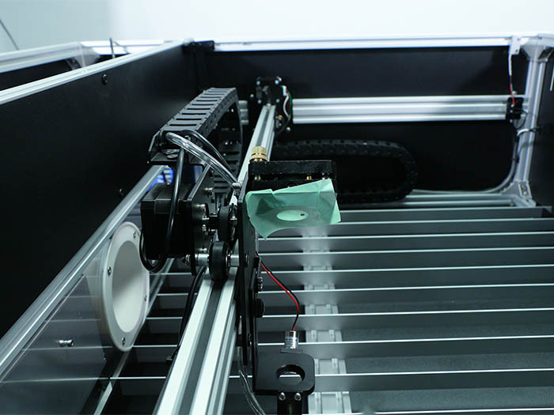

微調整はミラーマウントの調整ネジにて調整してください。調整後、第3反射ミラーの中心に照射されることを確認してください。
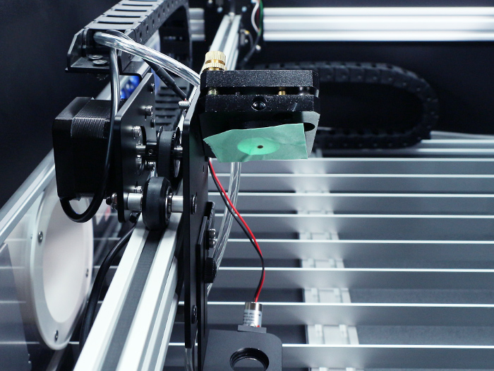

第3反射ミラーを取り付けます。 レーザーヘッド部分に照射します。大きくずれている場合は、第3反射ミラーのミラーマウントの傾きを調整してください。
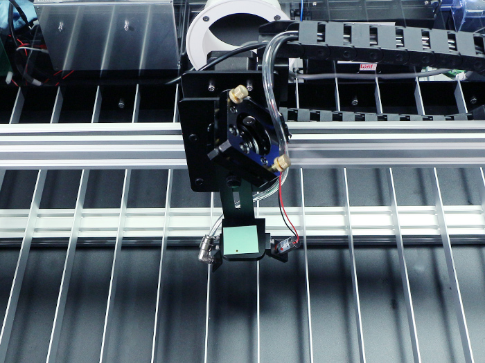

微調整はミラーマウントの調整ネジにて調整してください。レーザーヘッド部分に照射させて中心に照射されるようにミラーマウントの調整ネジで微調整してください。

加工エリアの4隅でレーザーを照射して、中心に照射されているか確認してください。

右前での照射
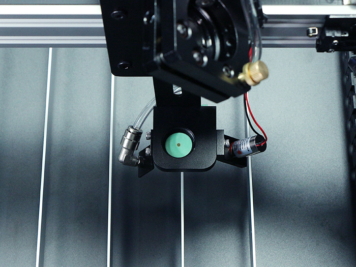

左前での照射
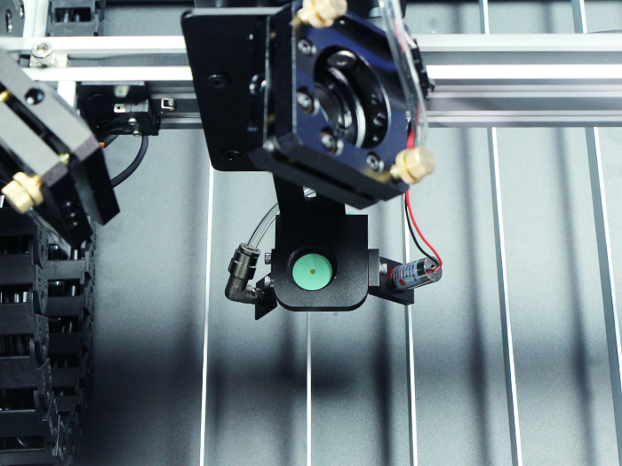

右奥での照射
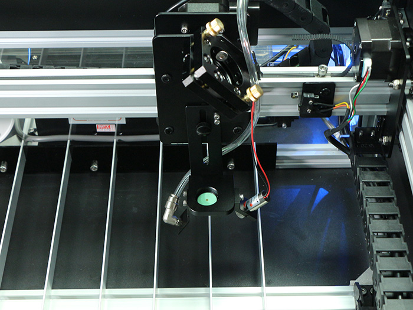

左奥での照射
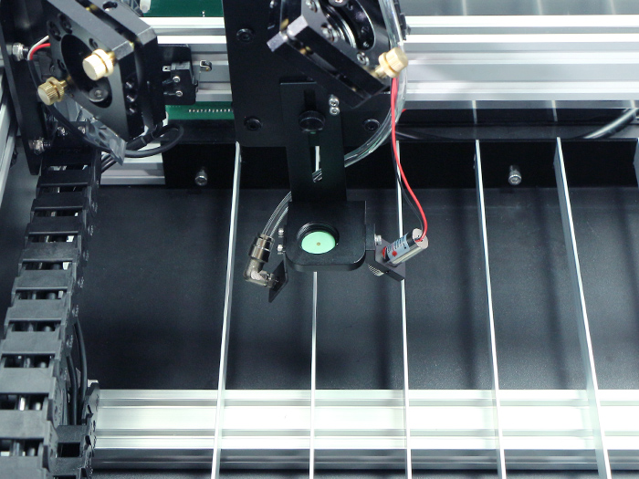

集光レンズを取り付けます。集光レンズには向きがありますので注意して取り付けてください。膨らんでいるほうが上側です。
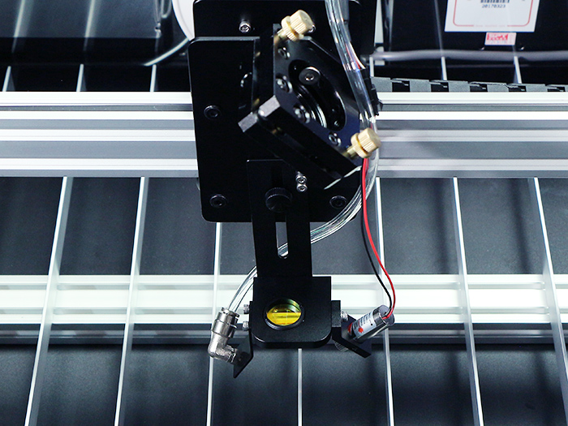