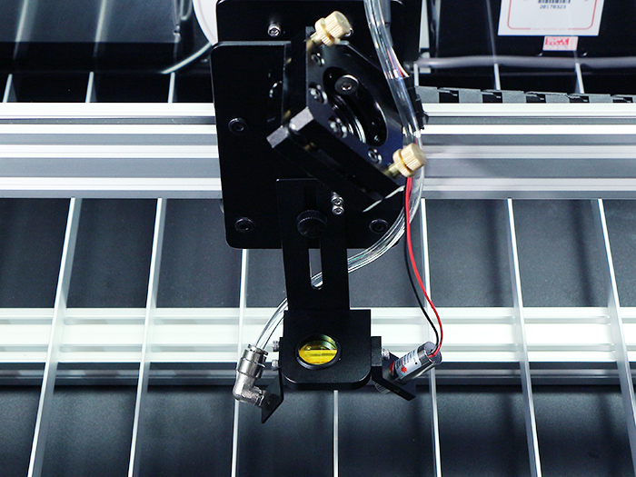

<table class="packing-list">
    <tbody>
        <tr>
            <td>部品名</td>
            <td>備考</td>
            <td class="packing-img">画像</td>
            <td>個数</td>
        </tr>
        <tr>
            <td>反射ミラー</td>
            <td>Φ25mm</td>
            <td></td>
            <td>2</td>
        </tr>
        <tr>
            <td>集光レンズ</td>
            <td>Φ20m</td>
            <td></td>
            <td>1</td>
        </tr>
    </tbody>
</table>

## 工程手順

### 第2反射ミラー 調整
第2反射ミラーをミラーマウントへ取り付けます。

第3反射ミラーへ照射します。
第2ミラーへ照射した時と同様に近い位置からはじめてください。

続けて、X軸ユニットを加工エリア中央に移動させます。

生じたズレに応じて、第2ミラーマウントを調整します。縦方向に大きくずれている場合は、第2ミラーマウントを固定しているアルミフレーム自体を写真のように少しずつ回して調整します。微調整はミラーマウントの調整ネジにて調整してください。近い距離、遠い距離でそれぞれ照射したときのずれを小さく修正していきます。

横方向に大きくずれている場合は、第2ミラーマウントを写真のように少しずつ回して調整します。

微調整はミラーマウントの調整ネジにて調整してください。近い距離、遠い距離でそれぞれ照射したときのずれを小さく修正していきます。
調整後、第3反射ミラーの中心に照射されることを確認してください。

### 第3反射ミラー 調整
第3反射ミラーを取り付けます。微調整はミラーマウントの調整ネジにて調整してください。
調整後、レーザーヘッド部分の中心に照射されることを確認してください。

光軸がずれている場合は調整ネジにて調整してください。
横方向に大きくずれている場合はミラーマウントの傾き調整をしてください。

調整後、レーザーヘッド部分の中心に照射されることを確認してください。

加工エリアの4隅でレーザーを照射して、レーザーヘッド部分の中心に照射されているか確認してください。

加工エリア左手前

加工エリア右手前

加工エリア左奥

加工エリア右奥

### 集光レンズ 取付
集光レンズを取り付けます。
※集光レンズには向きがありますので注意して取り付けてください。膨らんでいるほうが上側です。

集光レンズを取り付けて光軸調整は終わりです。
