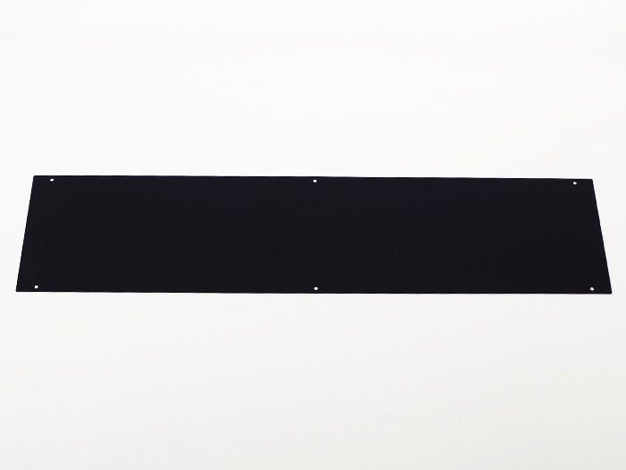

<table class="packing-list">
    <tbody>
        <tr>
            <td>部品名</td>
            <td>備考</td>
            <td class="packing-img">画像</td>
            <td>個数</td>
        </tr>
        <tr>
            <td>Cover top back</td>
            <td></td>
            <td></td>
            <td>1</td>
        </tr>
        <tr>
            <td>M5x6低頭ボルト</td>
            <td></td>
            <td></td>
            <td>6</td>
        </tr>
    </tbody>
</table>

## 工程手順

### Cover top back取り付け
Cover top backをあらかじめ入れておいたM5Tナット6個とM5×6低頭ボルト6個で取り付けます。

ダクト取り付け【オプション: 排気キットをご購入された方】
座付ソケットにホースクリップを通します。

座付ソケットにダクトを固定し、ホースクリップを締めて下さい。
※締めすぎると座付ソケットが破損する恐れがあるので、締めすぎに注意してください。
