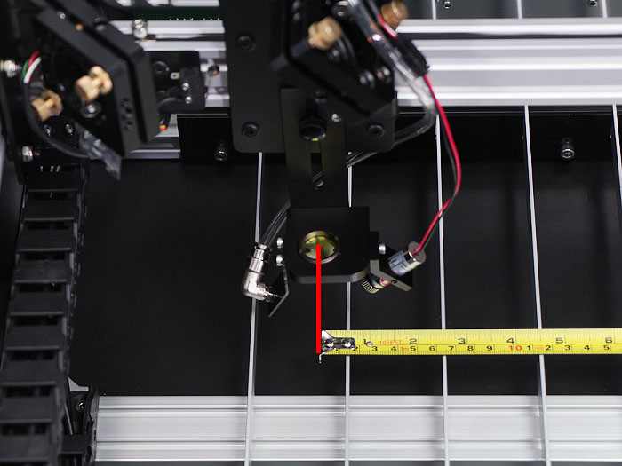
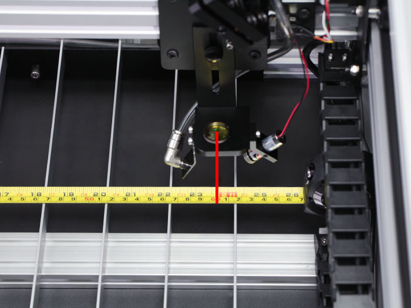
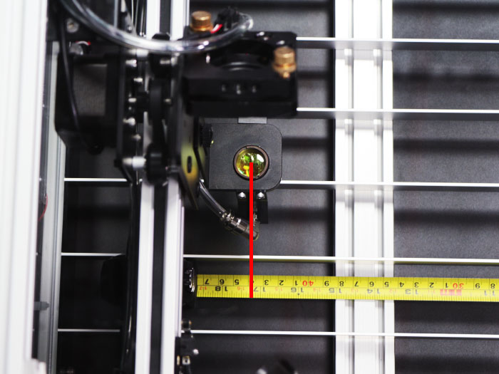
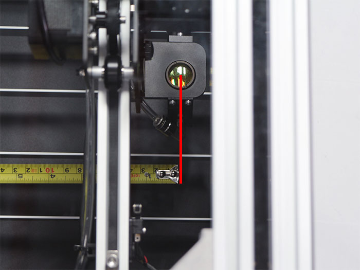

## 工程手順

### 加工範囲確認
ホイールプレートX軸を左に寄せます。
リミットから少し離した位置でミラーの中心から、同様に右に移動した時に600mmの移動が出来るようにリミットマウントの位置を調整して下さい。

ホイールプレートY軸を左に寄せます。
リミットから少し離した位置でミラーの中心から、同様に右に移動した時に440mmの移動が出来るようにリミットマウントの位置を調整して下さい。

