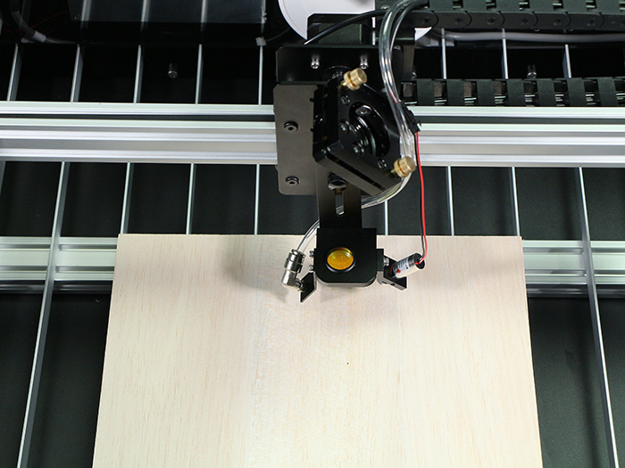
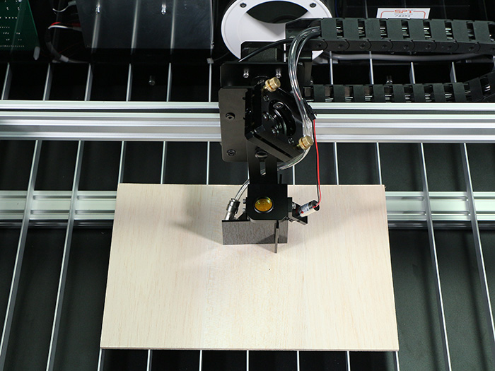
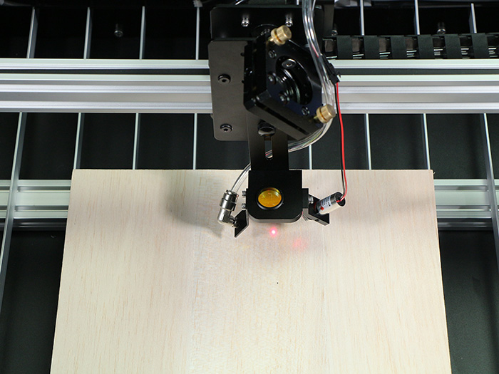

<table class="packing-list">
    <tbody>
        <tr>
            <td>部品名</td>
            <td>備考</td>
            <td class="packing-img">画像</td>
            <td>個数</td>
        </tr>
        <tr>
            <td>高さ調整冶具1,2</td>
            <td>アクリル</td>
            <td></td>
            <td>各1</td>
        </tr>
    </tbody>
</table>

## 工程手順

### 加工範囲確認
ホイールプレートX軸を左に寄せます。
リミットから少し離した位置でミラーの中心から、同様に右に移動した時に600mmの移動が出来るようにリミットマウントの位置を調整して下さい。

ホイールプレートY軸を左に寄せます。
リミットから少し離した位置でミラーの中心から、同様に右に移動した時に440mmの移動が出来るようにリミットマウントの位置を調整して下さい。

### 加工準備
加工ベッドに加工対象物を置きます。

つまみねじを緩めて高さを調整して下さい。
高さ調整治具1と高さ調整治具2を組み合わせてレンズマウントを載せます。こちらで焦点が加工対象物の表面に合っている状態です。調整後、つまみねじをしっかりと締めてください。

高さ調整治具1,2を外します。高さ調整は完了です。
