<table class="packing-list">
    <tbody>
        <tr>
            <td>No.</td>
            <td>部品名</td>
            <td>備考</td>
            <td class="packing-img">画像</td>
            <td>個数</td>
        </tr>
        <tr>
            <td>125</td>
            <td>Cover front</td>
            <td></td>
            <td></td>
            <td>1</td>
        </tr>
        <tr>
            <td>121</td>
            <td>Cover left</td>
            <td></td>
            <td></td>
            <td>1</td>
        </tr>
        <tr>
            <td>122</td>
            <td>Cover right</td>
            <td></td>
            <td>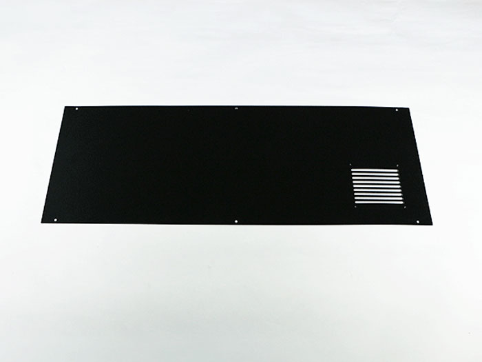</td>
            <td>1</td>
        </tr>
        <tr>
            <td>63</td>
            <td>AC-Mainケーブル</td>
            <td></td>
            <td></td>
            <td>1</td>
        </tr>
        <tr>
            <td>65</td>
            <td>AC-Switchケーブル</td>
            <td></td>
            <td>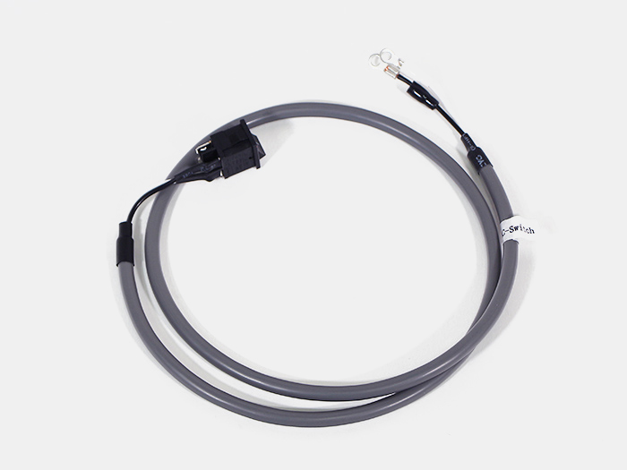</td>
            <td>1</td>
        </tr>
        <tr>
            <td>81</td>
            <td>Y1-Limitケーブル</td>
            <td></td>
            <td>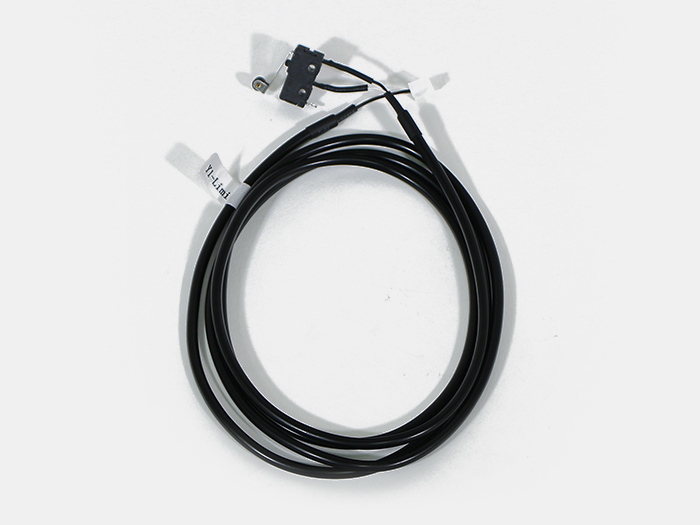</td>
            <td>1</td>
        </tr>
        <tr>
            <td>80</td>
            <td>Switchケーブル</td>
            <td>マグネット付属(22.top cover組み立てで使用)</td>
            <td></td>
            <td>1</td>
        </tr>
        <tr>
            <td>21</td>
            <td>LED DCファン</td>
            <td></td>
            <td>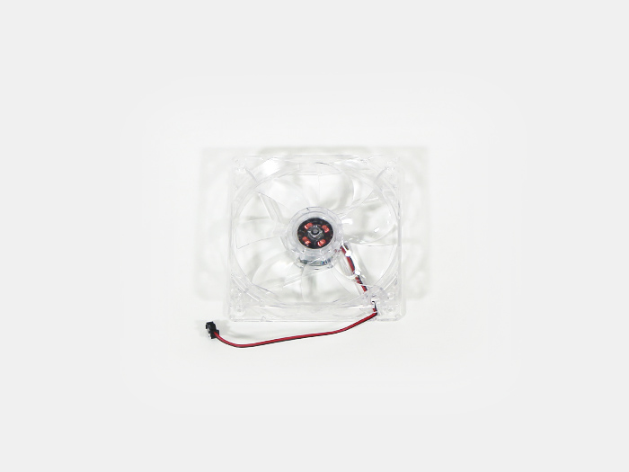</td>
            <td>1</td>
        </tr>
        <tr>
            <td>93</td>
            <td>パネルタッチコネクタ</td>
            <td></td>
            <td>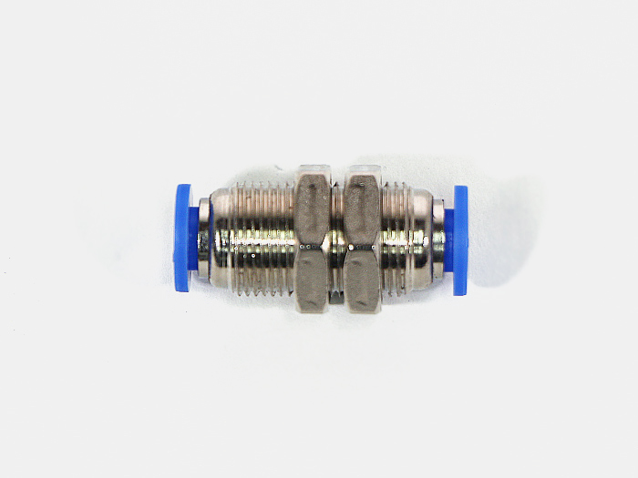</td>
            <td>1</td>
        </tr>
        <tr>
            <td>39</td>
            <td>結束バンド固定具</td>
            <td></td>
            <td></td>
            <td>8</td>
        </tr>
        <tr>
            <td>30</td>
            <td>M5 Tナット</td>
            <td></td>
            <td>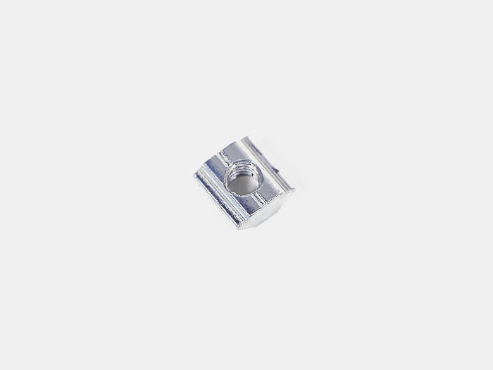</td>
            <td>6</td>
        </tr>
        <tr>
            <td>84</td>
            <td>M5x6低頭ボルト</td>
            <td></td>
            <td></td>
            <td>20</td>
        </tr>
        <tr>
            <td>103</td>
            <td>M4x30六角穴付ボルト</td>
            <td></td>
            <td>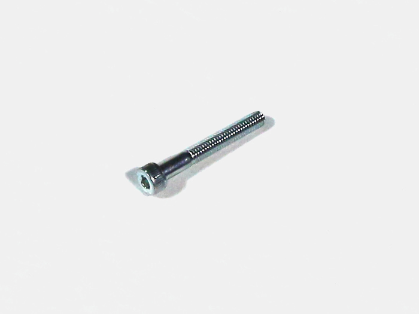</td>
            <td>4</td>
        </tr>
        <tr>
            <td>89</td>
            <td>M3後入ナット</td>
            <td></td>
            <td></td>
            <td>17</td>
        </tr>
        <tr>
            <td>112</td>
            <td>M3ナット</td>
            <td></td>
            <td>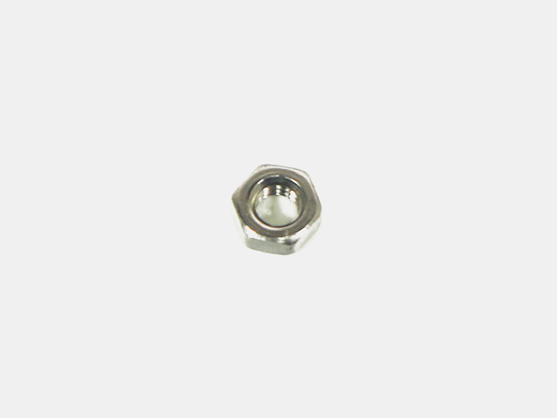</td>
            <td>2</td>
        </tr>
        <tr>
            <td>99</td>
            <td>M3x10六角穴付皿ボルト</td>
            <td></td>
            <td></td>
            <td>2</td>
        </tr>
        <tr>
            <td>100</td>
            <td>M3x12六角穴付ボルト</td>
            <td></td>
            <td></td>
            <td>1</td>
        </tr>
        <tr>
            <td>97</td>
            <td>M3x6六角穴付ボルト</td>
            <td></td>
            <td></td>
            <td>16</td>
        </tr>
        <tr>
            <td>95</td>
            <td>M2x8六角穴付ボルト</td>
            <td></td>
            <td>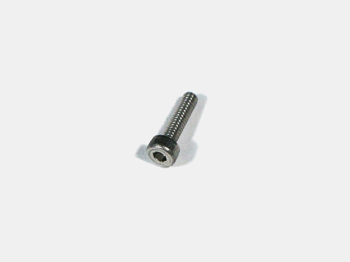</td>
            <td>4</td>
        </tr>
    </tbody>
</table>

## 工程手順

### Cover front取り付け
写真を参考に、アルミフレーム20mm角 800mmにM5Tナットを3個ずつ入れます。
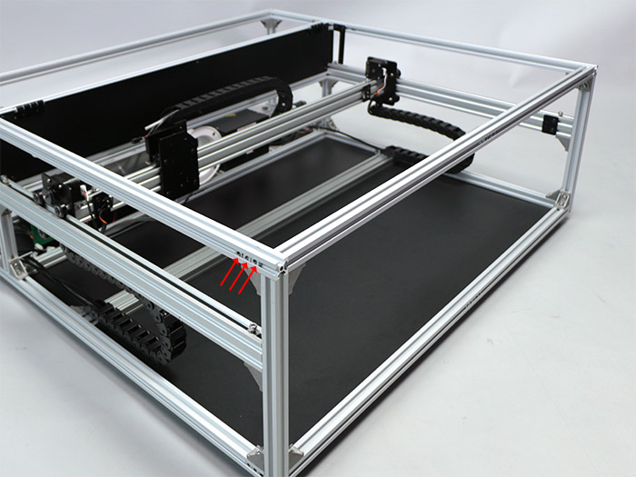
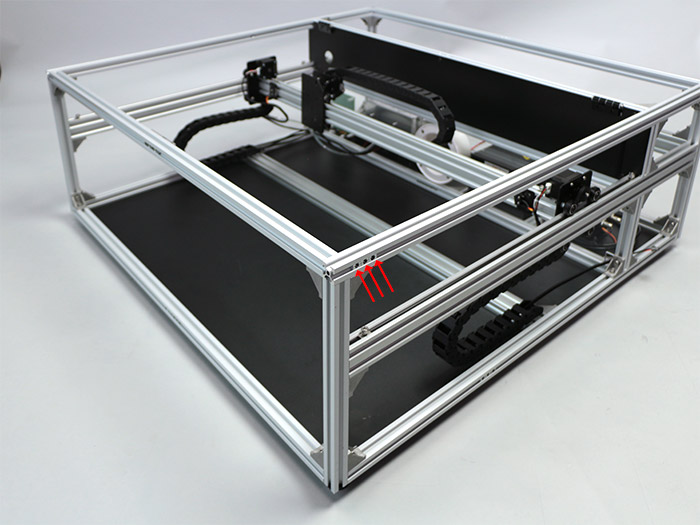

本体前面にCover frontを、入れておいたM5Tナット8個とM5x6低頭ボルト8個で取り付けます。
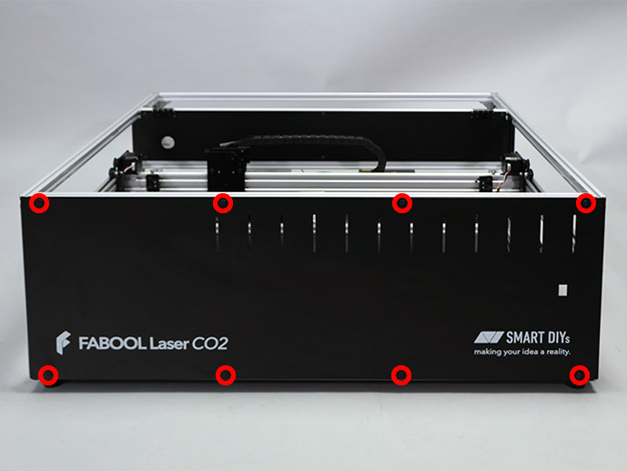

### 結束バンド固定具取り付け
本体フレームに、結束バンド固定具をM3x6六角穴付ボルトとM3後入ナットで取り付けます。取付方法は写真を参考にして下さい。
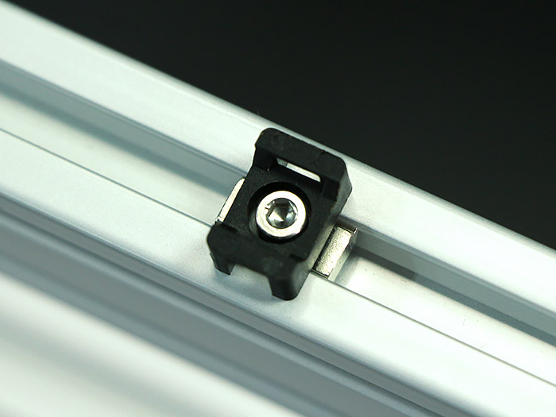

本体右側に、結束バンド固定具3個をM3後入ナット3個とM3x6六角穴付ボルト3個で取り付けます。
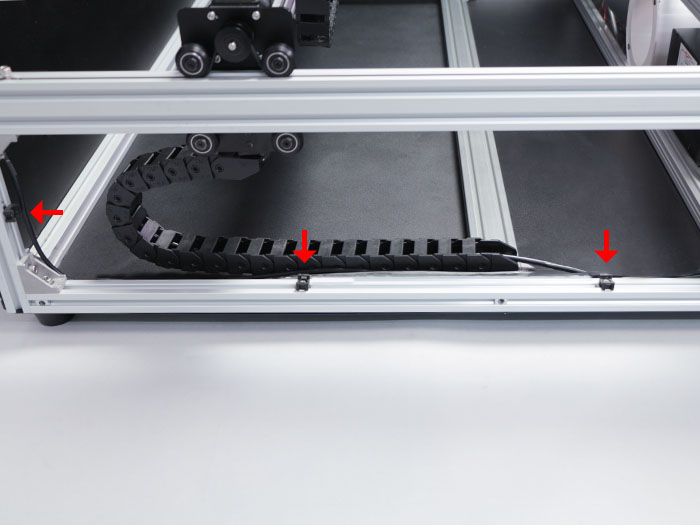

V-slot 848mmに、結束バンド固定具3個をM3後入ナット3個とM3x6六角穴付ボルト3個で取り付けます。
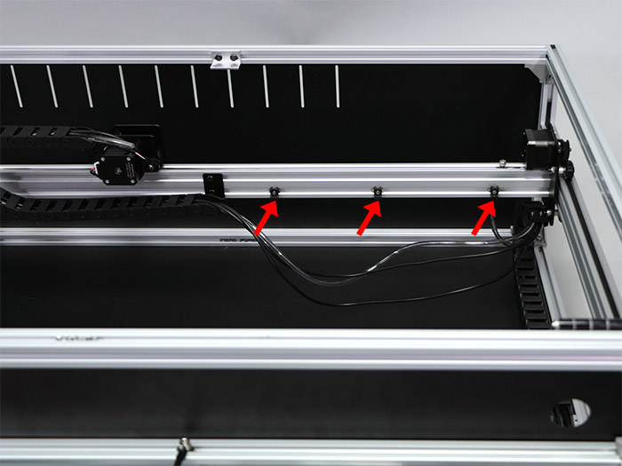

本体左側に、結束バンド固定具1個をM3後入ナット1個とM3x6六角穴付ボルト1個で取り付けます。
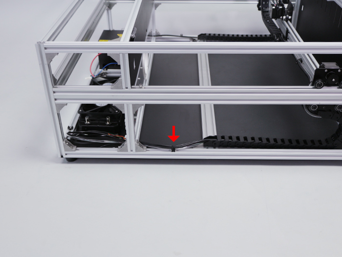

写真の位置に、結束バンド固定具5個をM3後入ナット5個とM3x6六角穴付ボルト5個で取り付けます。
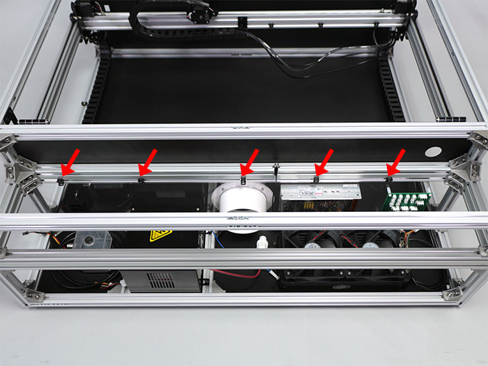

写真の位置に、結束バンド固定具3個をM3後入ナット3個とM3x6六角穴付ボルト3個で取り付けます。
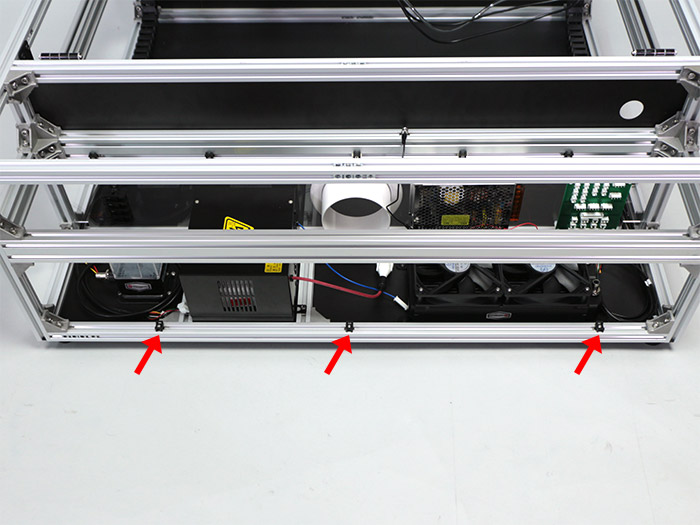

写真の位置に、結束バンド固定具1個をM3後入ナット1個とM3x6六角穴付ボルト1個で取り付けます。
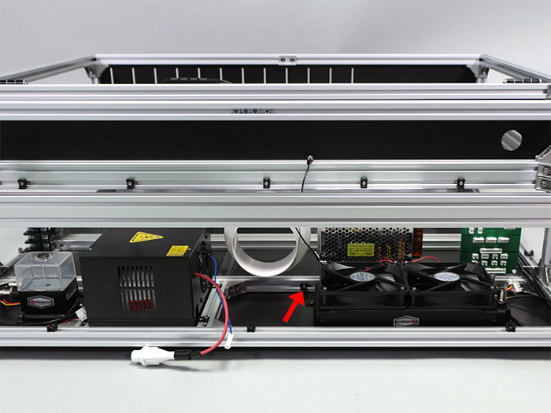

取り付けた結束バンド固定具に、結束バンドで以下を固定します。
- ポリウレタンチューブ
- X-Motorケーブル
- [オプション品]Pointerケーブル
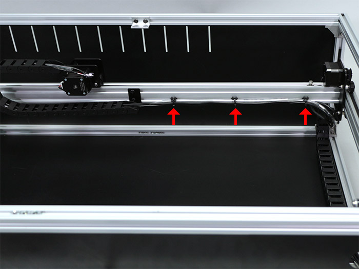

取り付けた結束バンド固定具に、結束バンドで以下を固定します。
- ポリウレタンチューブ
- X-Motorケーブル
- [オプション品]Pointerケーブル
- Y-Motor-Lケーブル

写真を参考にSwitchケーブルを取り付けます。スイッチをM2x8六角穴付ボルト2個でリミットマウントに、マグネットをM3x12六角穴付ボルト1個とM3後入ナット1個で写真の位置、向きで取り付けます。
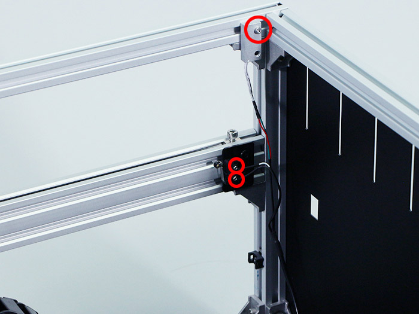

Cover frontにAC-Switchケーブルを取り付けます。写真の向きで挿入します。
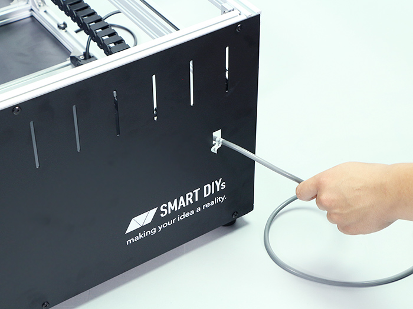

写真を参考にAC-SwitchケーブルをCover frontに固定してください。板金に固定するため、奥までしっかりと入れて下さい。
※写真の状態がOFFです。組立時はOFFの状態にしてください。
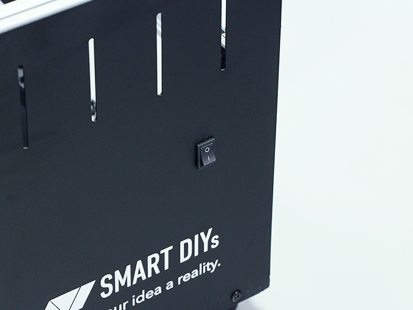

取り付けた結束バンド固定具に、結束バンドで以下を固定します。
- AC-Switchケーブル
- Switchケーブル
- Y-Motor-Rケーブル
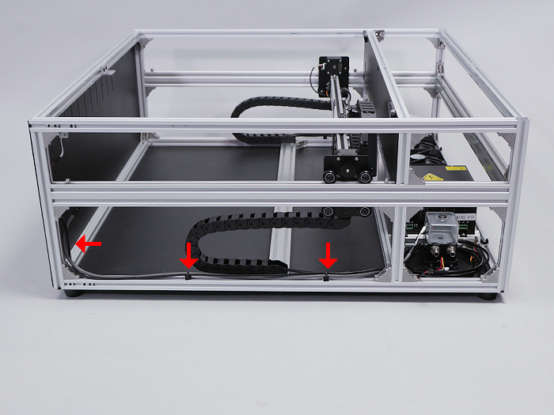

Y1-LimitケーブルをM2x8六角穴付ボルト2個で、リミットマウントy1に写真の向きを参考に取り付けます。
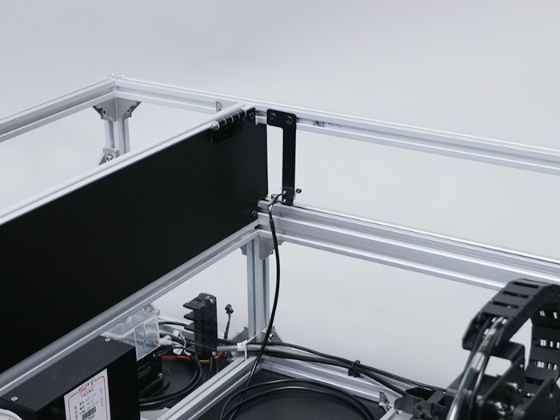
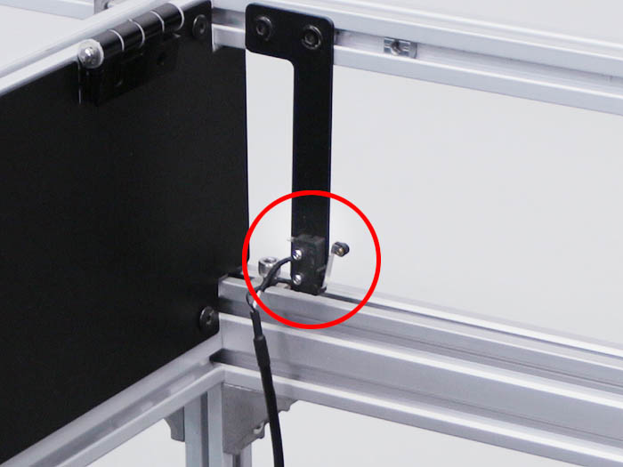

Y1-Limitケーブルを以下のケーブルと一緒に結束バンドで固定します。
- AC-Switchケーブル
- Switchケーブル
- Y-Motor-Rケーブル

### アクセサリ取り付け
Cover Rightを入れておいたM5Tナット6個とM5x6低頭ボルト6個で取り付けます。
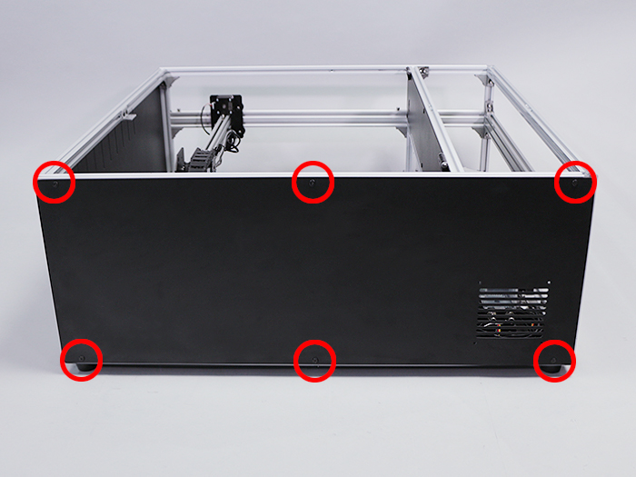

Cover RightにLED DCファンをM4x30六角穴付ボルト4個で取り付けます。

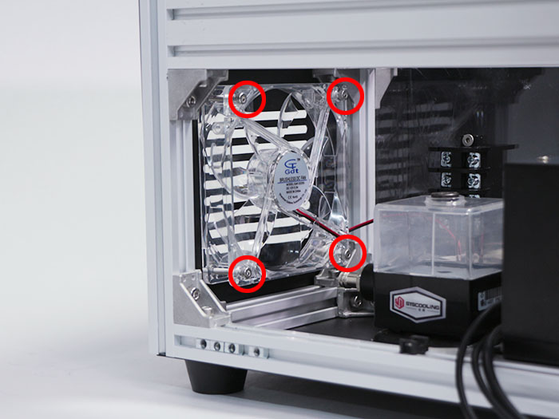

Cover leftを入れておいたM5Tナット6個とM5x6低頭ボルト6個で取り付けます。
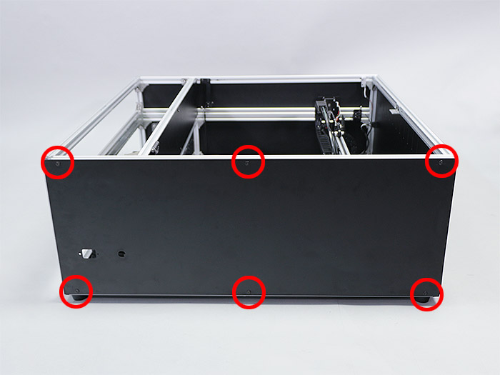

Cover leftにAC-MainケーブルをM3x10六角穴付皿ボルト2個とM3ナット2個で取り付けます。
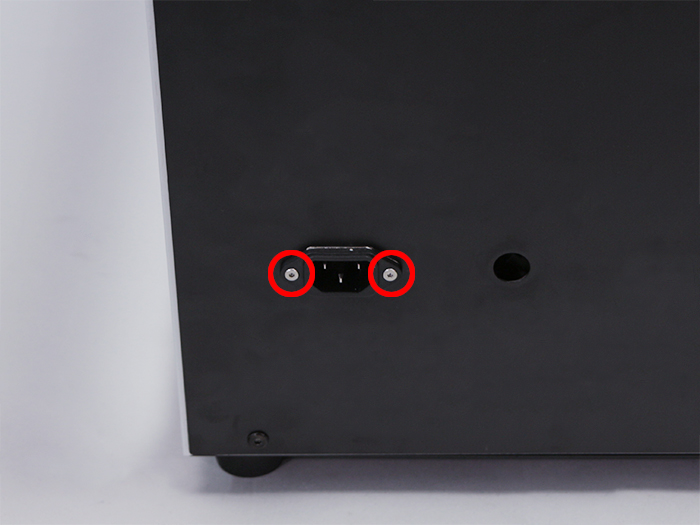
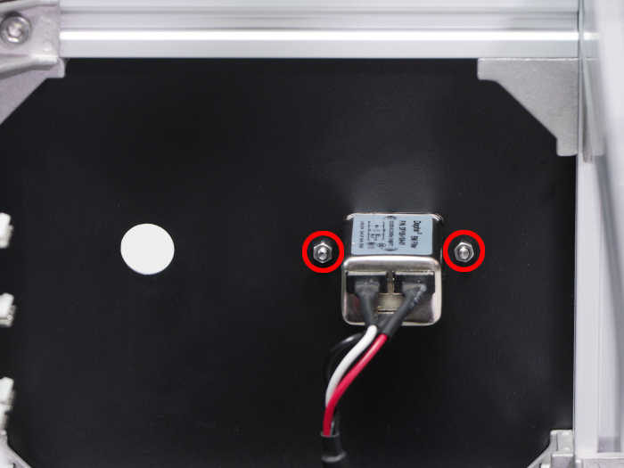

パネルタッチコネクタのナットを外します。

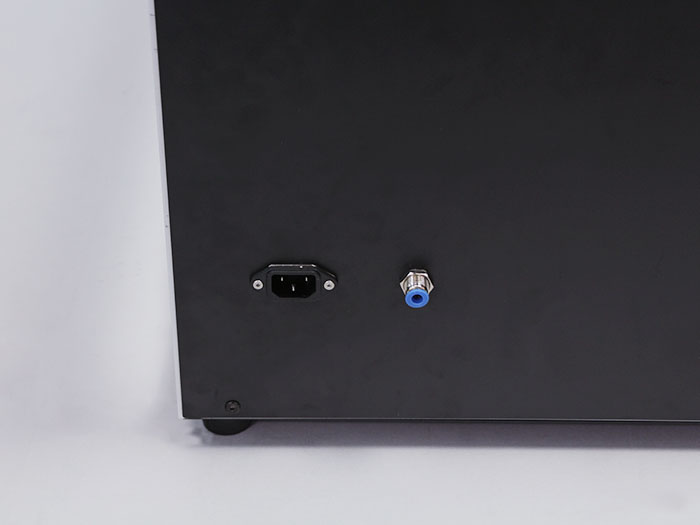

ポリウレタンチューブをパネルタッチコネクタに接続します。余った分はカットしてください。
