<table class="packing-list">
    <tbody>
        <tr>
            <td>No.</td>
            <td>部品名</td>
            <td>備考</td>
            <td class="packing-img">画像</td>
            <td>個数</td>
        </tr>
        <tr>
            <td>62</td>
            <td>AC-Laserケーブル</td>
            <td></td>
            <td>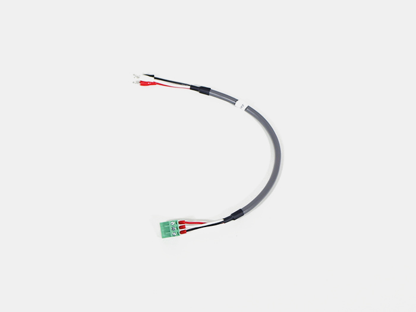</td>
            <td>1</td>
        </tr>
        <tr>
            <td>64</td>
            <td>AC-DCケーブル</td>
            <td></td>
            <td>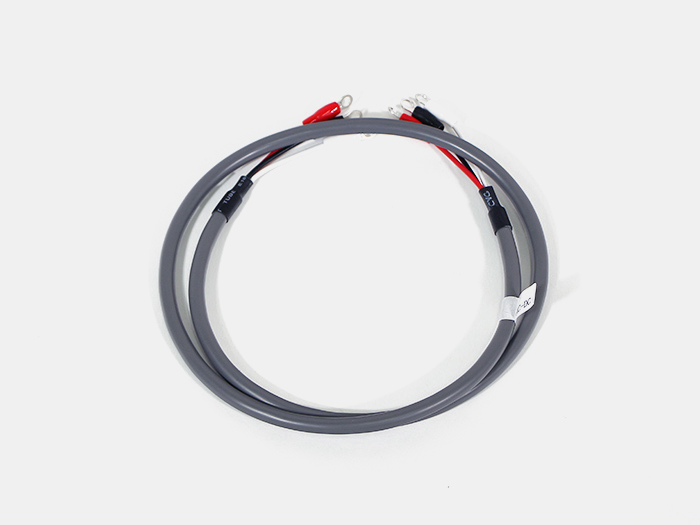</td>
            <td>1</td>
        </tr>
        <tr>
            <td>82</td>
            <td>Ground(S)ケーブル</td>
            <td></td>
            <td>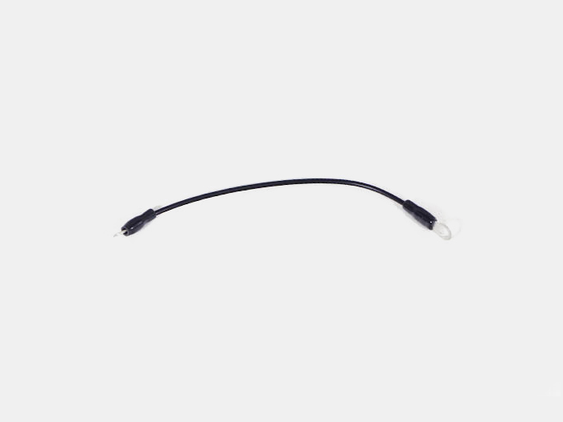</td>
            <td>1</td>
        </tr>
        <tr>
            <td>38</td>
            <td>結束バンド</td>
            <td></td>
            <td></td>
            <td>4</td>
        </tr>
        <tr>
            <td>91</td>
            <td>M5後入ナット</td>
            <td></td>
            <td>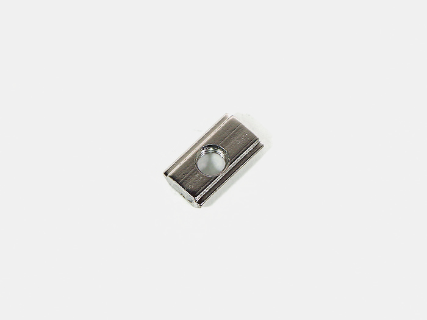</td>
            <td>1</td>
        </tr>
        <tr>
            <td>117</td>
            <td>M5ワッシャー</td>
            <td></td>
            <td>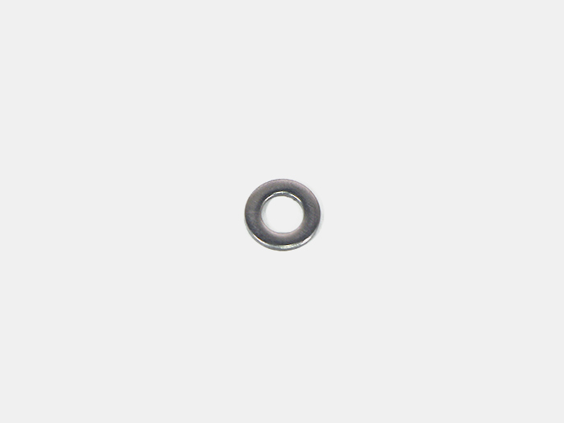</td>
            <td>1</td>
        </tr>
        <tr>
            <td>111</td>
            <td>歯付きワッシャー</td>
            <td></td>
            <td>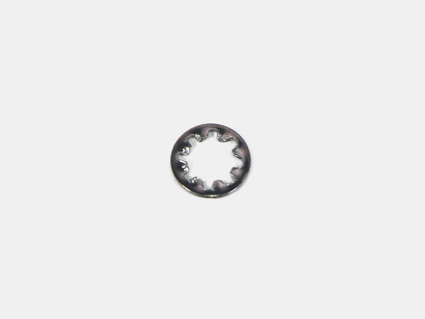</td>
            <td>1</td>
        </tr>
        <tr>
            <td>31</td>
            <td>M5x8 六角穴付ボルト</td>
            <td></td>
            <td>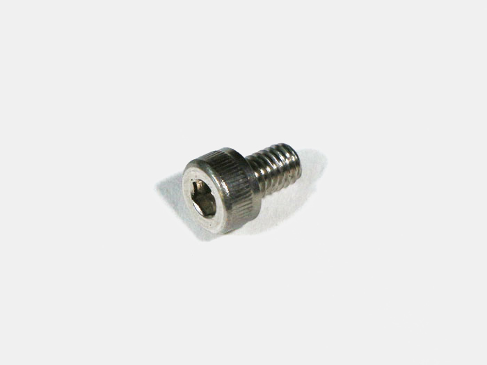</td>
            <td>1</td>
        </tr>
    </tbody>
</table>

## 工程手順

写真を参考に、取り付けた結束バンド固定具にAC-Mainケーブルを結束バンドで固定します。
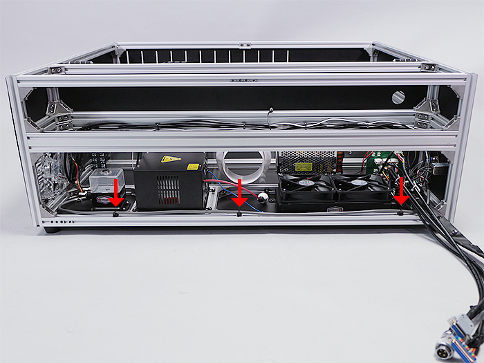

レーザー電源にAC-Laserケーブルを接続します。
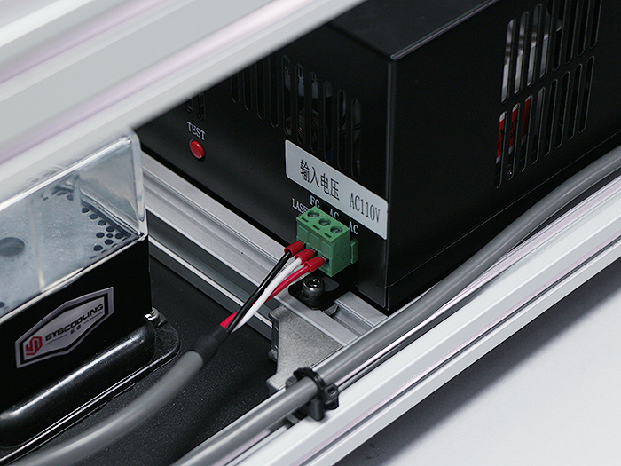

写真の通りに端子台に各ケーブルを取り付けます。線の色を参考にして下さい。
※こちらの配線が間違えていた場合、通電時に本体が破損する可能性があります。
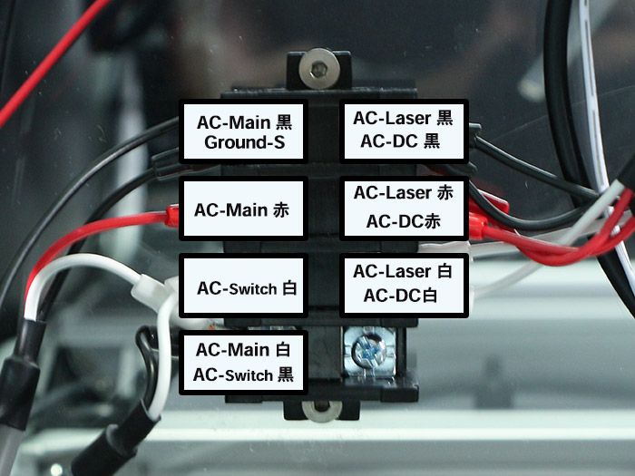

Ground-Sケーブルを写真の順番で本体に取り付けます。
- M5x8六角穴付ボルト
- Ground-Sケーブル
- M5ワッシャー
- 歯付ワッシャー
- M5後入ナット

※アルミフレームが傷がつくように取り付けてください。
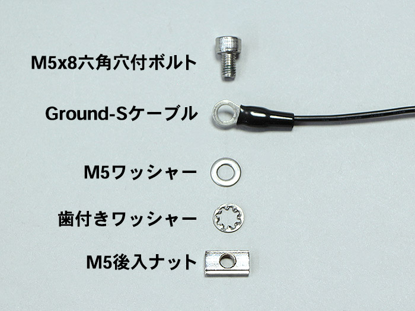

写真の位置に取り付けて下さい。
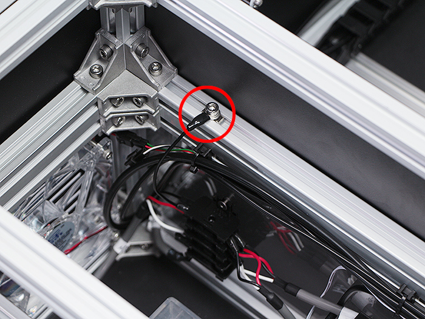

AC-DCケーブルを青矢印の通りにレーザー電源とInner acrylicの間に通します。
写真の赤矢印に入れておいた結束バンド固定具に結束バンドで固定して下さい。
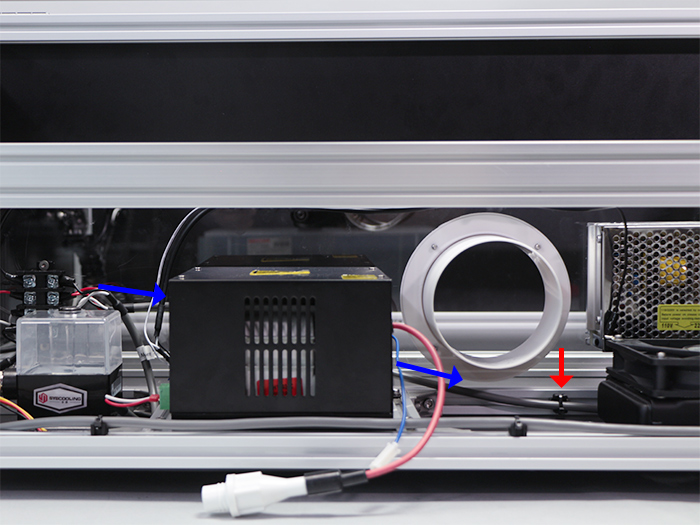

写真の通りにスイッチング電源に各ケーブルを取り付けます。線の色を参考にして下さい。
※こちらの配線が間違えていた場合、通電時に本体が破損する可能性があります。
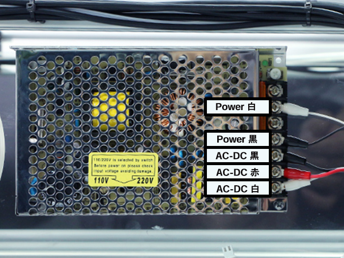