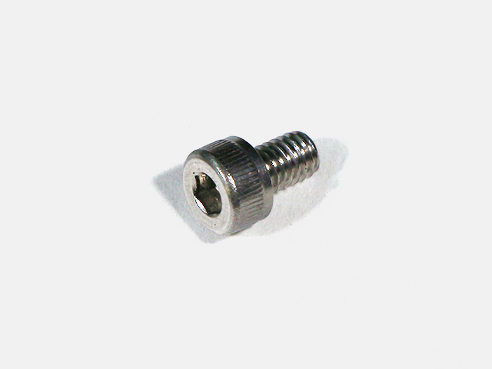
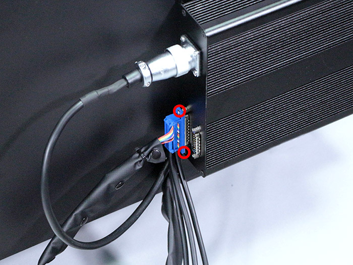
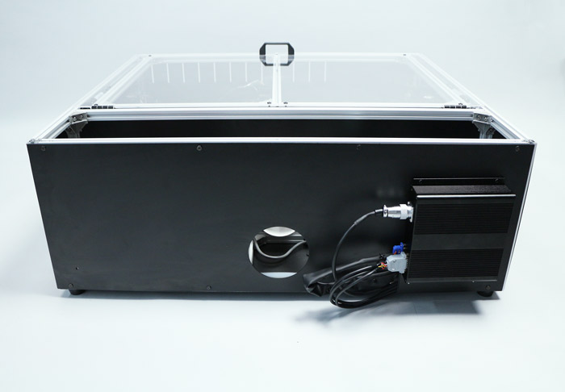

<table class="packing-list">
    <tbody>
        <tr>
            <td>No.</td>
            <td>部品名</td>
            <td>備考</td>
            <td class="packing-img">画像</td>
            <td>個数</td>
        </tr>
        <tr>
            <td>123</td>
            <td>Cover back</td>
            <td></td>
            <td></td>
            <td>1</td>
        </tr>
        <tr>
            <td>133</td>
            <td>PCBケース</td>
            <td></td>
            <td></td>
            <td>1</td>
        </tr>
        <tr>
            <td>84</td>
            <td>M5x6低頭ボルト</td>
            <td></td>
            <td></td>
            <td>8</td>
        </tr>
        <tr>
            <td>101</td>
            <td>M4x6六角穴付ボルト</td>
            <td></td>
            <td></td>
            <td>4</td>
        </tr>
        <tr>
            <td>142</td>
            <td>M2.5×6 六角穴付ボルト</td>
            <td></td>
            <td></td>
            <td>2</td>
        </tr>
    </tbody>
</table>

## 工程手順

### Cover back取り付け
PCBケースをCover BackにM4x6六角穴付ボルト4個で取り付けます。

RELAY DC POWERケーブルとRELAY MOTORケーブルとRELAY SIGNALケーブルを、cover backの長穴から外に出します。

Cover backを、あらかじめ入れておいたM5Tナット8個とM5x6低頭ボルト8個で本体に取り付けます。

PCBケースにRELAY DC POWERケーブルを取り付けます。コネクタ部分に記載されている番号同士を合わせ、根元のローレットナットを回して固定して下さい。

RELAY SIGNALケーブルをM2.5×6六角穴付ボルト2個で取り付けます。

RELAY MOTORケーブルをコネクタに取り付いているネジで取り付けます。

