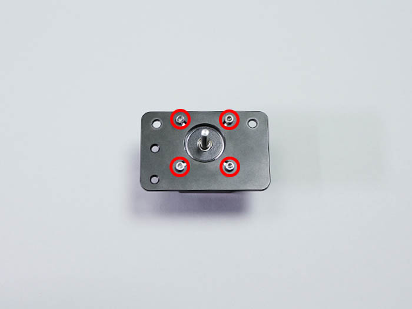

<table class="packing-list">
    <tbody>
        <tr>
            <td>部品名</td>
            <td>備考</td>
            <td class="packing-img">画像</td>
            <td>個数</td>
        </tr>
        <tr>
            <td>V-slot 1348mm</td>
            <td></td>
            <td></td>
            <td>1</td>
        </tr>
        <tr>
            <td>ホイールプレートY軸</td>
            <td></td>
            <td></td>
            <td>2</td>
        </tr>
        <tr>
            <td>ホイールプレートX軸</td>
            <td></td>
            <td></td>
            <td>1</td>
        </tr>
        <tr>
            <td>タイミングプーリー</td>
            <td></td>
            <td></td>
            <td>1</td>
        </tr>
        <tr>
            <td>ステッピングモーター</td>
            <td></td>
            <td></td>
            <td>3</td>
        </tr>
        <tr>
            <td>ホイールプレートモーターマウント</td>
            <td></td>
            <td></td>
            <td>1</td>
        </tr>
        <tr>
            <td>M3x6六角穴付ボルト</td>
            <td></td>
            <td></td>
            <td>12</td>
        </tr>
        <tr>
            <td>M5x8低頭ボルト</td>
            <td></td>
            <td></td>
            <td>4</td>
        </tr>
        <tr>
            <td>M3イモネジ</td>
            <td></td>
            <td></td>
            <td>2</td>
        </tr>
    </tbody>
</table>

## 工程手順

### ホイールプレートモーターマウント取り付け

ホイールプレートモーターマウントには取り付ける向きがあるので注意して下さい。

ステッピングモーターにホイールプレートモーターマウントをM3x6六角穴付ボルト4個で取り付けます。

どちらか片方のネジ穴をステッピングモーターのシャフト切りかけ部分に合わせて取り付けて下さい。

タイミングプーリーをM3イモネジ2個で取り付けます。
※タイミングプーリーで取り付けたイモネジは後で高さを調整するので仮止めして下さい。

ホイールプレートX軸の上部2か所のM5ナイロンナットを外します。

ホイールプレートX軸にホイールプレートモーターマウントを通します。
ホイールプレートモーターマウントには、向きがあるので注意して下さい。

取り外したM5ナイロンナットを取り付けます。

### ホイールプレートY軸取り付け

ホイールプレートY軸にステッピングモーターを写真の向きで置きます。
ステッピングモーターのコネクタの向きでホイールプレートY軸LとY軸Rに分かれます。

M3x6六角穴付ボルト8個で取り付けます。

### XY軸ユニット組み立て

V-slot 1348mmの溝にホイールプレートX軸を通します。

V-slot 1348mmの両端にホイールプレートY軸L/RをM5x8低頭ボルト4個で取り付けます。

