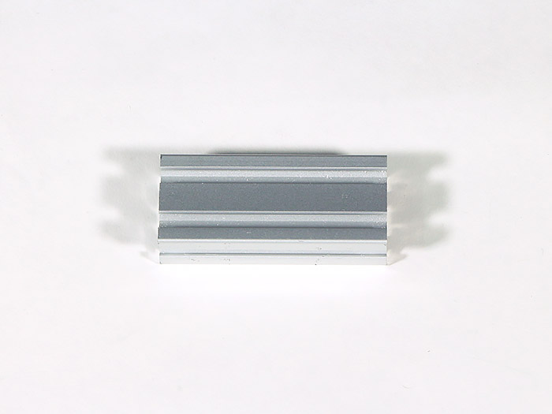
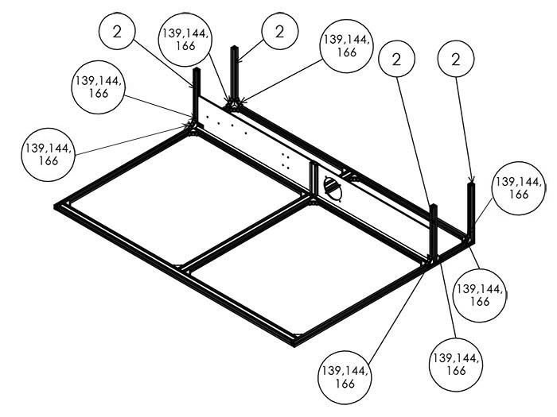

<table class="packing-list">
    <tbody>
        <tr>
            <td>部品名</td>
            <td>備考</td>
            <td class="packing-img">画像</td>
            <td>個数</td>
        </tr>
        <tr>
            <td>V-slot 790mm</td>
            <td></td>
            <td></td>
            <td>2</td>
        </tr>
        <tr>
            <td>アルミフレーム20x40mm 260mm</td>
            <td></td>
            <td></td>
            <td>1</td>
        </tr>
        <tr>
            <td>アルミフレーム20x40mm 150mm</td>
            <td></td>
            <td></td>
            <td>2</td>
        </tr>
        <tr>
            <td>アルミフレーム20x40mm 90mm</td>
            <td></td>
            <td></td>
            <td>2</td>
        </tr>
        <tr>
            <td>アルミフレーム 20x20mm 1360mm</td>
            <td></td>
            <td></td>
            <td>2</td>
        </tr>
        <tr>
            <td>アルミフレーム 20x20mm 280mm</td>
            <td></td>
            <td></td>
            <td>6</td>
        </tr>
        <tr>
            <td>Inner left</td>
            <td>機器取り付け済み</td>
            <td></td>
            <td>1</td>
        </tr>
        <tr>
            <td>Inner right</td>
            <td>機器取り付け済み</td>
            <td></td>
            <td>1</td>
        </tr>
        <tr>
            <td>M5後入ナット</td>
            <td></td>
            <td></td>
            <td>64</td>
        </tr>
        <tr>
            <td>M5x8六角穴付ボルト</td>
            <td></td>
            <td></td>
            <td>64</td>
        </tr>
        <tr>
            <td>直角ブラケット</td>
            <td></td>
            <td></td>
            <td>32</td>
        </tr>
    </tbody>
</table>

## 中段部分完成図

## 工程手順

### Inner acylic挿入

アルミフレーム20x40mm 150mmをM5後入ナット4個とM5x8六角穴付ボルト4個と直角ブラケット2個で取り付けます。

「[Inner acrylic機器取り付け](https://www.smartdiys.com/manual/fabool-laser-ds-ver3-inner-acrylic-assembly/)」で組み立てたInner leftとInner rightをアルミフレーム20x40mm 1360mmの溝にはめます。

アルミフレーム 20x20mm 280mm4本をM5後入ナット16個とM5x8六角穴付ボルト16個と直角ブラケット8個で取り付けます。

アルミフレーム 20x20mm 1360mmをM5後入ナット4個とM5x8六角穴付ボルト4個と直角ブラケット2個で取り付けます。

### 中段部分背面組み立て

アルミフレーム20x40mm 150mmをM5後入ナット4個とM5x8六角穴付ボルト4個と直角ブラケット2個で取り付けます。

アルミフレーム 20x20mm 1360mmをM5後入ナット8個とM5x8六角穴付ボルト8個と直角ブラケット4個で取り付けます。

### XY軸ユニット挿入

V-slot 790mm 2本をM5後入ナット4個とM5x8六角穴付ボルト4個と直角ブラケット2個で取り付けます。
取付後に「[XY軸ユニット組み立て](https://www.smartdiys.com/manual/fabool-laser-ds-ver3-xy-axis-unit-assembly/)」で組み立てたXY軸ユニットをV-slot 790mm に通します。

アルミフレーム20mm角 280mm2本をM5後入ナット12個とM5x8六角穴付ボルト12個と直角ブラケット6個で取り付けます。

V-slot 790mmと本体フレーム下段部分の間が130mmで、水平かつ左右のV-slot 790mmが並行で取り付けができていることを確認して下さい。

### 中段部分正面組み立て

アルミフレーム20*40mm 260mmをM5後入ナット4個とM5x8六角穴付ボルト4個と直角ブラケット2個で取り付けます。

### 中段部分背面上部組み立て

アルミフレーム20x40mm 90mm2本をM5後入ナット8個とM5x8六角穴付ボルト8個と直角ブラケット4個で取り付けます。

