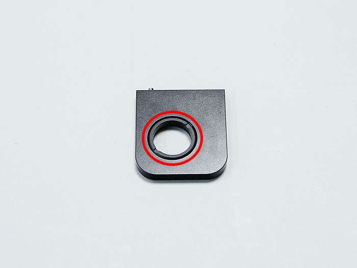

<table class="packing-list">
    <tbody>
        <tr>
            <td>部品名</td>
            <td>備考</td>
            <td class="packing-img">画像</td>
            <td>個数</td>
        </tr>
        <tr>
            <td>レンズマウントガイド</td>
            <td></td>
            <td></td>
            <td>1</td>
        </tr>
        <tr>
            <td>エアーアシストホルダー</td>
            <td></td>
            <td></td>
            <td>1</td>
        </tr>
        <tr>
            <td>ポジションブラケット</td>
            <td></td>
            <td></td>
            <td>1</td>
        </tr>
        <tr>
            <td>レンズナット</td>
            <td></td>
            <td></td>
            <td>1</td>
        </tr>
        <tr>
            <td>レンズマウント</td>
            <td></td>
            <td></td>
            <td>1</td>
        </tr>
        <tr>
            <td>耐熱ワンタッチ継手</td>
            <td></td>
            <td></td>
            <td>1</td>
        </tr>
        <tr>
            <td>M3x3六角穴付ボルト</td>
            <td></td>
            <td></td>
            <td>2</td>
        </tr>
        <tr>
            <td>M3x6六角穴付ボルト</td>
            <td></td>
            <td></td>
            <td>1</td>
        </tr>
        <tr>
            <td>M3x4六角穴付ボルト</td>
            <td></td>
            <td></td>
            <td>2</td>
        </tr>
    </tbody>
</table>

## 工程手順

### レーザーヘッド組み立て

レンズマウントにレンズナットを取り付けます。

レンズマウントにレンズマウントガイドをM3x6六角穴きボルト1個で取り付けます。
レンズマウントガイドには取り付ける向きがあるので注意して下さい。

レンズマウントガイドにポジションブラケットをM3x3六角穴付ボルト2個で取り付けます。
ポジションブラケットには取り付ける向きがあるので注意して下さい。

レンズマウントにエアーアシストホルダーをM3x4六角穴付ボルト2個で取り付けます。
エアーアシストホルダーには取り付ける向きがあるので注意して下さい。

エアーアシストホルダーに耐熱ワンタッチ継手を取り付けます。
耐熱ワンタッチ継手の接続部分がネジになっているので回して取り付けます。
