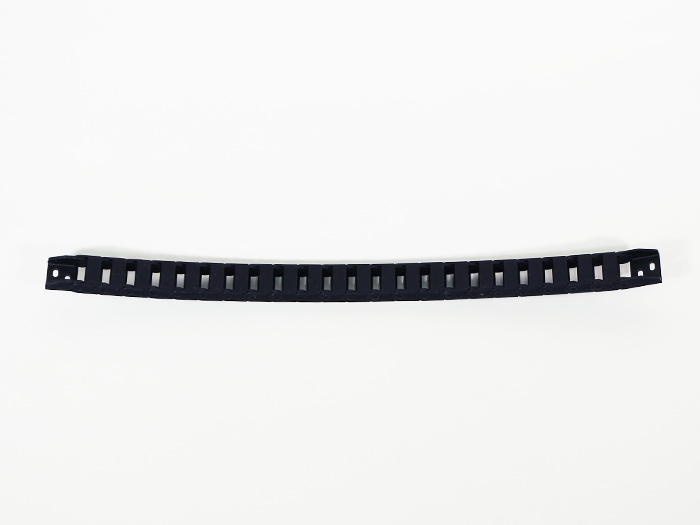
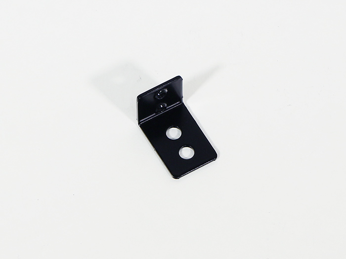
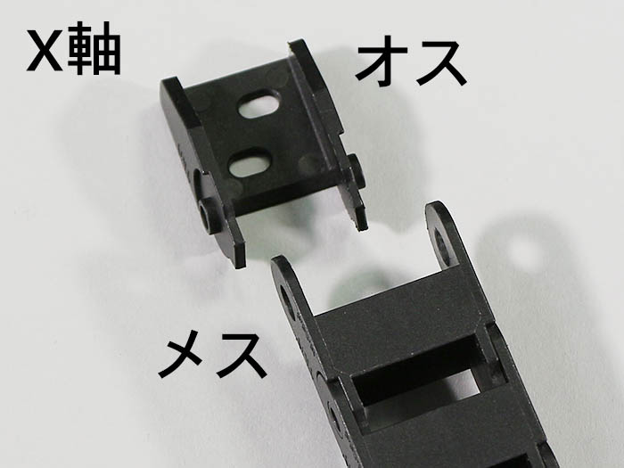

<table class="packing-list">
    <tbody>
        <tr>
            <td>部品名</td>
            <td>備考</td>
            <td class="packing-img">画像</td>
            <td>個数</td>
        </tr>
        <tr>
            <td>ケーブルキャリア X軸</td>
            <td></td>
            <td></td>
            <td>1</td>
        </tr>
        <tr>
            <td>ケーブルキャリア Y軸</td>
            <td></td>
            <td></td>
            <td>2</td>
        </tr>
        <tr>
            <td>キャリアーマウントX軸</td>
            <td></td>
            <td></td>
            <td>3</td>
        </tr>
        <tr>
            <td>キャリアーマウントY軸</td>
            <td></td>
            <td></td>
            <td>2</td>
        </tr>
        <tr>
            <td>リミットマウント</td>
            <td></td>
            <td></td>
            <td>4</td>
        </tr>
        <tr>
            <td>M5x6低頭ボルト</td>
            <td></td>
            <td></td>
            <td>8</td>
        </tr>
        <tr>
            <td>M5x8低頭ボルト</td>
            <td></td>
            <td></td>
            <td>10</td>
        </tr>
        <tr>
            <td>M5後入ナット</td>
            <td></td>
            <td></td>
            <td>12</td>
        </tr>
        <tr>
            <td>M4x10六角穴付皿ボルト</td>
            <td></td>
            <td></td>
            <td>12</td>
        </tr>
        <tr>
            <td>M4ナット</td>
            <td></td>
            <td></td>
            <td>8</td>
        </tr>
    </tbody>
</table>

## 工程手順

### ケーブルキャリア取り付けブラケット 取り外し

ケーブルキャリアX軸とケーブルキャリアY軸の両端についているケーブルキャリア取り付けブラケットを取り外します。マイナスドライバーを使用すると簡単に取り外せます。

マイナスドライバーを使用する際は怪我に十分注意して作業を行なって下さい。

ケーブルキャリア取り付けブラケットにはオス、メスがありますので注意して下さい。

### キャリアーマウントX軸 取り付け

ホイールプレートX軸にキャリア―マウントX軸をM5x8低頭ボルト2個で取り付けます。

ケーブルキャリア取り付けブラケットのメスを、M4x10六角穴付皿ボルト2個とM4ナット2個で取り付けます。

V-slot 1348mm背面側に、キャリア―マウントX軸2個をM5x8低頭ボルト4個とM5後入ナット4個で取り付けます。キャリア―マウントX軸は赤丸Aを本体中央、赤丸Bを本体中央から350mm程度離して取り付けて下さい。

Aで取り付けたキャリアーマウントX軸にケーブルキャリアX軸取り付けブラケットのオスをM4x10六角穴付皿ボルト2個とM4ナット2個で取り付けます。

### キャリアーマウントY軸 取り付け

キャリア―マウントY軸に、ケーブルキャリアY軸取り付けブラケットのメスをM4x10六角穴付皿ボルト2個で取り付けます。

左右対称になるように2セット組み立てます。

ホイールプレートY軸の両側にキャリア―マウントY軸2個をM5x8低頭ボルト4個で取り付けます。

### ケーブルキャリアY軸取付ブラケット 取り付け

Bottom-FにケーブルキャリアY軸取付ブラケットのオス2個をM4x10六角穴付皿ボルト4個とM4ナット4個で取り付けます。

### リミットマウント 取り付け

V-slot 1348mm正面側に、リミットマウント2個をM5後入ナット4個とM5x6低頭ボルト4個で取り付けます。

リミットマウントには取り付ける向きがあるので注意して下さい。リミットマウントの位置は後ほど調整しますので写真で示した付近に取り付けて下さい。

V-slot 790mm左側に、リミットマウント2個をM5後入ナット4個とM5x6低頭ボルト4個で取り付けます。

リミットマウントには取り付ける向きがあるので注意して下さい。リミットマウントの位置は後ほど調整しますので写真で示した付近に取り付けて下さい。

