<table class="packing-list">
    <tbody>
        <tr>
            <td>部品名</td>
            <td>備考</td>
            <td class="packing-img">画像</td>
            <td>個数</td>
        </tr>
        <tr>
            <td>タイミングプーリー</td>
            <td></td>
            <td></td>
            <td>2</td>
        </tr>
        <tr>
            <td>タイミングベルト1350mm</td>
            <td></td>
            <td>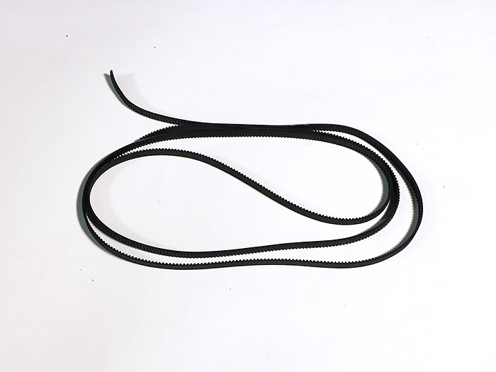</td>
            <td>1</td>
        </tr>
        <tr>
            <td>タイミングベルト900mm</td>
            <td></td>
            <td>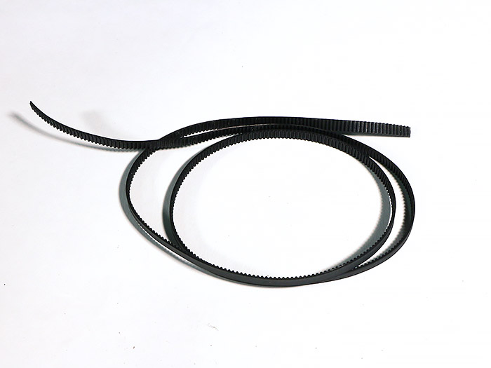</td>
            <td>2</td>
        </tr>
        <tr>
            <td>M5x8六角穴付ボルト</td>
            <td></td>
            <td></td>
            <td>6</td>
        </tr>
        <tr>
            <td>M5後入ナット</td>
            <td></td>
            <td></td>
            <td>6</td>
        </tr>
        <tr>
            <td>M3イモネジ</td>
            <td></td>
            <td>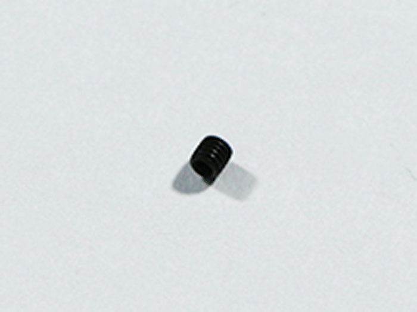</td>
            <td>4</td>
        </tr>
    </tbody>
</table>

## 工程手順

### タイミングプーリー 取り付け

ホイールプレートY軸に、タイミングプーリー2個をM3イモネジ4個で取り付けます。どちらか片方のネジ穴をステッピングモーターのシャフト切りかけ部分に合わせて取り付けてください。
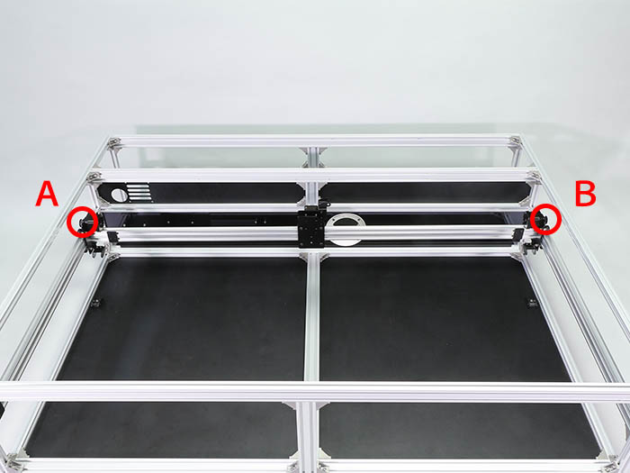
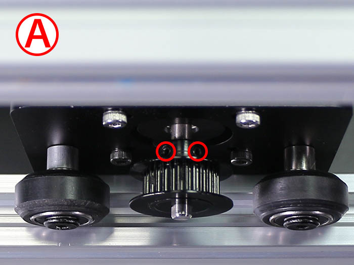
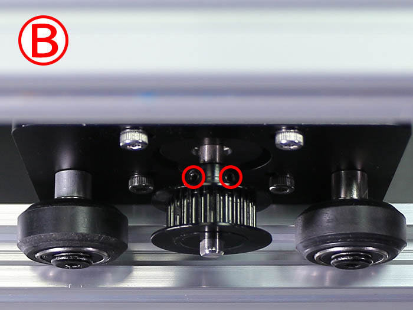

### タイミングベルト取り付け

<iframe allowfullscreen="" frameborder="0" height="315" src="//www.youtube-nocookie.com/embed/O227nCrA0uE" width="560">
</iframe>

V-slot 1348mmの溝にタイミングベルト1350mmをM5後入ナット2個とM5x8六角穴付ボルト2個で取り付けます。
タイミングベルト1350mmは凹凸がある面をタイミングプーリーの歯に合うように取り付けて下さい。
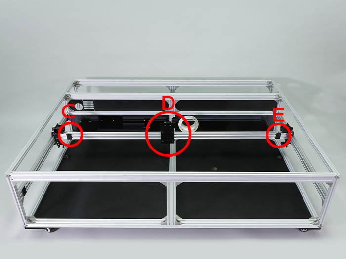
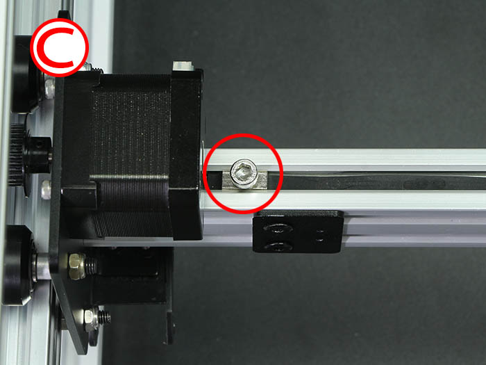
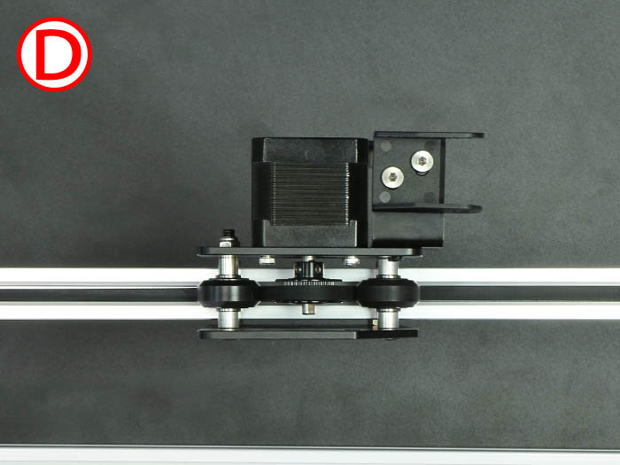
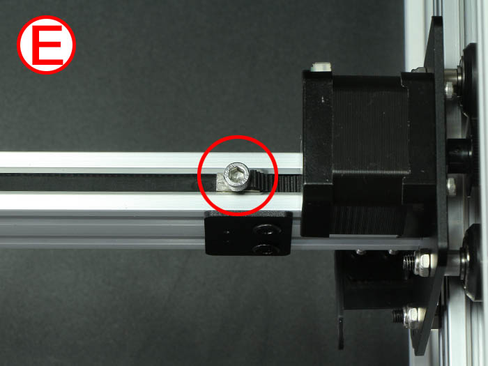

V-slot 790mm左側にタイミングベルト900mmをM5後入ナット2個とM5x8六角穴付ボルト2個で取り付けます。
タイミングベルト900mmは凹凸がある面をタイミングプーリーの歯に合うように取り付けて下さい。
右側も同様に取り付けます。
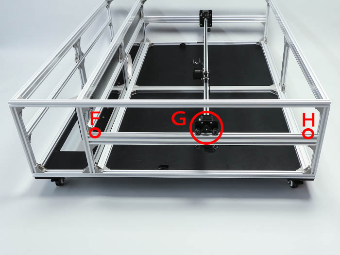
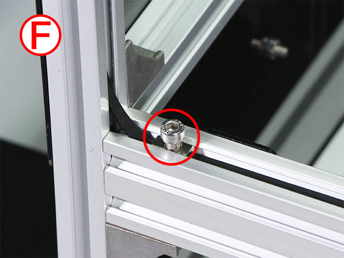
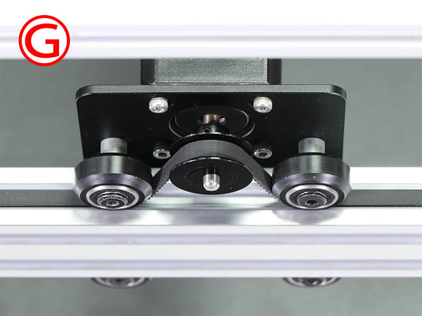
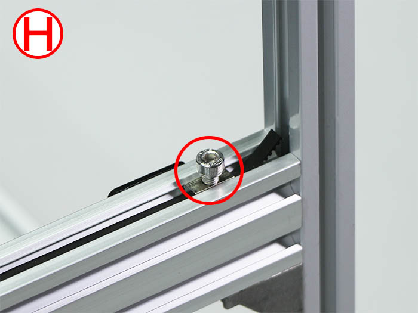

### タイミングプーリー調整

XY軸ユニットとタイミングベルトがNG写真のようにずれている場合は、タイミングプーリーのM3イモネジを緩めて位置を調整します。
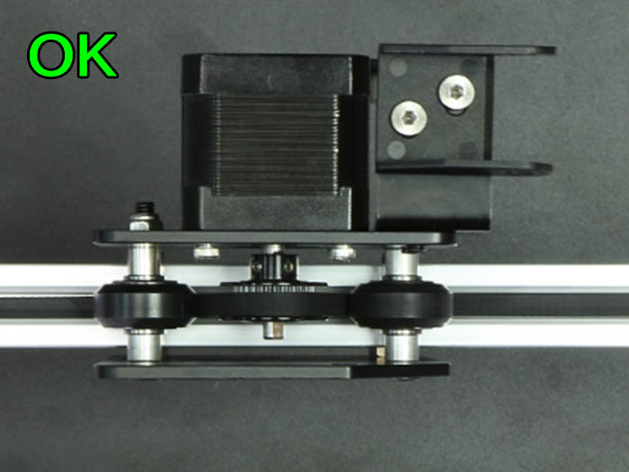
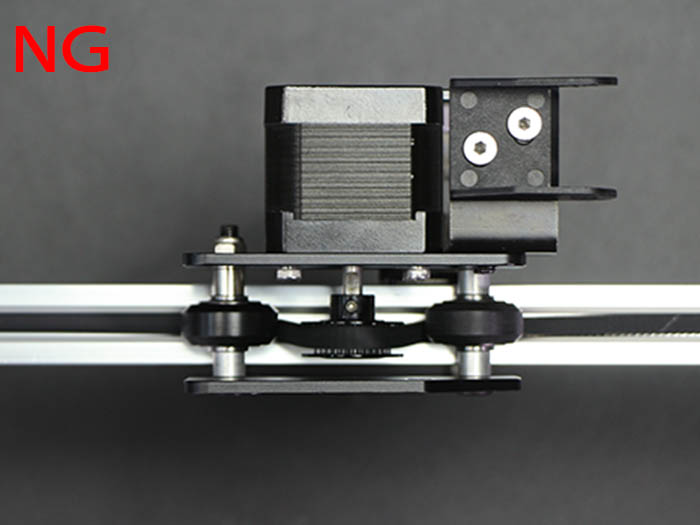