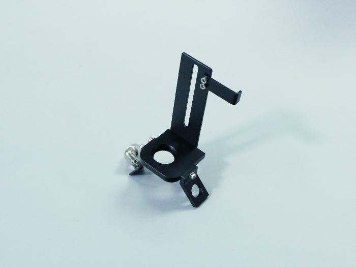
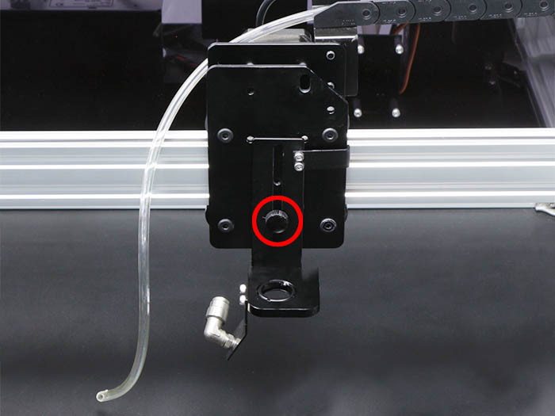
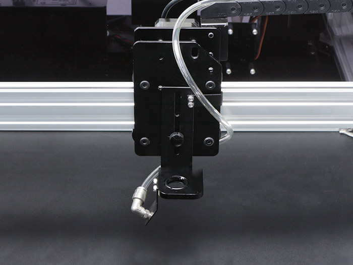

<table class="packing-list">
    <tbody>
        <tr>
            <td>部品名</td>
            <td>備考</td>
            <td class="packing-img">画像</td>
            <td>個数</td>
        </tr>
        <tr>
            <td>つまみねじ</td>
            <td></td>
            <td></td>
            <td>1</td>
        </tr>
        <tr>
            <td>レーザーヘッド</td>
            <td>取り付け済み</td>
            <td></td>
            <td>1</td>
        </tr>
    </tbody>
</table>

## 工程手順

### レーザーヘッド 取り付け

「[レーザーヘッド 組み立て](https://support.smartdiys.com/hc/ja/articles/360007300552" rel="noopener" target="_blank)」で組み立てたレーザーヘッドをXY軸ユニットのホイールプレートX軸につまみねじを使って取り付けます。

写真を参考に耐熱ワンタッチ継手にポリウレタンチューブを奥まで取り付けます。

XY軸ユニットのホイールプレートX軸にレーザーヘッドを取り付けたときにホイールプレートX軸の側面にポジションブラケットが当たるように調整します。

ポジションブラケットが斜めに取り付いている場合はネジを緩めて調整してください。

