<table class="packing-list">
    <tbody>
        <tr>
            <td>部品名</td>
            <td>備考</td>
            <td class="packing-img">画像</td>
            <td>個数</td>
        </tr>
        <tr>
            <td>第1ミラー用アルミフレーム</td>
            <td>ミラーマウント組み立て済み</td>
            <td></td>
            <td>1</td>
        </tr>
        <tr>
            <td>第2ミラー用アルミフレーム</td>
            <td>ミラーマウント組み立て済み</td>
            <td></td>
            <td>1</td>
        </tr>
        <tr>
            <td>ミラーマウント</td>
            <td></td>
            <td>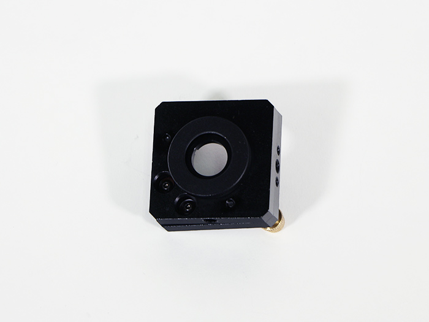</td>
            <td>1</td>
        </tr>
        <tr>
            <td>直角ブラケット</td>
            <td></td>
            <td></td>
            <td>2</td>
        </tr>
        <tr>
            <td>M5x8六角穴付ボルト</td>
            <td></td>
            <td>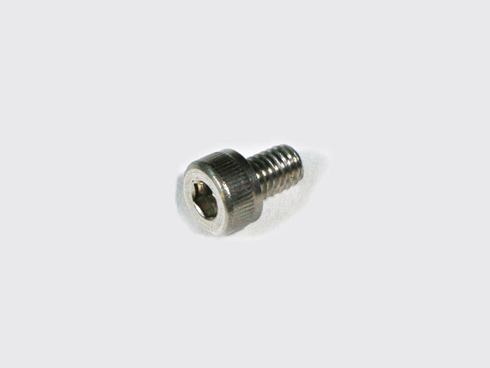</td>
            <td>4</td>
        </tr>
        <tr>
            <td>M5後入ナット</td>
            <td></td>
            <td></td>
            <td>4</td>
        </tr>
        <tr>
            <td>M5x25六角穴付皿ボルト</td>
            <td></td>
            <td>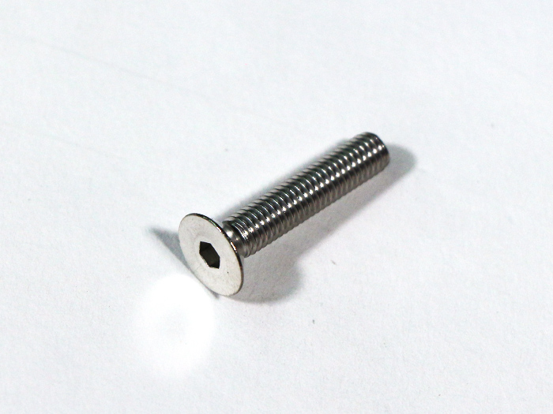</td>
            <td>1</td>
        </tr>
        <tr>
            <td>M5ナイロンナット</td>
            <td></td>
            <td>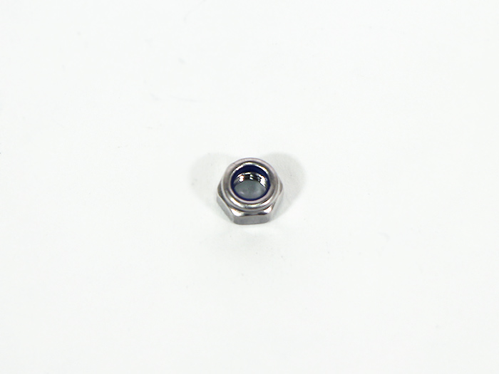</td>
            <td>1</td>
        </tr>
    </tbody>
</table>

## 工程手順

### ミラーマウント 取り付け

「[ミラーマウント組み立て](https://support.smartdiys.com/hc/ja/articles/360007304732" rel="noopener" target="_blank)」で組み立てた第1ミラー用アルミフレームをM5後入ナット2個とM5x8六角穴付ボルト2個と直角ブラケットで取り付けます。
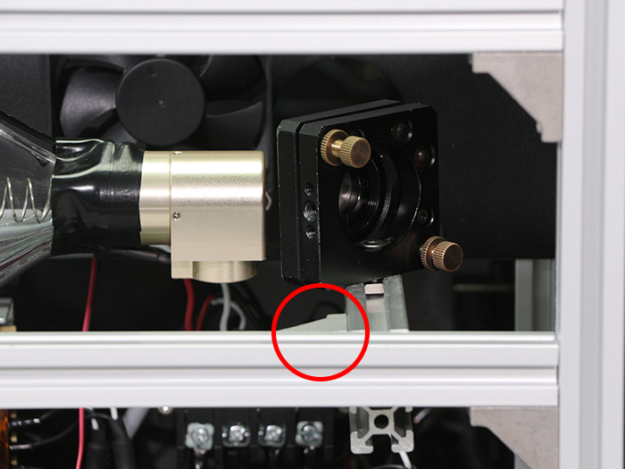

写真を参考に第1ミラー用アルミフレームの距離が40mmとなるようにして下さい。
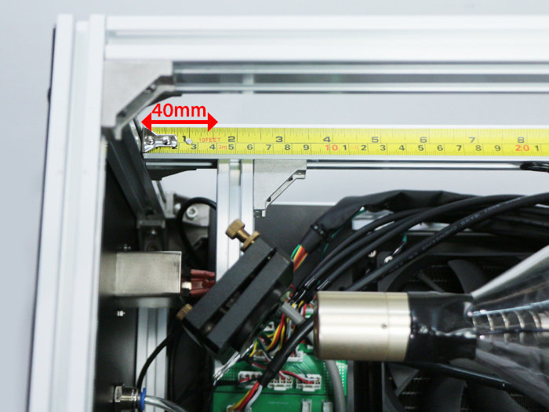

「[ミラーマウント組み立て](https://support.smartdiys.com/hc/ja/articles/360007304732" rel="noopener" target="_blank)」で組み立てた第2ミラー用アルミフレームをM5後入ナット2個とM5x8六角穴付ボルト2個と直角ブラケットで取り付けます。
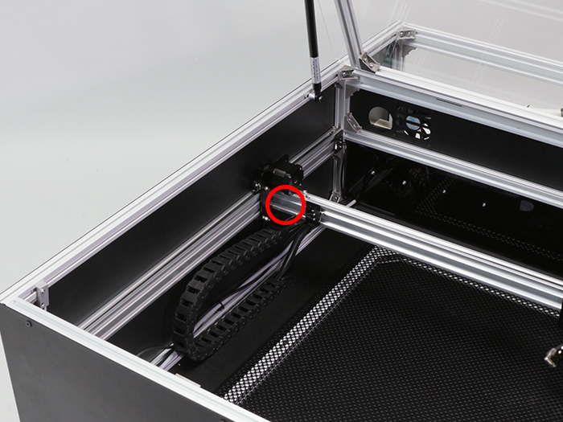
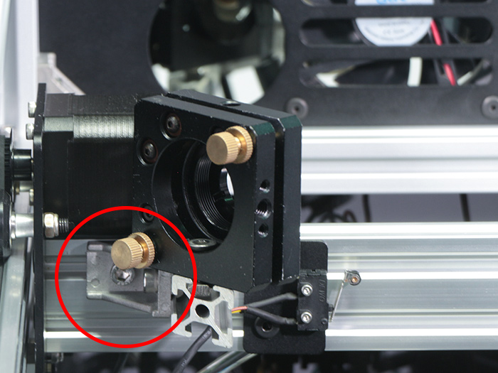

V-slot 790mmと第2ミラー用アルミフレームの頂点部分の距離が60mmとなるようにして下さい。
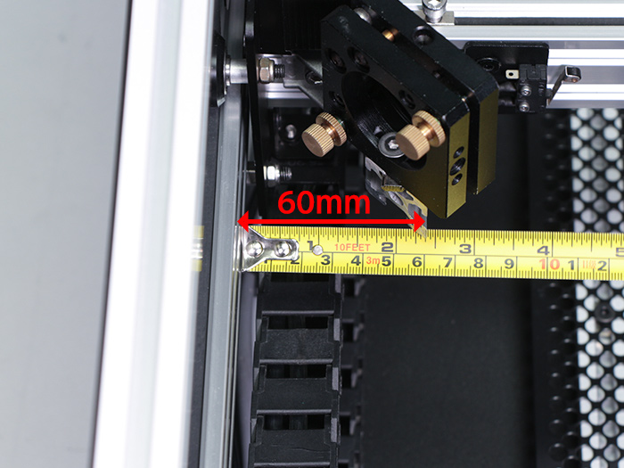

ミラーマウントをM5x25六角穴付皿ボルトとM5ナイロンナットで取り付けます。
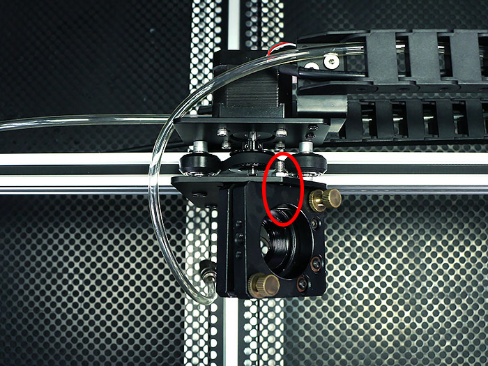

ホイールプレートX軸の切りかけとミラーマウントの赤線が平行になるように傾きを調整してください。
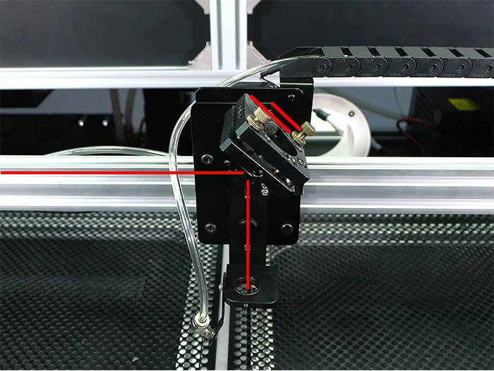