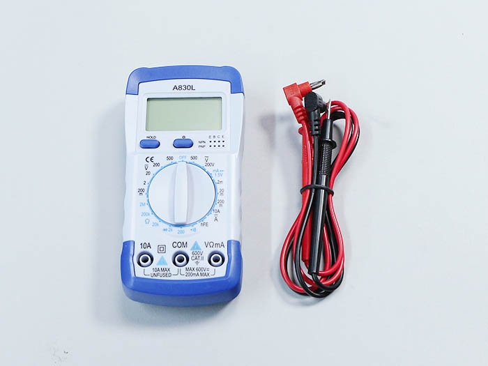
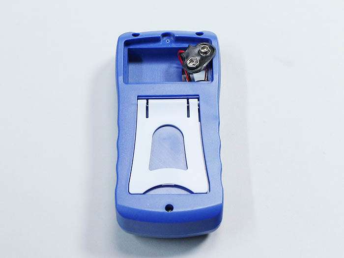
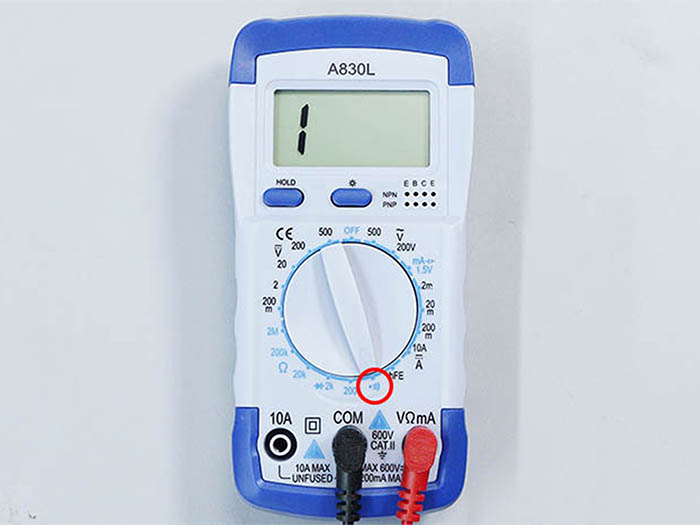
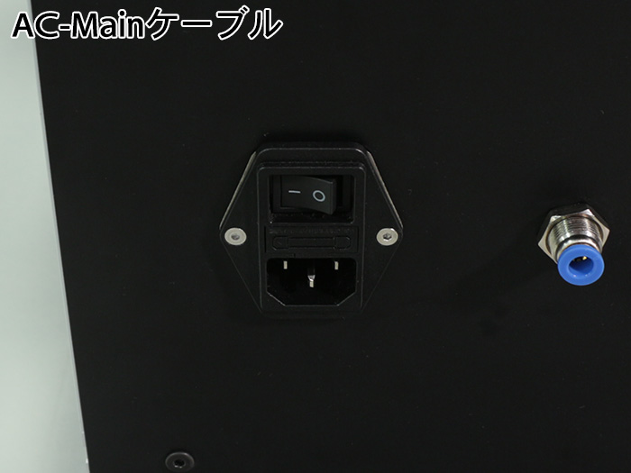

<table class="packing-list">
    <tbody>
        <tr>
            <td>部品名</td>
            <td>備考</td>
            <td class="packing-img">画像</td>
            <td>個数</td>
        </tr>
        <tr>
            <td>テスター</td>
            <td></td>
            <td></td>
            <td>1</td>
        </tr>
        <tr>
            <td>電池</td>
            <td>テスターの箱に同梱</td>
            <td></td>
            <td>1</td>
        </tr>
    </tbody>
</table>

## 工程手順

### テスター使用準備

テスターを箱から出します。

プラスドライバーでネジを外します。

電池の取り付けケーブルを出します。

電池を取り付けます。

電池を収納します。

プラスドライバーで蓋を閉めます。

テスターのテスト棒を取り付けます。黒色はCOM、赤色はVΩｍAに取り付けます。

テスターの中央のダイアルを赤丸のブザーまで回します。

テスト棒先端のテストピン同士を当ててブザー音が鳴るか確認してください。

テスターを写真のように当ててご使用ください。

### 導通確認: AC-Mainケーブルのアース部分・Groundケーブル2種

写真を参考にAC-Mainケーブルのアース部分とGroundケーブル2種を取り付けたM5x8六角穴付ボルトにテストピンを当てて導通確認を行います。ブザー音が鳴った場合が正常です。
ブザーが鳴らない場合は、ネジ締めが弱いか配線間違いの可能性がありますので、強くネジ締めを行うのと配線確認を行ってから再度導通確認をして下さい。

### 導通確認: AC-Mainケーブルのアース部分・端子台の左上のネジ

写真を参考にAC-Mainケーブルのアース部分と端子台の左上のネジにテストピンを当てて導通確認を行います。ブザー音が鳴った場合が正常です。
※ブザーが鳴らない場合は、ネジ締めが弱いか配線間違いの可能性がありますので、強くネジ締めを行うのと配線確認を行ってから再度導通確認をして下さい。

### 導通確認: AC-Mainケーブルの右側単子部分・スイッチング電源「+V」

AC-Mainケーブルのスイッチを「ON」にしてください。

トップカバーを開け、非常停止ボタンの単子取付部の色を確認してください。青色の場合、非常停止ボタンが「押された」状態、オレンジ色の場合は「押されていない」状態にしてください(共に非常停止ボタンが作動していない状態です)。

写真を参考にAC-Mainケーブルの右側単子部分とスイッチング電源「+V」にテストピンを当てて導通確認を行います。ブザー音が鳴らない場合が正常です。
※ブザーが鳴った場合はショートしておりますので絶対に電源を入れないでください。配線間違いの可能性がありますので配線の確認を行ってから再度導通確認をして下さい。

