## レーザー管

<table class="packing-list">
    <tbody>
        <tr>
            <td>部品名</td>
            <td>備考</td>
            <td class="packing-img">画像</td>
            <td>個数</td>
        </tr>
        <tr>
            <td>80Wレーザー管</td>
            <td></td>
            <td></td>
            <td>1</td>
        </tr>
        <tr>
            <td>V-slot 1348mm</td>
            <td></td>
            <td></td>
            <td>1</td>
        </tr>
        <tr>
            <td>V-slot 790mm</td>
            <td></td>
            <td></td>
            <td>2</td>
        </tr>
        <tr>
            <td>アルミフレーム20x40mm 1360mm</td>
            <td></td>
            <td></td>
            <td>5</td>
        </tr>
        <tr>
            <td>アルミフレーム20x40mm 750mm</td>
            <td></td>
            <td></td>
            <td>1</td>
        </tr>
        <tr>
            <td>アルミフレーム20x40mm 730mm</td>
            <td></td>
            <td>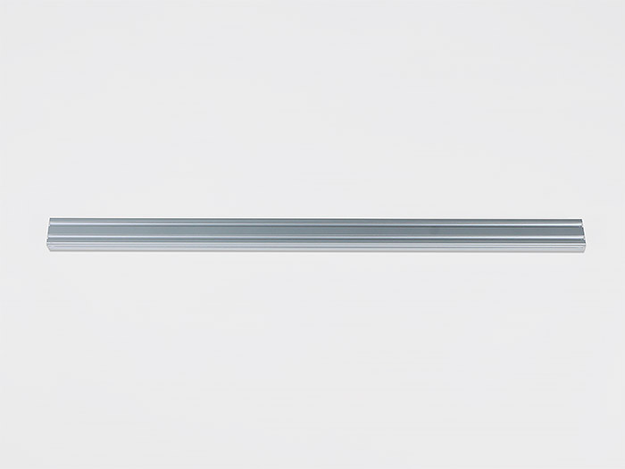</td>
            <td>1</td>
        </tr>
        <tr>
            <td>アルミフレーム20x40mm 260mm</td>
            <td></td>
            <td>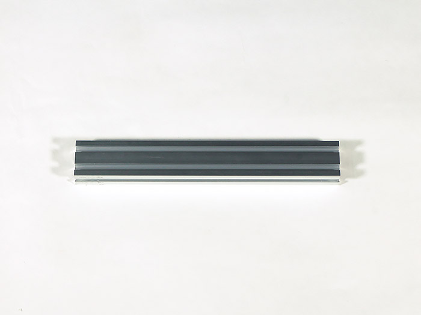</td>
            <td>1</td>
        </tr>
        <tr>
            <td>アルミフレーム20x40mm 200mm</td>
            <td></td>
            <td></td>
            <td>2</td>
        </tr>
        <tr>
            <td>アルミフレーム20x40mm 165mm</td>
            <td></td>
            <td></td>
            <td>2</td>
        </tr>
        <tr>
            <td>アルミフレーム20x40mm 75mm</td>
            <td></td>
            <td></td>
            <td>2</td>
        </tr>
        <tr>
            <td>アルミフレーム20x20mm 1360mm</td>
            <td></td>
            <td></td>
            <td>3</td>
        </tr>
        <tr>
            <td>アルミフレーム20x20mm 1300mm</td>
            <td></td>
            <td></td>
            <td>2</td>
        </tr>
        <tr>
            <td>アルミフレーム20x20mm 1050mm</td>
            <td></td>
            <td></td>
            <td>4</td>
        </tr>
        <tr>
            <td>アルミフレーム20x20mm 730mm</td>
            <td></td>
            <td></td>
            <td>2</td>
        </tr>
        <tr>
            <td>アルミフレーム20x20mm 644mm</td>
            <td></td>
            <td></td>
            <td>4</td>
        </tr>
        <tr>
            <td>アルミフレーム20x20mm 610mm</td>
            <td></td>
            <td></td>
            <td>2</td>
        </tr>
        <tr>
            <td>アルミフレーム20x20mm 530mm</td>
            <td></td>
            <td></td>
            <td>4</td>
        </tr>
        <tr>
            <td>アルミフレーム20x20mm 280mm</td>
            <td></td>
            <td></td>
            <td>6</td>
        </tr>
    </tbody>
</table>

## カバー1

<table class="packing-list">
    <tbody>
        <tr>
            <td>部品名</td>
            <td>備考</td>
            <td class="packing-img">画像</td>
            <td>個数</td>
        </tr>
        <tr>
            <td>Bottom-F</td>
            <td></td>
            <td></td>
            <td>2</td>
        </tr>
        <tr>
            <td>Top Panel</td>
            <td></td>
            <td></td>
            <td>2</td>
        </tr>
    </tbody>
</table>

## カバー2

<table class="packing-list">
    <tbody>
        <tr>
            <td>部品名</td>
            <td>備考</td>
            <td class="packing-img">画像</td>
            <td>個数</td>
        </tr>
        <tr>
            <td>Bottom-BL</td>
            <td></td>
            <td></td>
            <td>1</td>
        </tr>
        <tr>
            <td>Bottom-BLR</td>
            <td></td>
            <td></td>
            <td>1</td>
        </tr>
        <tr>
            <td>Top back-LR</td>
            <td></td>
            <td>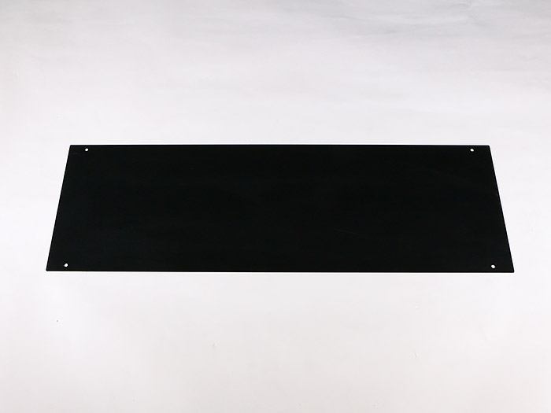</td>
            <td>2</td>
        </tr>
        <tr>
            <td>FLD L</td>
            <td></td>
            <td></td>
            <td>1</td>
        </tr>
        <tr>
            <td>FLD R</td>
            <td></td>
            <td></td>
            <td>1</td>
        </tr>
        <tr>
            <td>Inner L</td>
            <td></td>
            <td>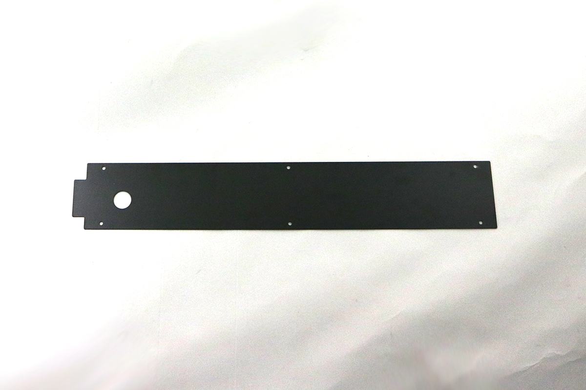</td>
            <td>1</td>
        </tr>
        <tr>
            <td>Inner R</td>
            <td></td>
            <td>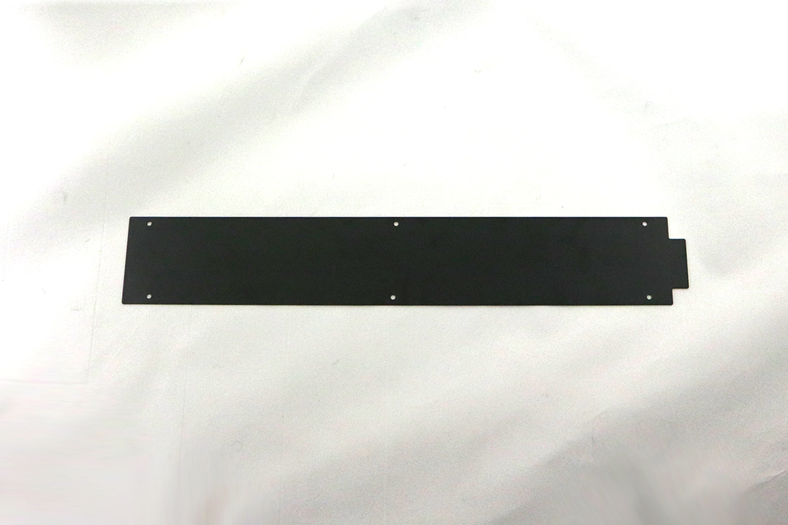</td>
            <td>1</td>
        </tr>
        <tr>
            <td>Cover Left</td>
            <td></td>
            <td>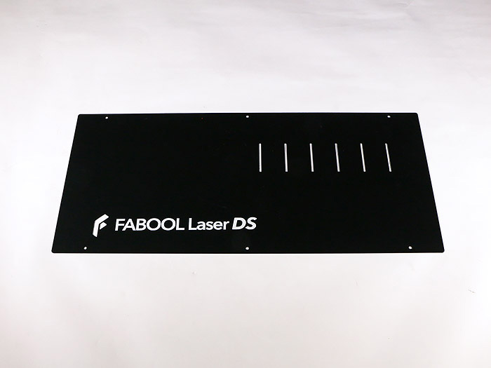</td>
            <td>1</td>
        </tr>
        <tr>
            <td>Cover Right</td>
            <td></td>
            <td></td>
            <td>1</td>
        </tr>
        <tr>
            <td>Back L</td>
            <td></td>
            <td></td>
            <td>1</td>
        </tr>
        <tr>
            <td>Back R</td>
            <td></td>
            <td></td>
            <td>1</td>
        </tr>
        <tr>
            <td>Inner left</td>
            <td></td>
            <td></td>
            <td>1</td>
        </tr>
        <tr>
            <td>Inner right</td>
            <td></td>
            <td></td>
            <td>1</td>
        </tr>
        <tr>
            <td>Bed-LR</td>
            <td></td>
            <td></td>
            <td>6</td>
        </tr>
        <tr>
            <td>フラットバー</td>
            <td></td>
            <td></td>
            <td>22</td>
        </tr>
    </tbody>
</table>

## メカパーツ

<table class="packing-list">
    <tbody>
        <tr>
            <td>部品名</td>
            <td>備考</td>
            <td class="packing-img">画像</td>
            <td>個数</td>
        </tr>
        <tr>
            <td>レーザー電源ユニット</td>
            <td>80Wレーザー用</td>
            <td></td>
            <td>1</td>
        </tr>
        <tr>
            <td>ケーブルキャリアX軸</td>
            <td></td>
            <td></td>
            <td>1</td>
        </tr>
        <tr>
            <td>ケーブルキャリアY軸</td>
            <td></td>
            <td>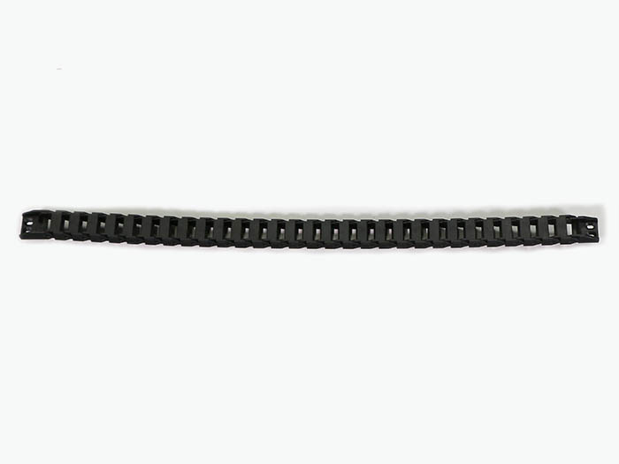</td>
            <td>2</td>
        </tr>
        <tr>
            <td>M5後入ナット</td>
            <td></td>
            <td></td>
            <td>395</td>
        </tr>
        <tr>
            <td>M5x8六角穴付ボルト</td>
            <td></td>
            <td></td>
            <td>207</td>
        </tr>
        <tr>
            <td>M5x8低頭ボルト</td>
            <td></td>
            <td></td>
            <td>142</td>
        </tr>
        <tr>
            <td>直角ブラケット</td>
            <td></td>
            <td></td>
            <td>100</td>
        </tr>
        <tr>
            <td>ホイールプレートY軸</td>
            <td></td>
            <td></td>
            <td>2</td>
        </tr>
        <tr>
            <td>ホイールプレートX軸</td>
            <td></td>
            <td></td>
            <td>1</td>
        </tr>
        <tr>
            <td>ステッピングモーター</td>
            <td></td>
            <td></td>
            <td>3</td>
        </tr>
        <tr>
            <td>耐熱ワンタッチ継手</td>
            <td></td>
            <td>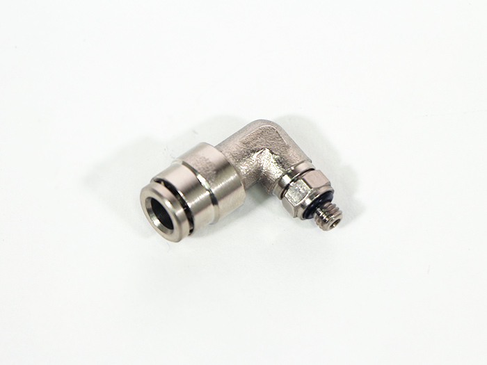</td>
            <td>1</td>
        </tr>
        <tr>
            <td>ミラーマウント</td>
            <td></td>
            <td>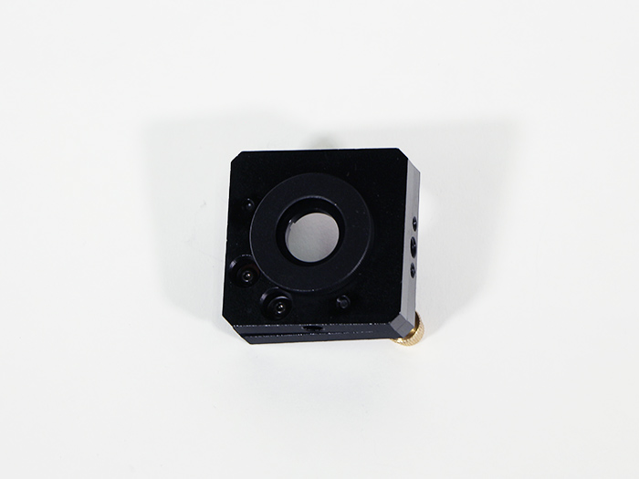</td>
            <td>3</td>
        </tr>
        <tr>
            <td>第1ミラー用アルミフレーム</td>
            <td></td>
            <td></td>
            <td>1</td>
        </tr>
        <tr>
            <td>第1ミラー用アルミフレーム</td>
            <td></td>
            <td></td>
            <td>1</td>
        </tr>
        <tr>
            <td>第2ミラー用アルミフレーム</td>
            <td></td>
            <td></td>
            <td>1</td>
        </tr>
        <tr>
            <td>取手</td>
            <td></td>
            <td></td>
            <td>1</td>
        </tr>
        <tr>
            <td>チューブマウントプレート</td>
            <td></td>
            <td></td>
            <td>2</td>
        </tr>
        <tr>
            <td>レーザー管マウント</td>
            <td></td>
            <td></td>
            <td>2</td>
        </tr>
        <tr>
            <td>パネルタッチコネクタ</td>
            <td></td>
            <td>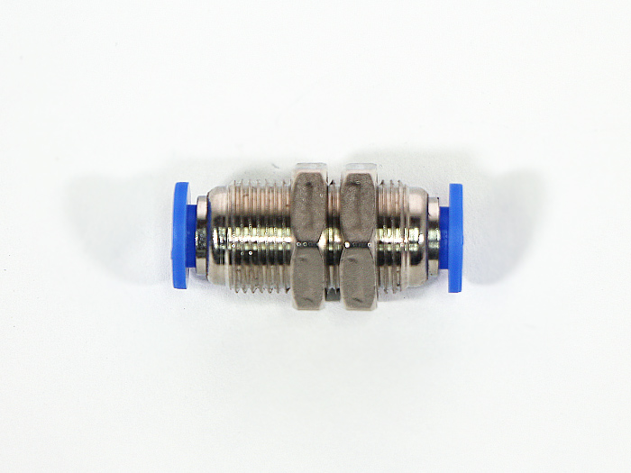</td>
            <td>1</td>
        </tr>
        <tr>
            <td>高さ調整冶具1</td>
            <td></td>
            <td rowspan="2"></td>
            <td>1</td>
        </tr>
        <tr>
            <td>高さ調整冶具2</td>
            <td></td>
            <td>1</td>
        </tr>
        <tr>
            <td>結束バンド</td>
            <td></td>
            <td></td>
            <td>50</td>
        </tr>
        <tr>
            <td>結束バンド固定具</td>
            <td></td>
            <td>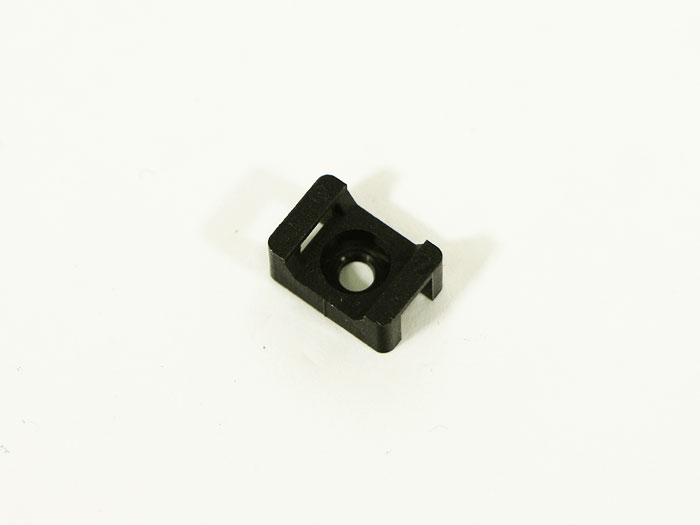</td>
            <td>20</td>
        </tr>
        <tr>
            <td>中継基板</td>
            <td></td>
            <td></td>
            <td>1</td>
        </tr>
        <tr>
            <td>タイミングベルト1350mm</td>
            <td></td>
            <td></td>
            <td>3</td>
        </tr>
        <tr>
            <td>タイミングプーリー</td>
            <td></td>
            <td></td>
            <td>3</td>
        </tr>
        <tr>
            <td>マグネット</td>
            <td></td>
            <td></td>
            <td>1</td>
        </tr>
        <tr>
            <td>端子台</td>
            <td></td>
            <td></td>
            <td>1</td>
        </tr>
        <tr>
            <td>反射ミラー</td>
            <td></td>
            <td></td>
            <td>3</td>
        </tr>
        <tr>
            <td>集光レンズ</td>
            <td></td>
            <td></td>
            <td>1</td>
        </tr>
        <tr>
            <td>薄型ブラケット</td>
            <td></td>
            <td></td>
            <td>2</td>
        </tr>
        <tr>
            <td>蝶番</td>
            <td></td>
            <td></td>
            <td>3</td>
        </tr>
        <tr>
            <td>ホイールプレートモーターマウント</td>
            <td></td>
            <td>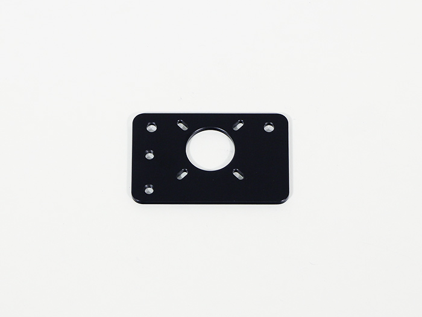</td>
            <td>1</td>
        </tr>
        <tr>
            <td>レンズマウントガイド</td>
            <td></td>
            <td></td>
            <td>1</td>
        </tr>
        <tr>
            <td>リミットマウント</td>
            <td></td>
            <td>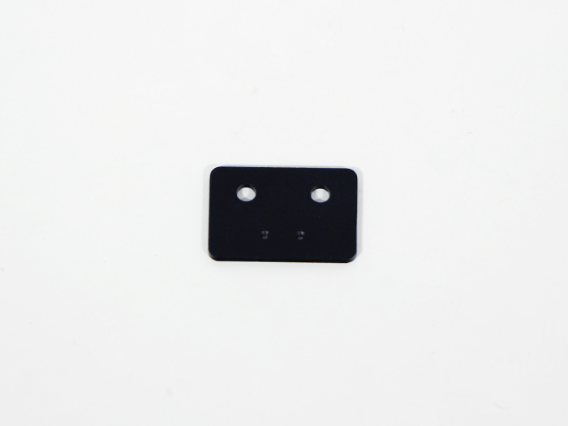</td>
            <td>4</td>
        </tr>
        <tr>
            <td>キャリアマウントX軸</td>
            <td></td>
            <td></td>
            <td>3</td>
        </tr>
        <tr>
            <td>キャリアマウントY軸</td>
            <td></td>
            <td></td>
            <td>2</td>
        </tr>
        <tr>
            <td>ポディションブラケット</td>
            <td></td>
            <td></td>
            <td>1</td>
        </tr>
        <tr>
            <td>レンズマウント</td>
            <td></td>
            <td></td>
            <td>1</td>
        </tr>
        <tr>
            <td>レンズナット</td>
            <td></td>
            <td></td>
            <td>1</td>
        </tr>
        <tr>
            <td>エアーアシストホルダー</td>
            <td></td>
            <td></td>
            <td>1</td>
        </tr>
        <tr>
            <td>つまみねじ</td>
            <td></td>
            <td></td>
            <td>1</td>
        </tr>
        <tr>
            <td>フローセンサー</td>
            <td></td>
            <td></td>
            <td>1</td>
        </tr>
        <tr>
            <td>ガススプリング</td>
            <td></td>
            <td></td>
            <td>2</td>
        </tr>
        <tr>
            <td>保護メガネ</td>
            <td></td>
            <td></td>
            <td>1</td>
        </tr>
        <tr>
            <td>ラジエーターユニット</td>
            <td></td>
            <td></td>
            <td>1</td>
        </tr>
        <tr>
            <td>キャスタープレート</td>
            <td></td>
            <td></td>
            <td>4</td>
        </tr>
        <tr>
            <td>水冷ポンプ</td>
            <td></td>
            <td></td>
            <td>1</td>
        </tr>
        <tr>
            <td>ポリウレタンチューブ</td>
            <td></td>
            <td></td>
            <td>1</td>
        </tr>
        <tr>
            <td>座付ソケット</td>
            <td></td>
            <td></td>
            <td>1</td>
        </tr>
        <tr>
            <td>水冷ホース</td>
            <td></td>
            <td></td>
            <td>1</td>
        </tr>
        <tr>
            <td>PCBケース</td>
            <td></td>
            <td></td>
            <td>1</td>
        </tr>
        <tr>
            <td>アダプターマウント</td>
            <td></td>
            <td></td>
            <td>1</td>
        </tr>
        <tr>
            <td>ゴム足</td>
            <td></td>
            <td></td>
            <td>1</td>
        </tr>
        <tr>
            <td>テスター</td>
            <td></td>
            <td></td>
            <td>1</td>
        </tr>
        <tr>
            <td>メジャー</td>
            <td></td>
            <td></td>
            <td>1</td>
        </tr>
    </tbody>
</table>

## ハーネス

<table class="packing-list">
    <tbody>
        <tr>
            <td>部品名</td>
            <td>備考</td>
            <td class="packing-img">画像</td>
            <td>個数</td>
        </tr>
        <tr>
            <td>USBケーブル</td>
            <td></td>
            <td></td>
            <td>1</td>
        </tr>
        <tr>
            <td>ACケーブル</td>
            <td></td>
            <td>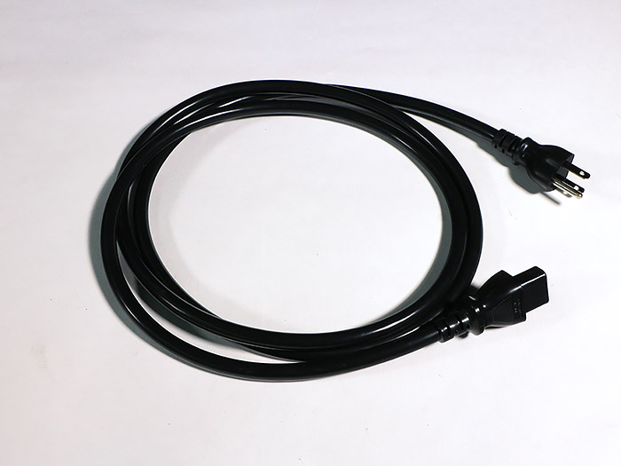</td>
            <td>1</td>
        </tr>
        <tr>
            <td>AC-Mainケーブル</td>
            <td></td>
            <td>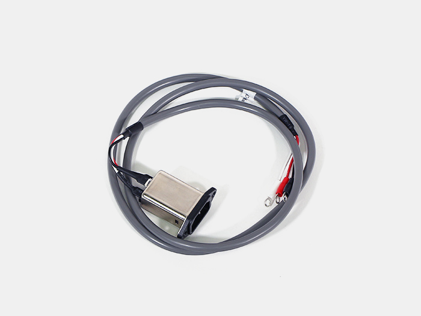</td>
            <td>1</td>
        </tr>
        <tr>
            <td>AC-Laserケーブル</td>
            <td></td>
            <td>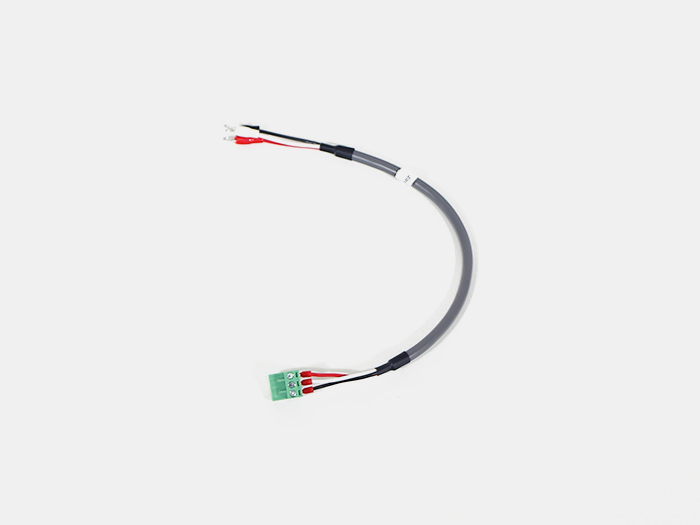</td>
            <td>1</td>
        </tr>
        <tr>
            <td>Laserケーブル</td>
            <td>マグネット付属</td>
            <td></td>
            <td>1</td>
        </tr>
        <tr>
            <td>Y1-limitケーブル</td>
            <td></td>
            <td>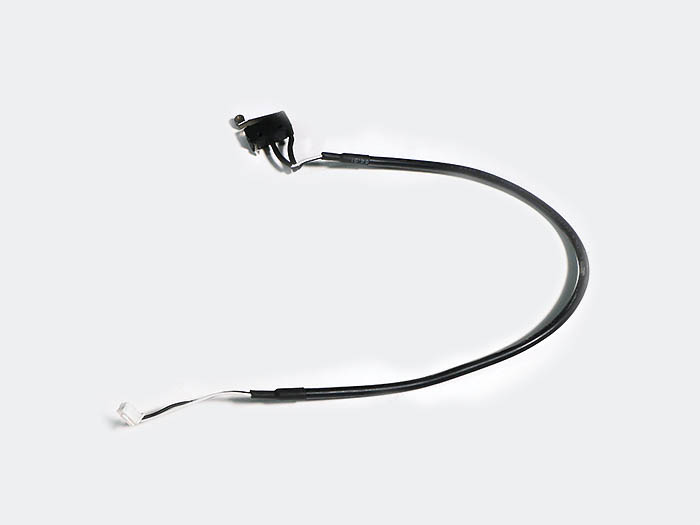</td>
            <td>1</td>
        </tr>
        <tr>
            <td>Switchケーブル</td>
            <td></td>
            <td>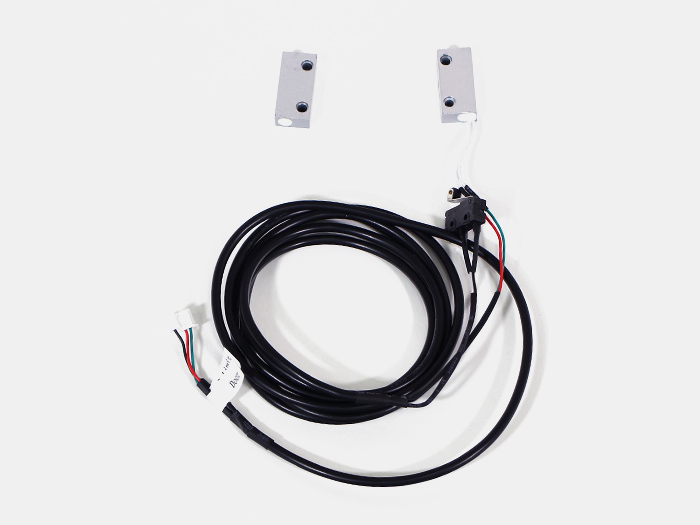</td>
            <td>1</td>
        </tr>
        <tr>
            <td>Y-Motor-Lケーブル</td>
            <td></td>
            <td>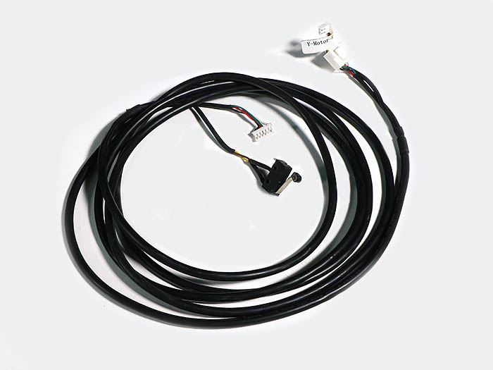</td>
            <td>1</td>
        </tr>
        <tr>
            <td>Y-Motor-Rケーブル</td>
            <td></td>
            <td></td>
            <td>1</td>
        </tr>
        <tr>
            <td>X-Motorケーブル</td>
            <td></td>
            <td>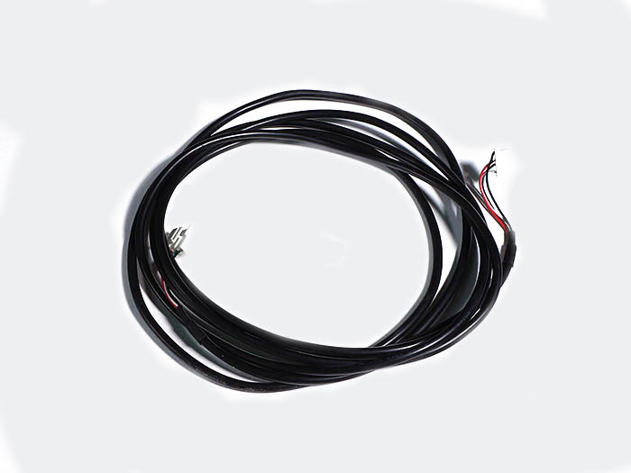</td>
            <td>1</td>
        </tr>
        <tr>
            <td>Ground(s)ケーブル</td>
            <td></td>
            <td></td>
            <td>1</td>
        </tr>
        <tr>
            <td>Pumpケーブル</td>
            <td></td>
            <td></td>
            <td>1</td>
        </tr>
        <tr>
            <td>AC-Cable</td>
            <td></td>
            <td></td>
            <td>1</td>
        </tr>
        <tr>
            <td>Relayケーブル</td>
            <td></td>
            <td></td>
            <td>1</td>
        </tr>
        <tr>
            <td>ACアダプタ</td>
            <td></td>
            <td>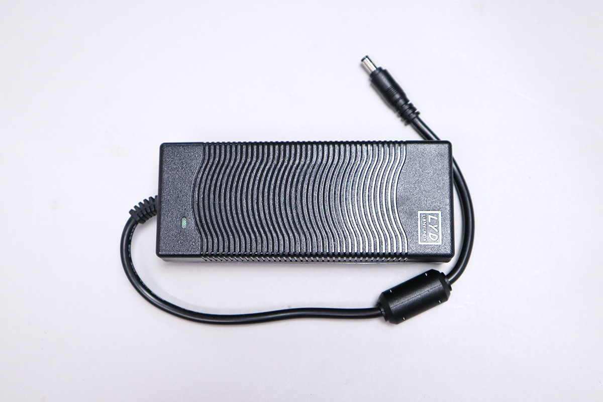</td>
            <td>1</td>
        </tr>
    </tbody>
</table>

## ネジケース

<table class="packing-list">
    <tbody>
        <tr>
            <td>部品名</td>
            <td>備考</td>
            <td class="packing-img">画像</td>
            <td>個数</td>
        </tr>
        <tr>
            <td>M3x10六角穴付皿ボルト</td>
            <td></td>
            <td></td>
            <td>2</td>
        </tr>
        <tr>
            <td>M4x10六角穴付皿ボルト</td>
            <td></td>
            <td></td>
            <td>16</td>
        </tr>
        <tr>
            <td>M5x8六角穴付皿ボルト</td>
            <td></td>
            <td></td>
            <td>12</td>
        </tr>
        <tr>
            <td>M5x15六角穴付皿ボルト</td>
            <td></td>
            <td></td>
            <td>2</td>
        </tr>
        <tr>
            <td>M5x25六角穴付皿ボルト</td>
            <td></td>
            <td>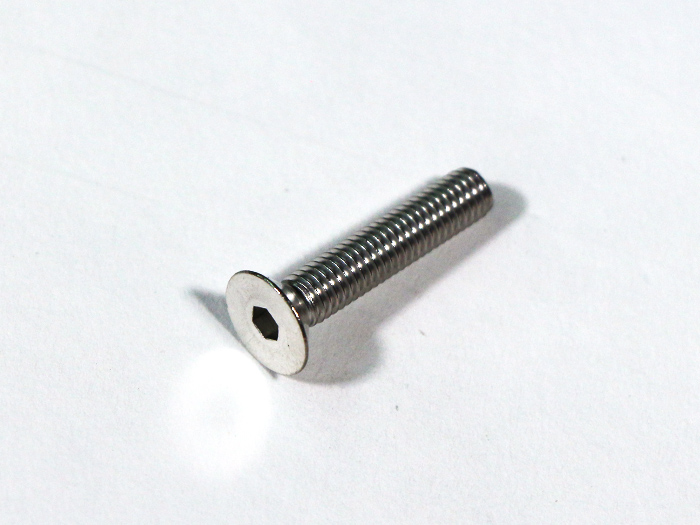</td>
            <td>1</td>
        </tr>
        <tr>
            <td>M6x8六角穴付ボルト</td>
            <td></td>
            <td></td>
            <td>16</td>
        </tr>
        <tr>
            <td>M4x30低頭ボルト</td>
            <td></td>
            <td></td>
            <td>8</td>
        </tr>
        <tr>
            <td>M5x6低頭ボルト</td>
            <td></td>
            <td></td>
            <td>8</td>
        </tr>
        <tr>
            <td>M5x30低頭ボルト</td>
            <td></td>
            <td></td>
            <td>4</td>
        </tr>
        <tr>
            <td>M4後入ナット</td>
            <td></td>
            <td></td>
            <td>2</td>
        </tr>
        <tr>
            <td>12mmスペーサー</td>
            <td></td>
            <td></td>
            <td>4</td>
        </tr>
        <tr>
            <td>M5ナイロンナット</td>
            <td></td>
            <td></td>
            <td>1</td>
        </tr>
        <tr>
            <td>M5ワッシャー</td>
            <td></td>
            <td></td>
            <td>13</td>
        </tr>
        <tr>
            <td>M6ワッシャー</td>
            <td></td>
            <td></td>
            <td>16</td>
        </tr>
        <tr>
            <td>六角スペーサーオネジ</td>
            <td></td>
            <td></td>
            <td>4</td>
        </tr>
        <tr>
            <td>六角スペーサーメネジ</td>
            <td></td>
            <td></td>
            <td>4</td>
        </tr>
        <tr>
            <td>M2x8六角穴付ボルト</td>
            <td></td>
            <td></td>
            <td>8</td>
        </tr>
        <tr>
            <td>M3x3六角穴付ボルト</td>
            <td></td>
            <td></td>
            <td>2</td>
        </tr>
        <tr>
            <td>M3x4六角穴付ボルト</td>
            <td></td>
            <td></td>
            <td>2</td>
        </tr>
        <tr>
            <td>M3x5ナイロンネジ</td>
            <td></td>
            <td></td>
            <td>8</td>
        </tr>
        <tr>
            <td>M3x6六角穴付ボルト</td>
            <td></td>
            <td></td>
            <td>36</td>
        </tr>
        <tr>
            <td>M3x8六角穴付ボルト</td>
            <td></td>
            <td></td>
            <td>6</td>
        </tr>
        <tr>
            <td>M3x12六角穴付ボルト</td>
            <td></td>
            <td></td>
            <td>4</td>
        </tr>
        <tr>
            <td>M4x6六角穴付ボルト</td>
            <td></td>
            <td></td>
            <td>12</td>
        </tr>
        <tr>
            <td>M4x10六角穴付ボルト</td>
            <td></td>
            <td></td>
            <td>2</td>
        </tr>
        <tr>
            <td>M4x16六角穴付ボルト</td>
            <td>M4x15から変更</td>
            <td></td>
            <td>2</td>
        </tr>
        <tr>
            <td>M5x16六角穴付ボルト</td>
            <td></td>
            <td></td>
            <td>24</td>
        </tr>
        <tr>
            <td>M5x18六角穴付ボルト</td>
            <td></td>
            <td></td>
            <td>2</td>
        </tr>
        <tr>
            <td>M3ナット</td>
            <td></td>
            <td></td>
            <td>2</td>
        </tr>
        <tr>
            <td>M4ナット</td>
            <td></td>
            <td>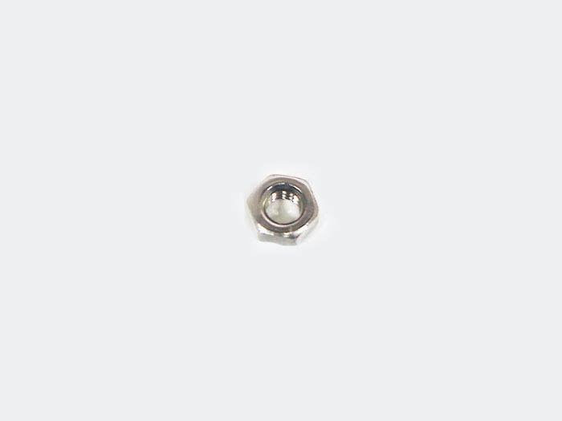</td>
            <td>22</td>
        </tr>
        <tr>
            <td>M3後入ナット</td>
            <td></td>
            <td></td>
            <td>19</td>
        </tr>
        <tr>
            <td>歯付きワッシャー</td>
            <td></td>
            <td></td>
            <td>1</td>
        </tr>
        <tr>
            <td>M3イモネジ</td>
            <td></td>
            <td></td>
            <td>6</td>
        </tr>
        <tr>
            <td>M3x5低頭ボルト</td>
            <td>PCBケース取付プレートが付属している場合、付属しています (PCBケースに付属)</td>
            <td></td>
            <td>4</td>
        </tr>
        <tr>
            <td>M4x4六角穴付ボルト</td>
            <td>PCBケース取付プレートが付属している場合、付属しています (PCBケースに付属)</td>
            <td></td>
            <td>4</td>
        </tr>
        <tr>
            <td>M2.5x6六角穴付ボルト</td>
            <td>PCBケース取付プレートが付属している場合、付属しています (PCBケースに付属)</td>
            <td></td>
            <td>2</td>
        </tr>
        <tr>
            <td>M5x6六角穴付ボルト</td>
            <td>PCBケース取付プレートが付属している場合、付属しています (PCBケースに付属)</td>
            <td></td>
            <td>8</td>
        </tr>
    </tbody>
</table>
