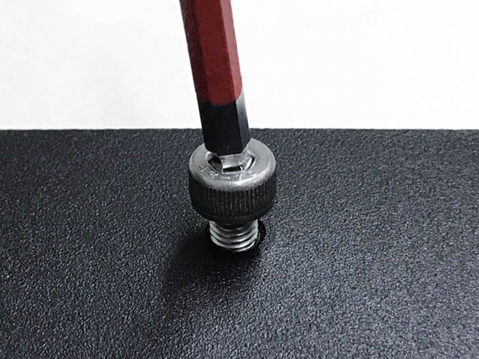
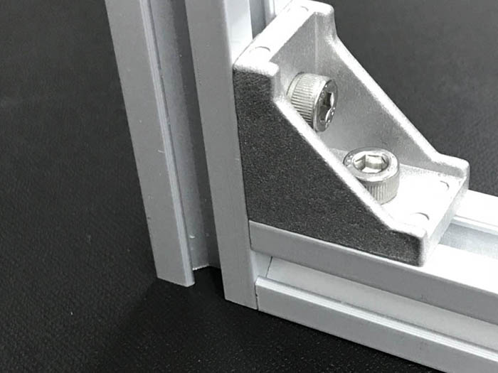

## 六角レンチの取り扱い

ネジ締めを行う際には、L型の長い方で仮止めまで行って下さい。
アルミフレームの位置が決まったら、L型の短い方ででネジの本締めを行って下さい。

## ネジの取り扱い

ネジを締める際は、ナットに対して直角にしてネジ締めを行って下さい。

写真のようにネジが斜めになっている場合、破損・動作不良の原因になりますので注意して下さい。
ネジ締めを斜めに行った場合は、ネジを外しナットを取り換えて下さい。

## 後入ナットの取り扱い

後入ナットには、裏と表があるので注意して下さい。

アルミフレームの溝に、表を上にした後入ナットを入れて下さい。

## 直角ブラケットの取り扱い

アルミフレーム同士を直角に取り付けることができます。

後入ナットの上に直角ブラケットを載せ、2つの穴位置を合わせます。

ネジ締めを行うことで直角ブラケットを固定できます。

## アルミフレームの取り扱い

直角ブラケットでアルミフレームを固定することができます。

アルミフレームを組み立てていくと隙間ができますが、製造上の公差なので問題ありません。

アルミフレーム同士を固定する際に、アルミフレームがねじれていないことを確認して下さい。

