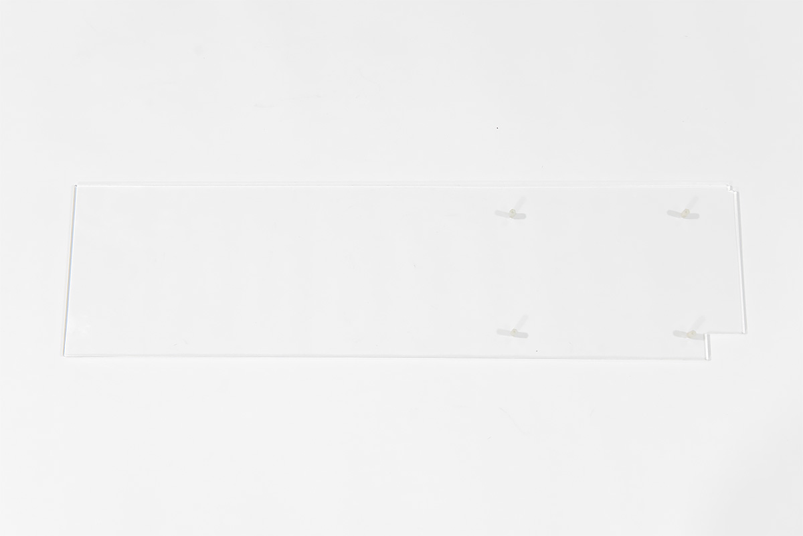
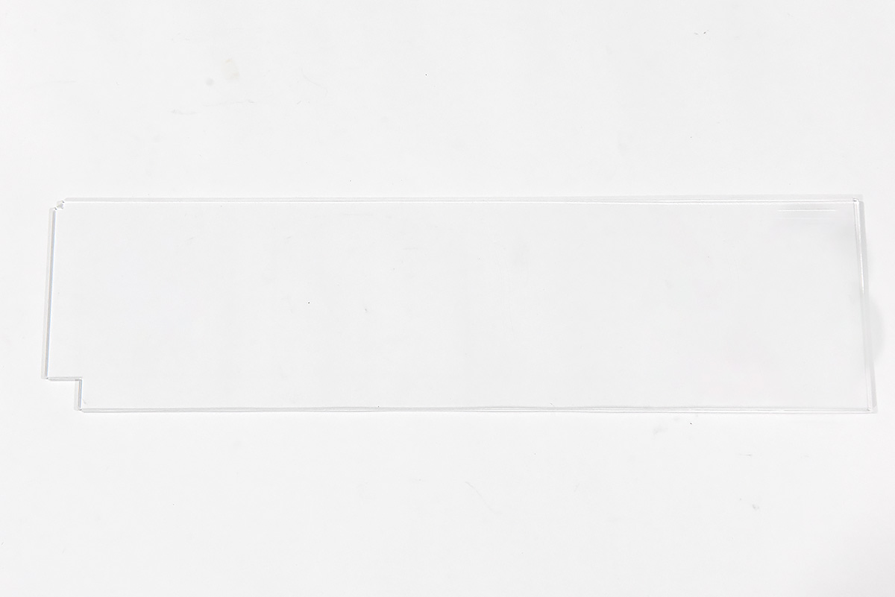
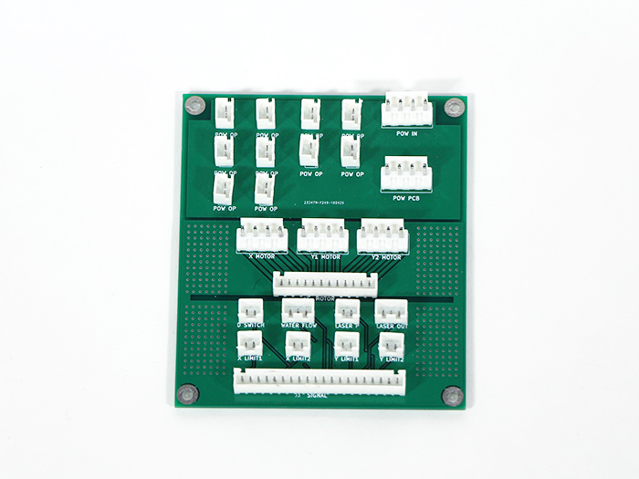
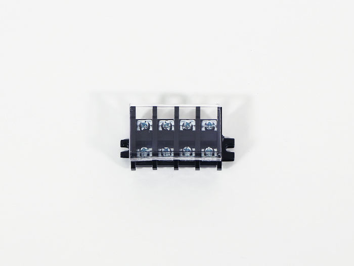
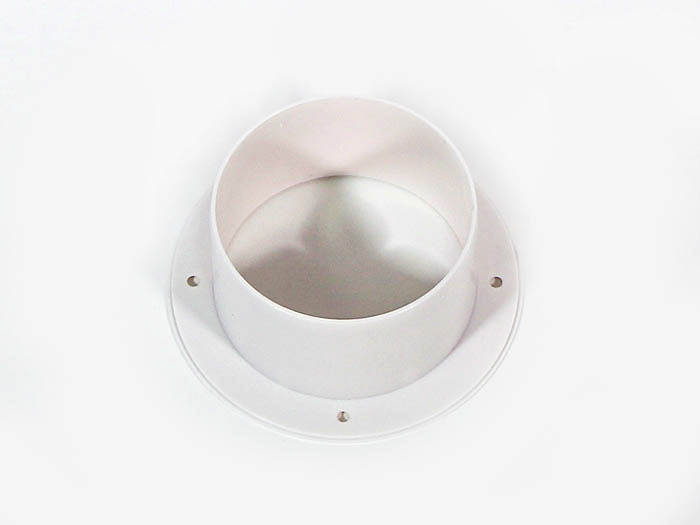
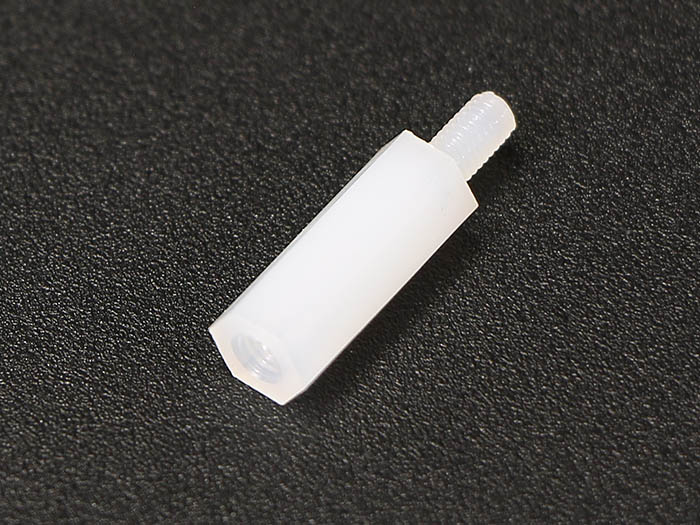
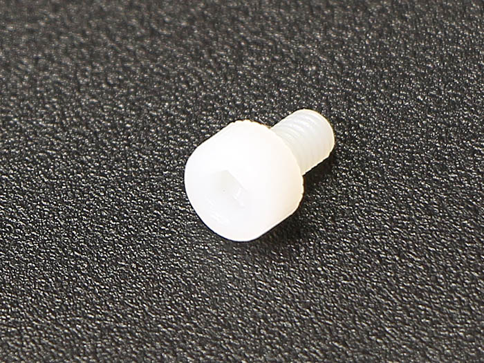

<table class="packing-list"><table>
    <tbody>
        <tr>
            <td>部品名</td>
            <td>備考</td>
            <td class="packing-img">画像</td>
            <td>個数</td>
        </tr>
        <tr>
            <td>Inner left</td>
            <td></td>
            <td></td>
            <td>1</td>
        </tr>
        <tr>
            <td>Inner right</td>
            <td></td>
            <td></td>
            <td>1</td>
        </tr>
        <tr>
            <td>中継基板</td>
            <td>基板</td>
            <td></td>
            <td>1</td>
        </tr>
        <tr>
            <td>端子台</td>
            <td></td>
            <td></td>
            <td>1</td>
        </tr>
        <tr>
            <td>座付ソケット</td>
            <td></td>
            <td></td>
            <td>1</td>
        </tr>
        <tr>
            <td>六角スペーサー オネジ</td>
            <td></td>
            <td></td>
            <td>4</td>
        </tr>
        <tr>
            <td>M3x5ナイロンネジ</td>
            <td></td>
            <td></td>
            <td>4</td>
        </tr>
        <tr>
            <td>M4x10六角穴付皿ボルト</td>
            <td></td>
            <td></td>
            <td>6</td>
        </tr>
    </tbody>
</table>

## 工程手順

### Inner left機器取り付け

Inner leftに六角スペーサー オネジ4個を取り付けます。

取り付けた六角スペーサーに、中継基板をM3x5ナイロンネジ4個で取り付けます。

Inner rightに座付ソケットをM4x10六角穴付皿ボルト4個で取り付けます。

Inner rightに端子台をM4x10六角穴付皿ボルト2個で取り付けます。

