<table class="packing-list">
    <tbody>
        <tr>
            <td>部品名</td>
            <td>備考</td>
            <td class="packing-img">画像</td>
            <td>個数</td>
        </tr>
        <tr>
            <td>アルミフレーム 20x20mm 1050mm</td>
            <td></td>
            <td>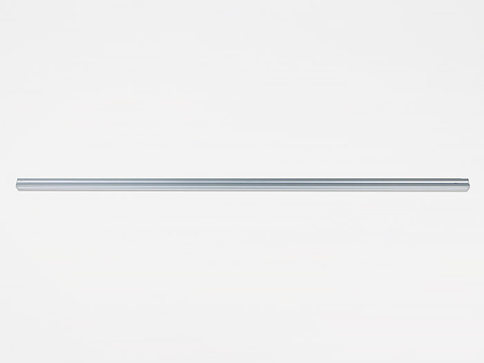</td>
            <td>2</td>
        </tr>
        <tr>
            <td>アルミフレーム 20x20mm 1360mm</td>
            <td></td>
            <td>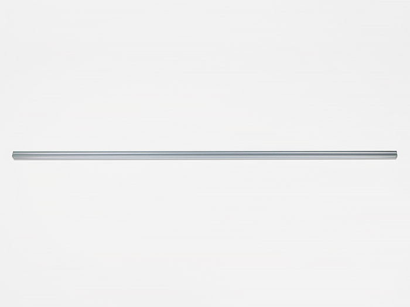</td>
            <td>1</td>
        </tr>
        <tr>
            <td>アルミフレーム 20x40mm 1360mm</td>
            <td></td>
            <td>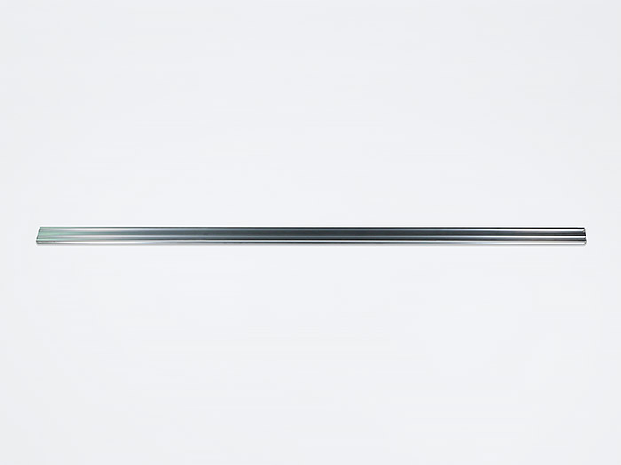</td>
            <td>2</td>
        </tr>
        <tr>
            <td>アルミフレーム 20x40mm 750mm</td>
            <td></td>
            <td>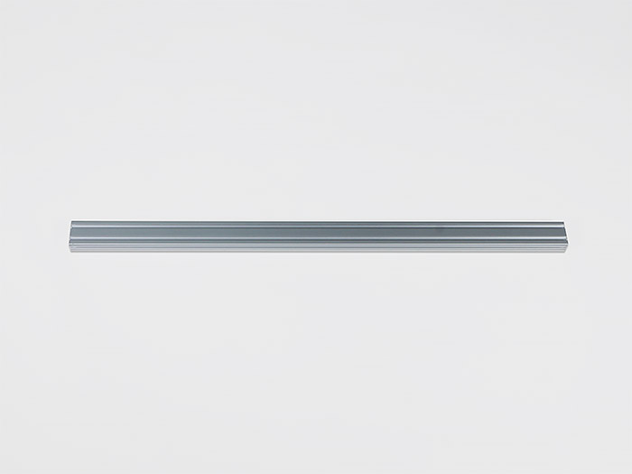</td>
            <td>1</td>
        </tr>
        <tr>
            <td>アルミフレーム 20x40mm 660mm</td>
            <td></td>
            <td></td>
            <td>2</td>
        </tr>
        <tr>
            <td>アルミフレーム 20x40mm 200mm</td>
            <td></td>
            <td>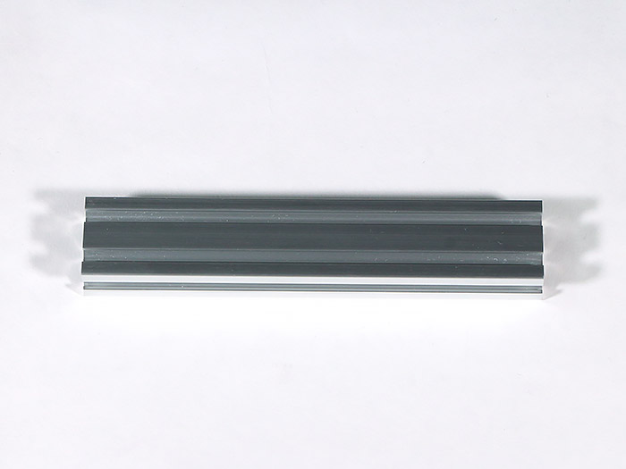</td>
            <td>1</td>
        </tr>
        <tr>
            <td>M5後入ナット</td>
            <td></td>
            <td></td>
            <td>44</td>
        </tr>
        <tr>
            <td>M5x8六角穴付ボルト</td>
            <td></td>
            <td></td>
            <td>44</td>
        </tr>
        <tr>
            <td>直角ブラケット</td>
            <td></td>
            <td>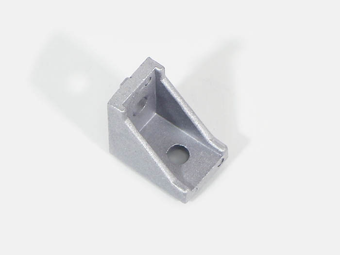</td>
            <td>22</td>
        </tr>
        <tr>
            <td>M4先入れナット</td>
            <td></td>
            <td>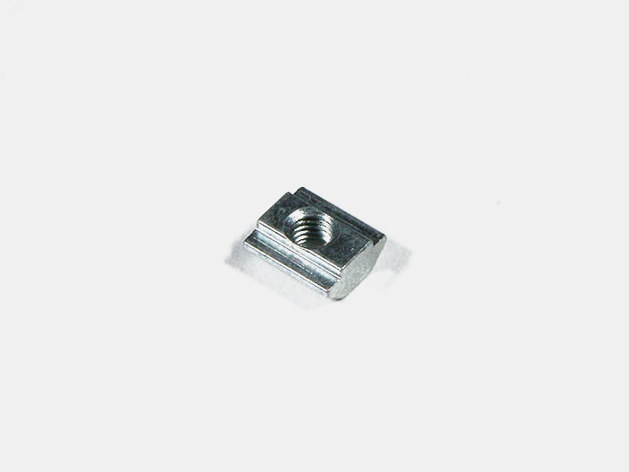</td>
            <td>4</td>
        </tr>
    </tbody>
</table>

直角ブラケットの取り付け方は、「[本体フレーム部材の取り扱い](/manual/fabool-laser-ds-ver4-handling-of-frames/)」を参考に取り付けを行って下さい。

## 工程手順

### 下段部分組み立て

アルミフレーム 20x40mm 660mm2本にM4先入れナットを2個ずつ（計4個）挿入します。
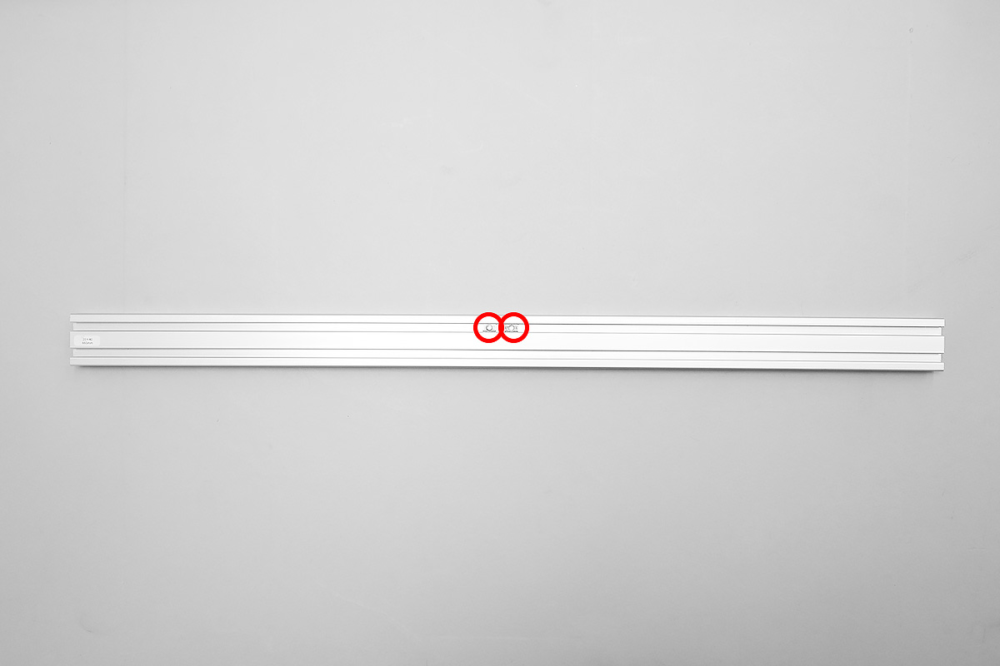

アルミフレーム 20x40mm 1360mmの両端にアルミフレーム 20x20mm 1050mm2本を置き、M5後入ナット4個とM5x8六角穴付ボルト4個と直角ブラケット2個で取り付けます。
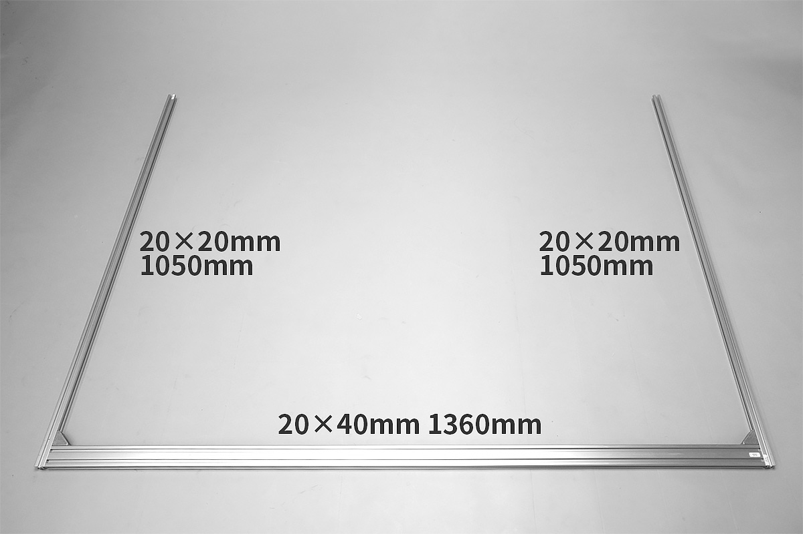

アルミフレーム 20x20mm 1360mmをM5後入ナット4個とM5x8六角穴付ボルト4個と直角ブラケット2個で取り付けます。
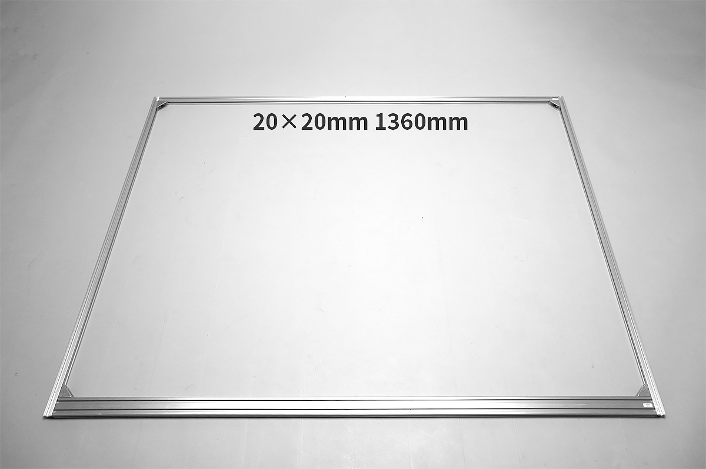

アルミフレーム20x40mm 200mmをM5後入ナット4個とM5x8六角穴付ボルト4個と直角ブラケット2個で取り付けます。アルミフレーム20x40mm 200mmが中心になるように取り付けてください。
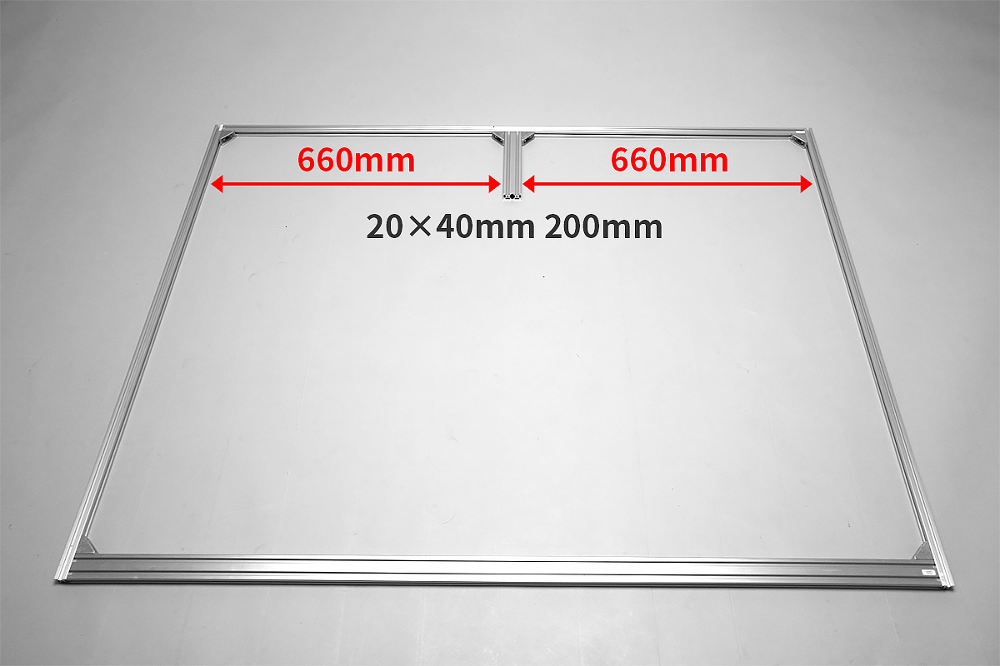

アルミフレーム20x40mm 1360mmをM5後入ナット8個とM5x8六角穴付ボルト8個と直角ブラケット4個で取り付けます。
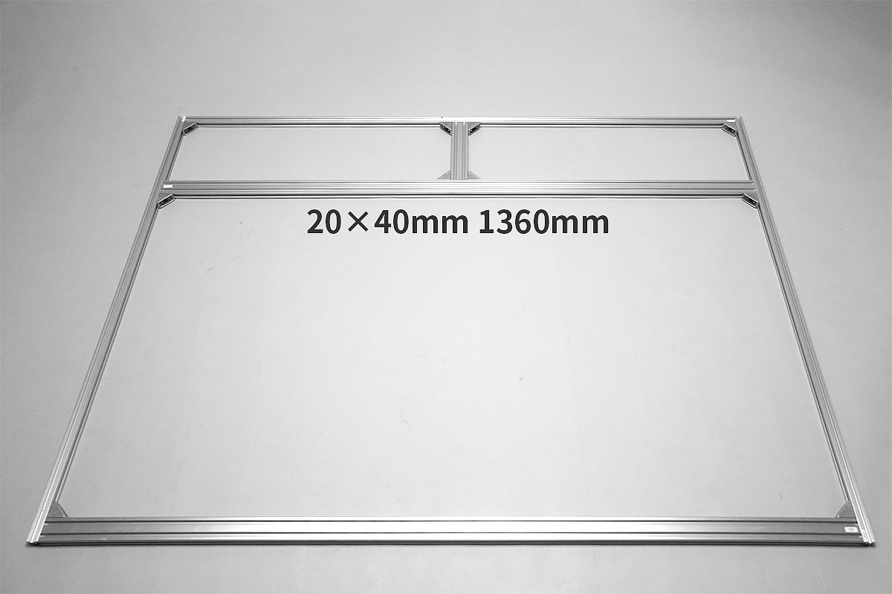

アルミフレーム20x40mm 750mmをM5後入ナット8個とM5x8六角穴付ボルト8個と直角ブラケット4個で取り付けます。
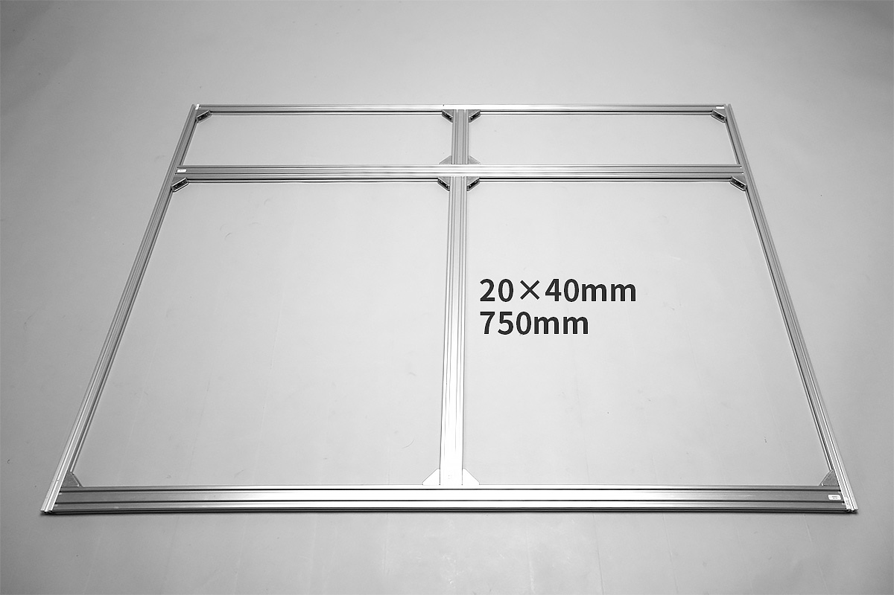

アルミフレーム20x40mm 660mm 2本をM5後入ナット16個とM5x8六角穴付ボルト16個と直角ブラケット8個で取り付けます。あらかじめ入れておいたM4先入れナットは奥側の溝にくるように取り付けてください。
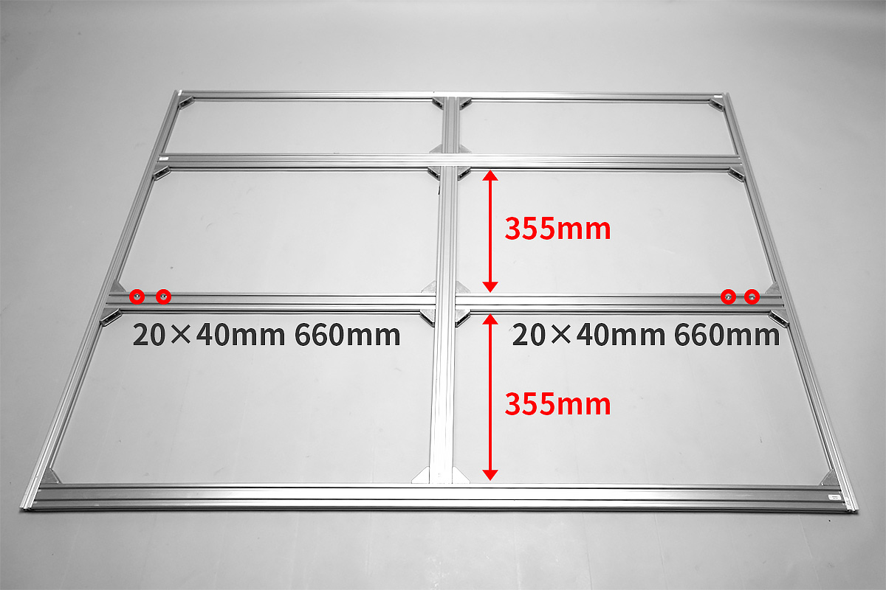
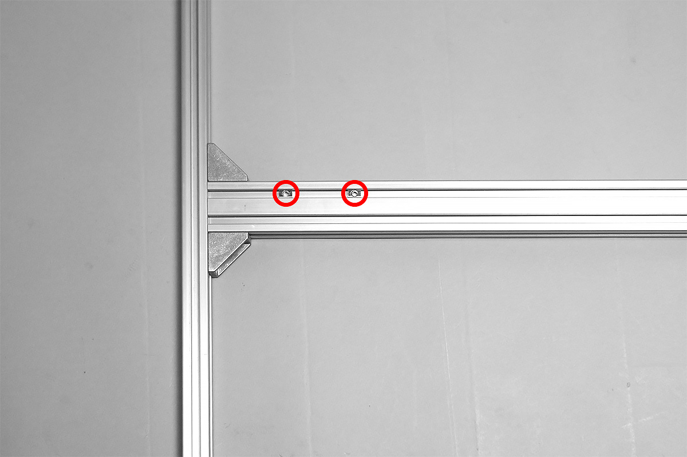
