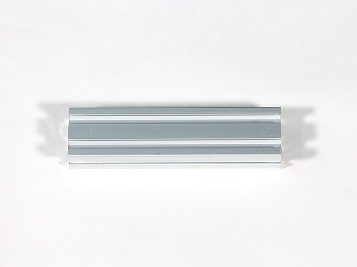
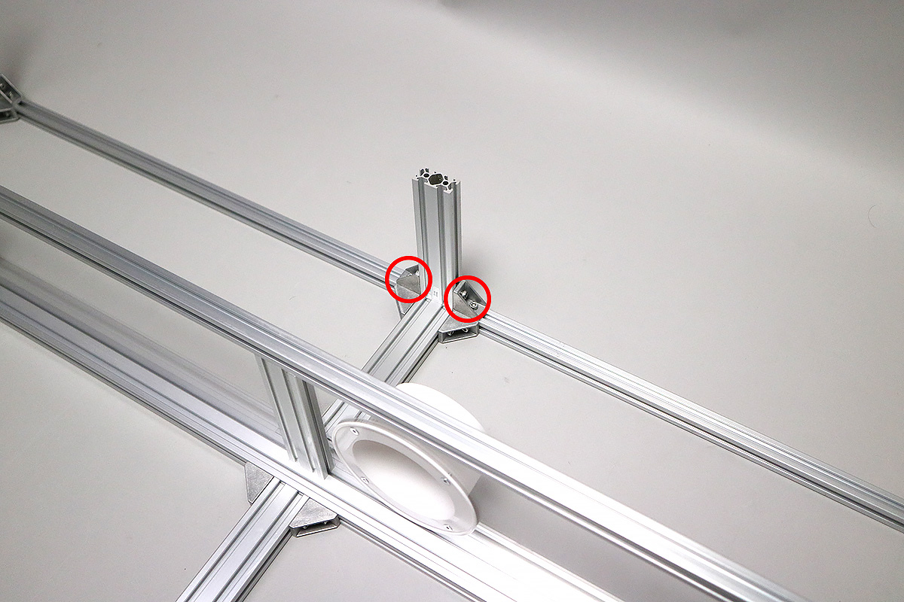

<table class="packing-list">
    <tbody>
        <tr>
            <td>部品名</td>
            <td>備考</td>
            <td class="packing-img">画像</td>
            <td>個数</td>
        </tr>
        <tr>
            <td>V-slot 790mm</td>
            <td></td>
            <td></td>
            <td>2</td>
        </tr>
        <tr>
            <td>アルミフレーム20x40mm 260mm</td>
            <td></td>
            <td></td>
            <td>1</td>
        </tr>
        <tr>
            <td>アルミフレーム20x40mm 165mm</td>
            <td></td>
            <td></td>
            <td>2</td>
        </tr>
        <tr>
            <td>アルミフレーム20x40mm 75mm</td>
            <td></td>
            <td></td>
            <td>2</td>
        </tr>
        <tr>
            <td>アルミフレーム 20x20mm 1360mm</td>
            <td></td>
            <td></td>
            <td>2</td>
        </tr>
        <tr>
            <td>アルミフレーム 20x20mm 280mm</td>
            <td></td>
            <td></td>
            <td>6</td>
        </tr>
        <tr>
            <td>Inner left</td>
            <td>機器取り付け済み</td>
            <td></td>
            <td>1</td>
        </tr>
        <tr>
            <td>Inner right</td>
            <td>機器取り付け済み</td>
            <td></td>
            <td>1</td>
        </tr>
        <tr>
            <td>M5後入ナット</td>
            <td></td>
            <td></td>
            <td>64</td>
        </tr>
        <tr>
            <td>M5x8六角穴付ボルト</td>
            <td></td>
            <td></td>
            <td>64</td>
        </tr>
        <tr>
            <td>直角ブラケット</td>
            <td></td>
            <td></td>
            <td>32</td>
        </tr>
    </tbody>
</table>

## 工程手順

### Inner acylic挿入

アルミフレーム20x40mm 165mmをM5後入ナット4個とM5x8六角穴付ボルト4個と直角ブラケット2個で取り付けます。

「[Inner acrylic機器取り付け](/manual/fabool-laser-ds-ver4-inner-acrylic-assembly/)」で組み立てたInner leftとInner rightをアルミフレーム20x40mm 1360mmの溝にはめます。写真を参考に挿入向きに注意してください。

アルミフレーム 20x20mm 280mm4本をM5後入ナット16個とM5x8六角穴付ボルト16個と直角ブラケット8個で取り付けます。左右、両側に取り付けます。

アルミフレーム 20x20mm 1360mmをM5後入ナット4個とM5x8六角穴付ボルト4個と直角ブラケット2個で取り付けます。

### 中段部分背面組み立て

アルミフレーム20x40mm 165mmをM5後入ナット4個とM5x8六角穴付ボルト4個と直角ブラケット2個で取り付けます。

アルミフレーム 20x20mm 1360mmをM5後入ナット8個とM5x8六角穴付ボルト8個と直角ブラケット4個で取り付けます。

### XY軸ユニット挿入

V-slot 790mm 2本をM5後入ナット4個とM5x8六角穴付ボルト4個と直角ブラケット2個で取り付けます。

「[XY軸ユニット組み立て](/manual/fabool-laser-ds-ver4-xy-axis-unit-assembly/)」で組み立てたXY軸ユニットをV-slot 790mm に通します。

アルミフレーム20mm角 280mm2本をM5後入ナット12個とM5x8六角穴付ボルト12個と直角ブラケット6個で取り付けます。

V-slot 790mmと本体フレーム下段部分の間を145mmにして下さい。距離がずれると装置が正常に動かない場合があります。

X軸ユニットがX方向、Y方向に傾いていないか、水平器を使用して確認してください。傾いている場合は、<a href="https://support.smartdiys.com/hc/ja/articles/360015981792" taget="_blank">切断面が斜めになる Y軸の調整</a>を確認し、左右のV-slot 790mmの高さや歪みを確認してください。
注意：傾いている場合は正常に動作しない可能性があります。また、加工結果に影響が出る場合はあります。

### 軸の組立チェック
X軸ユニットを、X方向、Y方向に手動で動かしてみて、すべての場所でスムーズに動くか確認してください。
引っかかりや硬さを感じる箇所がある場合は、V-slot 790mm高さや歪みを修正してください。動作時の脱調してしまう可能性があります。
中心部分だけでなく、端の方でも十分にチェックします。
<video muted="" autoplay="" loop="" width="100%" height="auto" src="images/007/frame-middle-assembly.mp4"></video>

### 中段部分正面組み立て

アルミフレーム20*40mm 260mmをM5後入ナット4個とM5x8六角穴付ボルト4個と直角ブラケット2個で取り付けます。

### 中段部分背面上部組み立て

アルミフレーム20x40mm 75mm2本をM5後入ナット8個とM5x8六角穴付ボルト8個と直角ブラケット4個で取り付けます。

