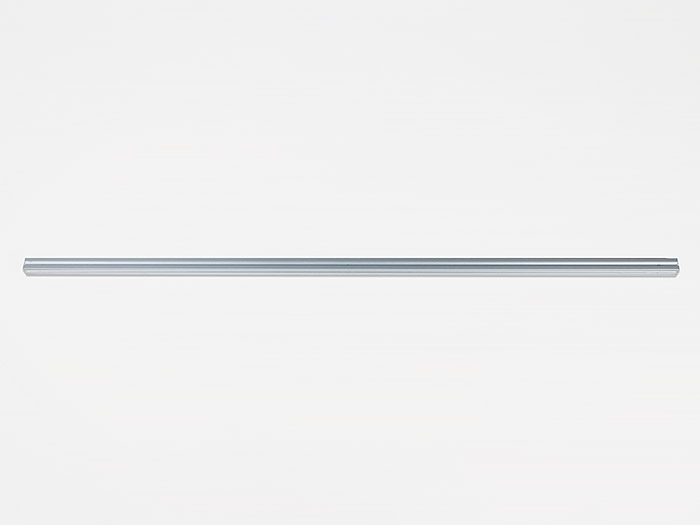
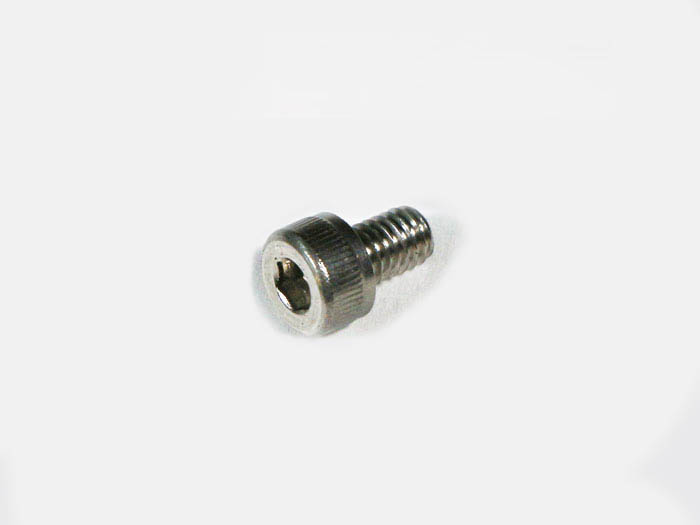
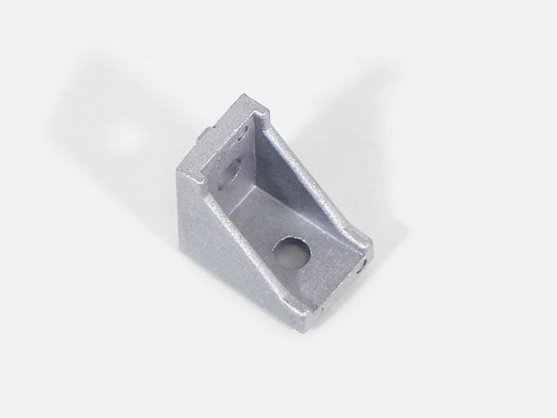
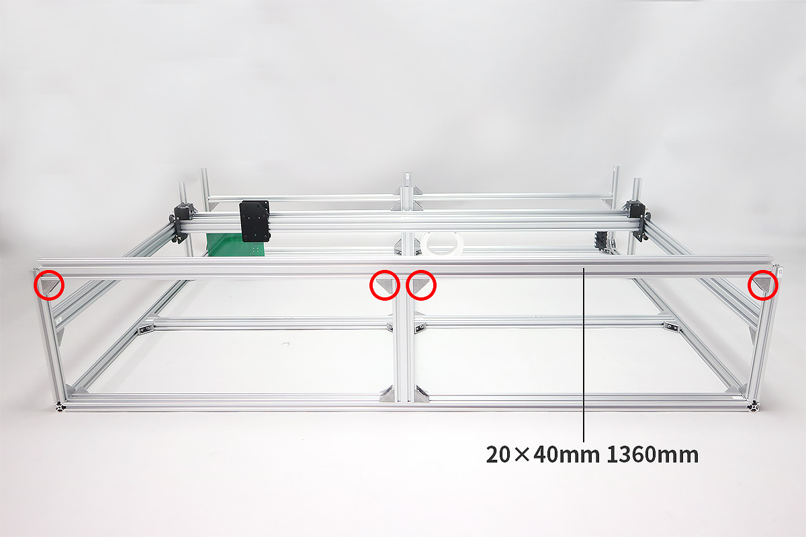

<table class="packing-list">
    <tbody>
        <tr>
            <td>部品名</td>
            <td>備考</td>
            <td class="packing-img">画像</td>
            <td>個数</td>
        </tr>
        <tr>
            <td>アルミフレーム20x20mm 1050mm</td>
            <td></td>
            <td></td>
            <td>2</td>
        </tr>
        <tr>
            <td>アルミフレーム20x40mm 1360mm</td>
            <td></td>
            <td></td>
            <td>3</td>
        </tr>
        <tr>
            <td>M5後入ナット</td>
            <td></td>
            <td></td>
            <td>48</td>
        </tr>
        <tr>
            <td>M5x8六角穴付ボルト</td>
            <td></td>
            <td></td>
            <td>48</td>
        </tr>
        <tr>
            <td>直角ブラケット</td>
            <td></td>
            <td></td>
            <td>24</td>
        </tr>
    </tbody>
</table>

## 工程手順

### 上段部分正面組み立て

アルミフレーム20x40mm 1360mmをM5後入ナット8個とM5x8六角穴付ボルト8個と直角ブラケット4個で取り付けます。

アルミフレーム20x40mm 1360mmをM5後入ナット8個とM5x8六角穴付ボルト8個と直角ブラケット4個で取り付けます。

アルミフレーム20x40mm 1360mmをM5後入ナット8個とM5x8六角穴付ボルト8個と直角ブラケット4個で取り付けます。

### 上段部分左右組み立て

アルミフレーム20x20mm 1050mm2本をM5後入ナット24個とM5x8六角穴付ボルト24個と直角ブラケット12個で取り付けます。

