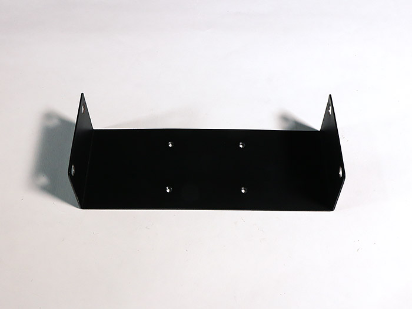
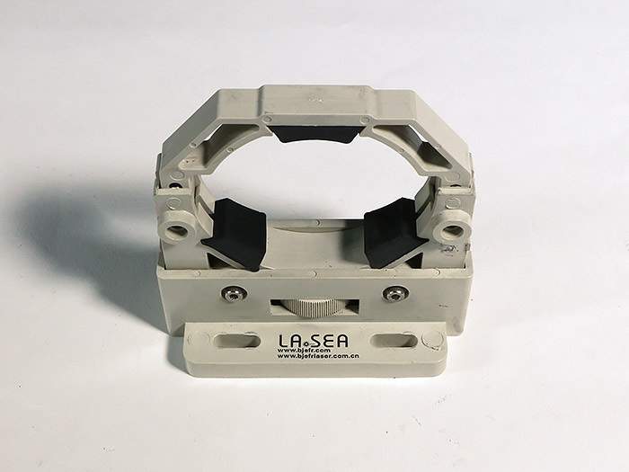
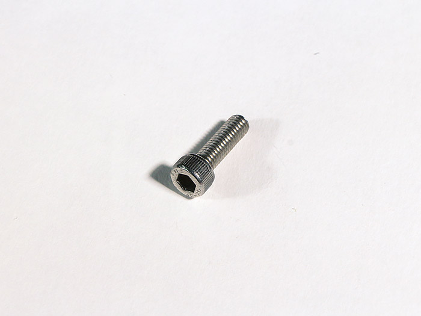
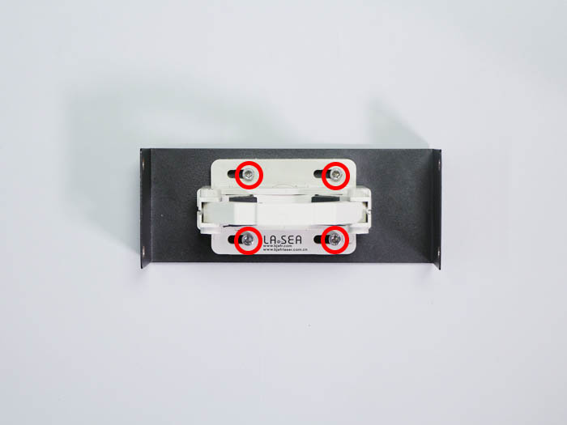
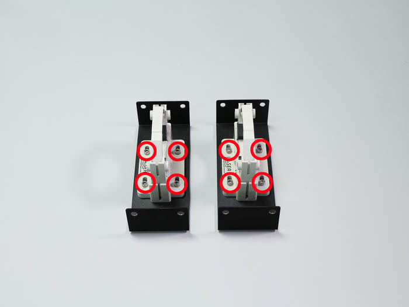

<table class="packing-list">
    <tbody>
        <tr>
            <td>部品名</td>
            <td>備考</td>
            <td class="packing-img">画像</td>
            <td>個数</td>
        </tr>
        <tr>
            <td>チューブマウントプレート</td>
            <td></td>
            <td></td>
            <td>2</td>
        </tr>
        <tr>
            <td>レーザー管マウント</td>
            <td></td>
            <td></td>
            <td>2</td>
        </tr>
        <tr>
            <td>M5x16六角穴付ボルト</td>
            <td></td>
            <td></td>
            <td>8</td>
        </tr>
    </tbody>
</table>

## 工程手順

### レーザー管マウント組み立て

チューブマウントプレートにレーザー管マウントをM5x16六角穴付ボルト4個で取り付けます。

2セット組み立てます。

