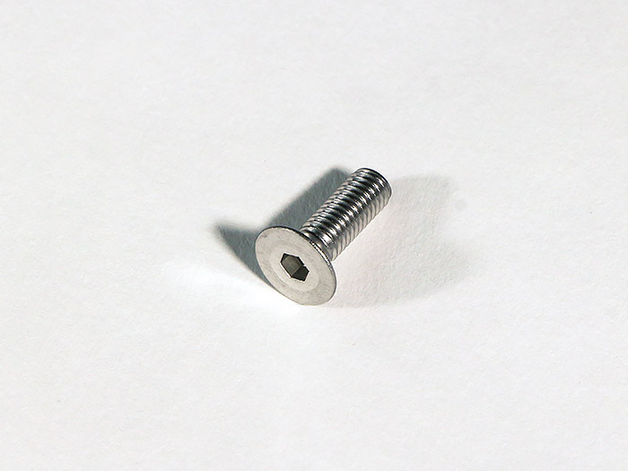
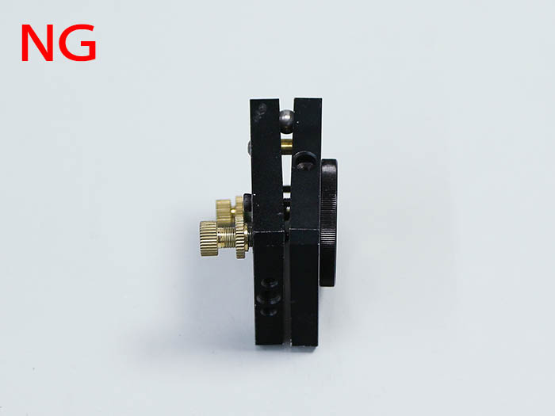

<table class="packing-list">
    <tbody>
        <tr>
            <td>部品名</td>
            <td>備考</td>
            <td class="packing-img">画像</td>
            <td>個数</td>
        </tr>
        <tr>
            <td>ミラーマウント</td>
            <td></td>
            <td></td>
            <td>2</td>
        </tr>
        <tr>
            <td>第1ミラー用アルミフレーム</td>
            <td></td>
            <td></td>
            <td>1</td>
        </tr>
        <tr>
            <td>第2ミラー用アルミフレーム</td>
            <td></td>
            <td></td>
            <td>1</td>
        </tr>
        <tr>
            <td>M5後入ナット</td>
            <td></td>
            <td></td>
            <td>2</td>
        </tr>
        <tr>
            <td>M5x15六角穴付皿ボルト</td>
            <td></td>
            <td></td>
            <td>2</td>
        </tr>
    </tbody>
</table>

## 工程手順

### ミラーマウント調整

ミラーマウントがNG写真のように傾いている場合は、ネジを回して調整して下さい。

### ミラーマウント組み立て

写真のように第1ミラー用アルミフレームにミラーマウントを載せます。

第1ミラー用アルミフレームにミラーマウントをM5後入ナット1個とM5x15六角穴付皿ボルト1個で取り付けます。

写真のように第2ミラー用アルミフレームにミラーマウントを載せます。

第2ミラー用アルミフレームにミラーマウントをM5後入ナット1個とM5x15六角穴付皿ボルト1個で取り付けます。

