<table class="packing-list">
    <tbody>
        <tr>
            <td>部品名</td>
            <td>備考</td>
            <td class="packing-img">画像</td>
            <td>個数</td>
        </tr>
        <tr>
            <td>水冷ポンプ</td>
            <td></td>
            <td>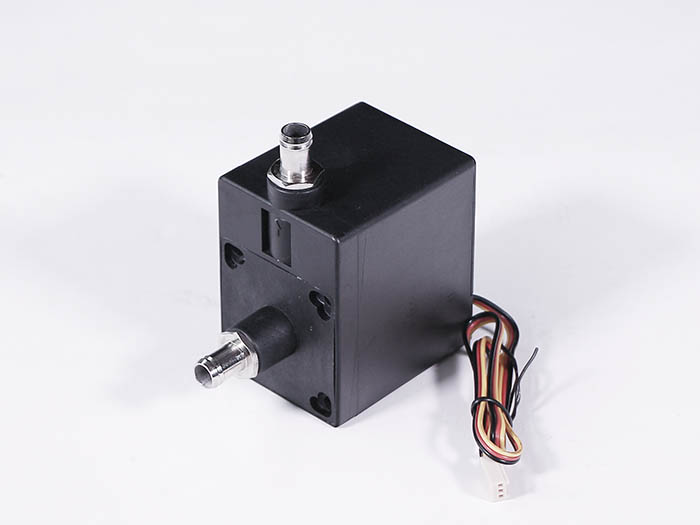</td>
            <td>1</td>
        </tr>
        <tr>
            <td>水冷ポンプマウント</td>
            <td></td>
            <td>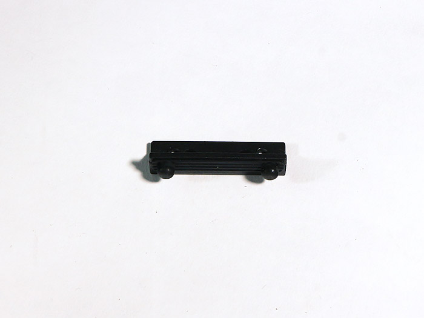</td>
            <td>2</td>
        </tr>
        <tr>
            <td>Utility BKT2</td>
            <td></td>
            <td>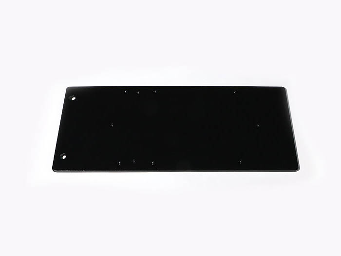</td>
            <td>1</td>
        </tr>
        <tr>
            <td>M3x6六角穴付ボルト</td>
            <td></td>
            <td>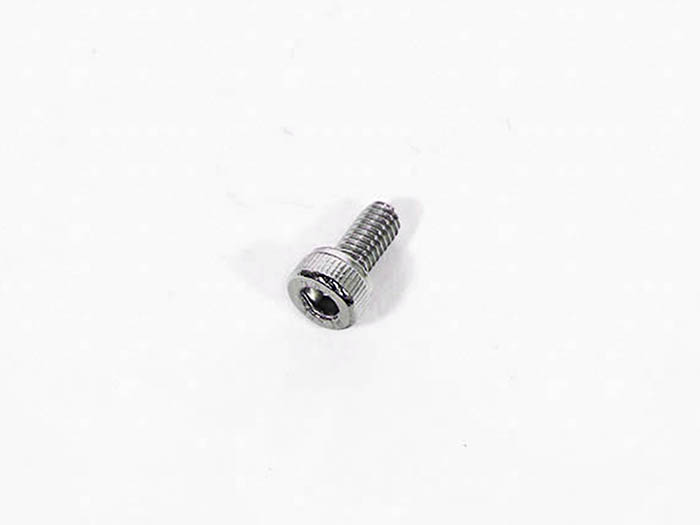</td>
            <td>4</td>
        </tr>
        <tr>
            <td>タンク</td>
            <td></td>
            <td>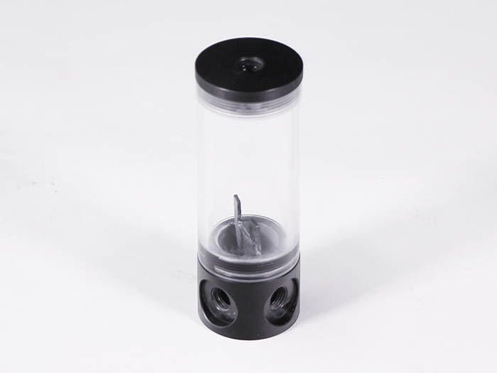</td>
            <td>1</td>
        </tr>
        <tr>
            <td>タンク用ホース接続継手</td>
            <td></td>
            <td>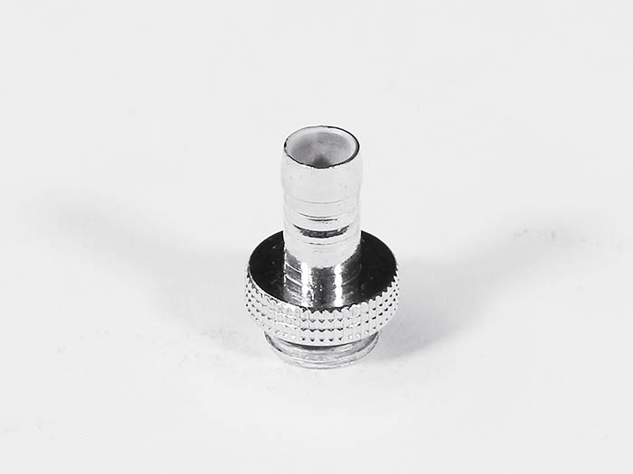</td>
            <td>2</td>
        </tr>
        <tr>
            <td>蓋</td>
            <td>タンクの付属品</td>
            <td>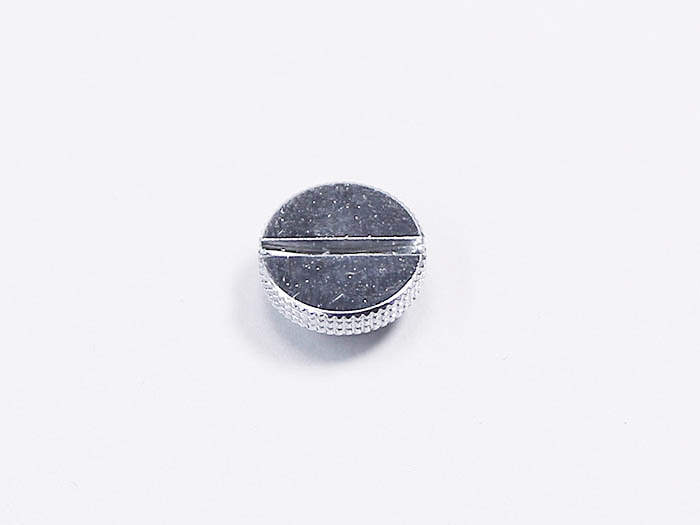</td>
            <td></td>
        </tr>
    </tbody>
</table>

## 工程手順

### 水冷ポンプ組み立て

水冷ポンプに水冷ポンプマウント2個を取り付けます。

Utility BKT2と水冷ポンプには取り付ける向きがあるので注意して下さい。Utility BKT2は突起部分を裏面にして下さい。
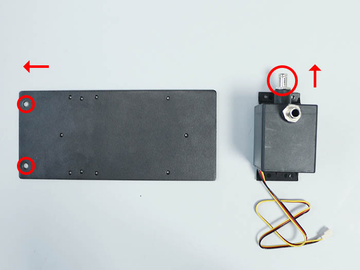

Utility BKT2に水冷ポンプをM3x6六角穴付ボルト4個で取り付けます。
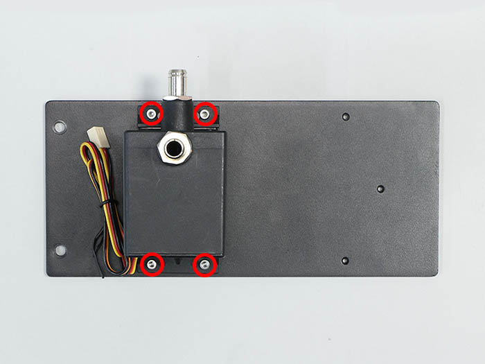

### タンク組み立て

タンクにタンク用ホース接続継手を取り付けます。手で回らなくなるまで締め、ペンチで増し締めを行って下さい。
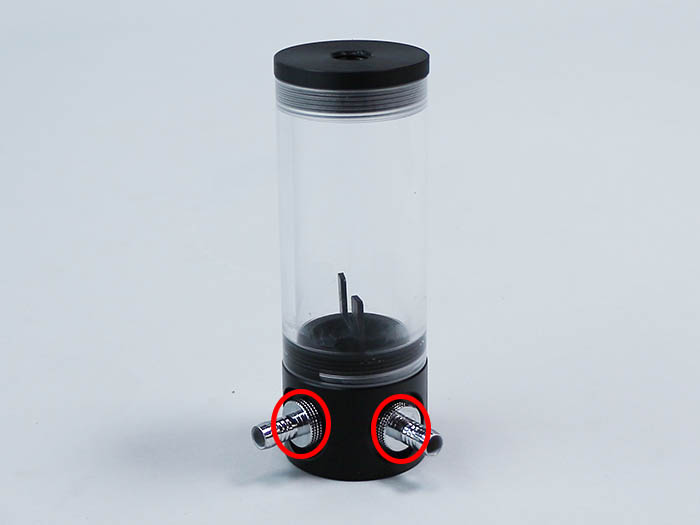

タンクに付属している蓋2個を、上下の取付穴に取り付けます。
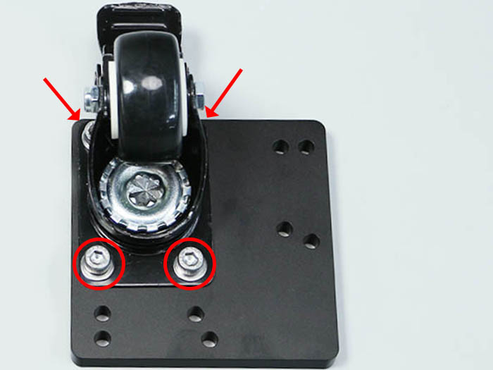
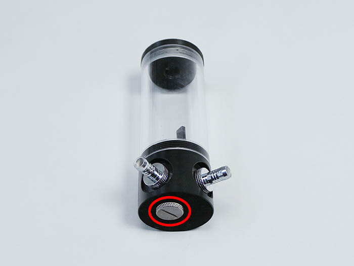