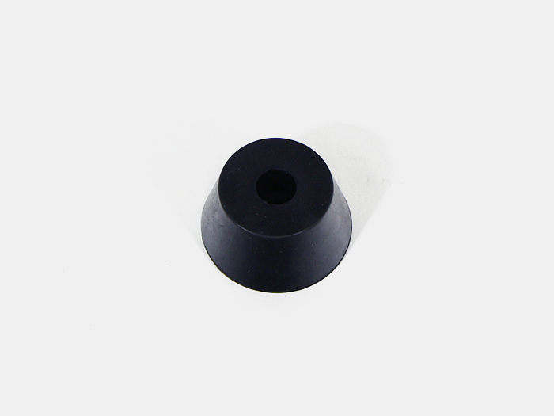

作業台をご購入の方は本工程を省略してください。

<table class="packing-list">
    <tbody>
        <tr>
            <td>部品名</td>
            <td>備考</td>
            <td class="packing-img">画像</td>
            <td>個数</td>
        </tr>
        <tr>
            <td>キャスタープレート</td>
            <td></td>
            <td></td>
            <td>4</td>
        </tr>
        <tr>
            <td>ゴム足</td>
            <td></td>
            <td></td>
            <td>4</td>
        </tr>
        <tr>
            <td>M6x20六角穴付ボルト</td>
            <td></td>
            <td></td>
            <td>4</td>
        </tr>
    </tbody>
</table>

## 工程手順

### キャスター組み立て
キャスタープレートにゴム足を載せて、M6x20六角穴付ボルトで取り付けます。

4セット組み立てます。

