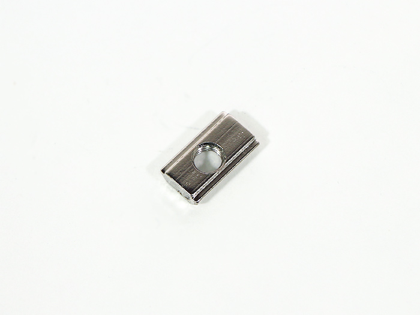
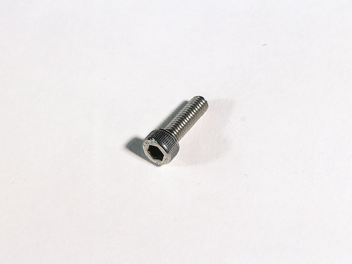
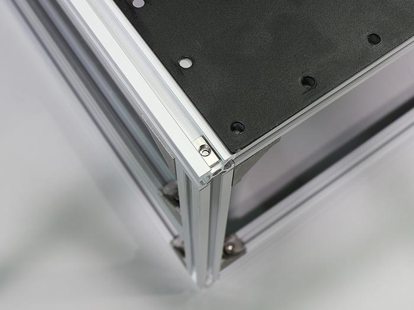

Bottom 取り付けは、[DSレーザー加工機用作業台](https://shop.smartdiys.com/products/detail.php?product_id=836)の有無により作業工程が異なります。
DSレーザー加工機用作業台を[お持ちの方](/hc/ja/articles/360007605672)

## 作業台なし

<table class="packing-list">
    <tbody>
        <tr>
            <td>部品名</td>
            <td>備考</td>
            <td class="packing-img">画像</td>
            <td>個数</td>
        </tr>
        <tr>
            <td>Bottom-F</td>
            <td></td>
            <td></td>
            <td>2</td>
        </tr>
        <tr>
            <td>Bottom-BL</td>
            <td></td>
            <td></td>
            <td>1</td>
        </tr>
        <tr>
            <td>Bottom-BLR</td>
            <td></td>
            <td></td>
            <td>1</td>
        </tr>
        <tr>
            <td>M5x8低頭ボルト</td>
            <td></td>
            <td></td>
            <td>32</td>
        </tr>
        <tr>
            <td>M5後入ナット</td>
            <td></td>
            <td></td>
            <td>48</td>
        </tr>
        <tr>
            <td>キャスタープレート</td>
            <td>キャスター取付済み</td>
            <td></td>
            <td>4</td>
        </tr>
        <tr>
            <td>M5x16六角穴付ボルト</td>
            <td></td>
            <td></td>
            <td>16</td>
        </tr>
    </tbody>
</table>

## 工程手順 (作業台あり)

### Bottom 取り付け

本体フレームを逆さにします。

Bottom-FとBottom-BLとBottom-BLRには取り付ける向きがあるので注意して下さい。

本体フレームに各Bottomを載せて、穴の位置に合わせてM5後入ナット48個を入れます。

各BottomをM5x8低頭ボルト32個で取り付けます。

「キャスター組み立て」で取り付けたキャスタープレートを載せます。

キャスタープレートをM5x16六角穴付ボルト16個で取り付けます。

