<table class="packing-list">
    <tbody>
        <tr>
            <td>部品名</td>
            <td>備考</td>
            <td class="packing-img">画像</td>
            <td>個数</td>
        </tr>
        <tr>
            <td>80Wレーザー電源</td>
            <td></td>
            <td>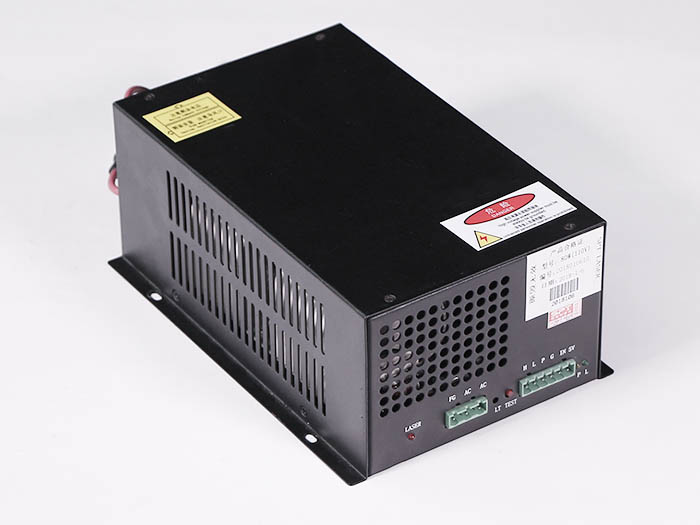</td>
            <td>1</td>
        </tr>
        <tr>
            <td>中継基板</td>
            <td></td>
            <td>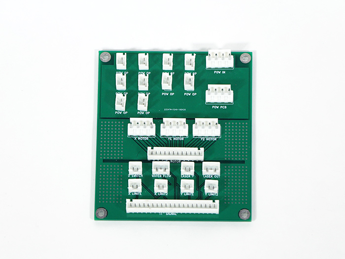</td>
            <td>1</td>
        </tr>
        <tr>
            <td>Utility BKT 2</td>
            <td></td>
            <td>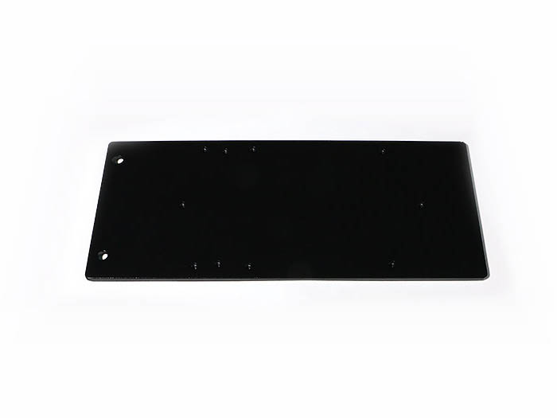</td>
            <td>1</td>
        </tr>
        <tr>
            <td>Utility BKT 1</td>
            <td></td>
            <td>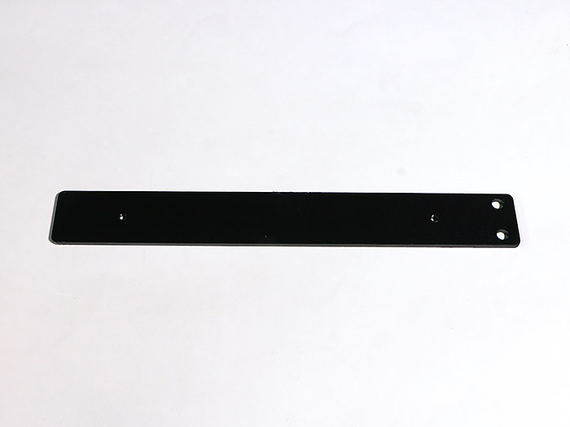</td>
            <td>2</td>
        </tr>
        <tr>
            <td>M4x6六角穴付ボルト</td>
            <td></td>
            <td>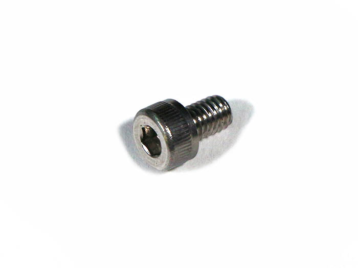</td>
            <td>4</td>
        </tr>
        <tr>
            <td>M3x5ナイロンネジ</td>
            <td></td>
            <td></td>
            <td>4</td>
        </tr>
        <tr>
            <td>六角スペーサーオネジ</td>
            <td></td>
            <td>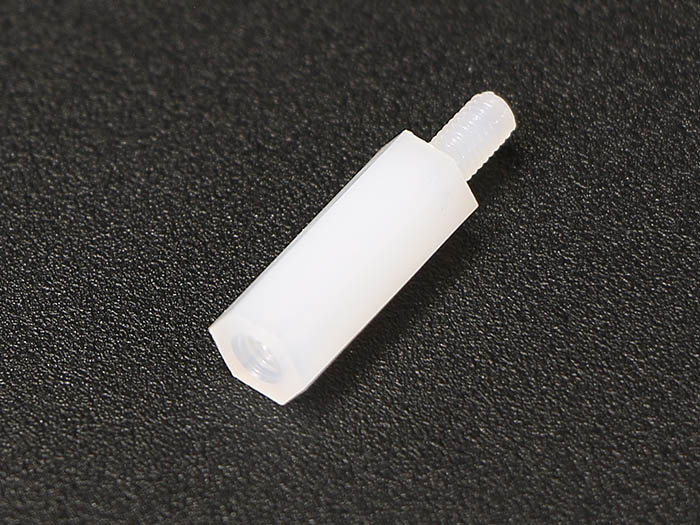</td>
            <td>4</td>
        </tr>
    </tbody>
</table>

## 組立手順

### 中継基板組み立て

Utility BKT 2には取り付ける向きがあるので注意して下さい。
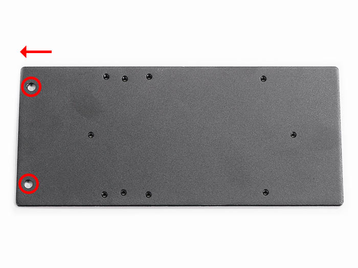

Utility BKT 2に六角スペーサーオネジ4個を取り付けます。
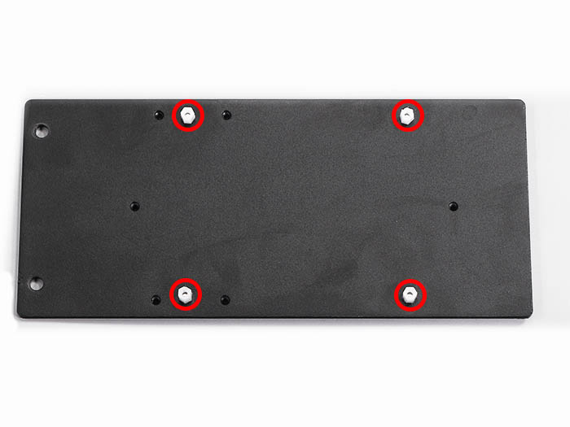

六角スペーサーオネジに中継基板のネジ穴を合わせて載せて、M3x5ナイロンネジ4個で取り付けます。

### 80Wレーザー電源組み立て

Utility BKT 1と80Wレーザー電源には取り付ける向きがるので注意して下さい。
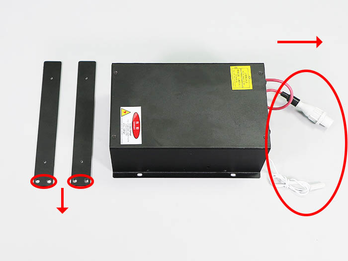

Utility BKT 1に80Wレーザー電源をM4x6六角穴付ボルト4個で取り付けます。
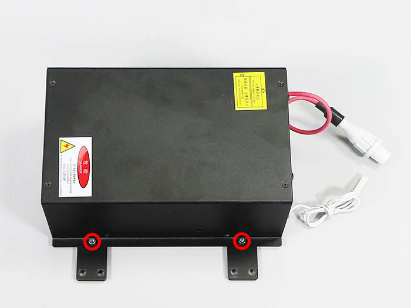
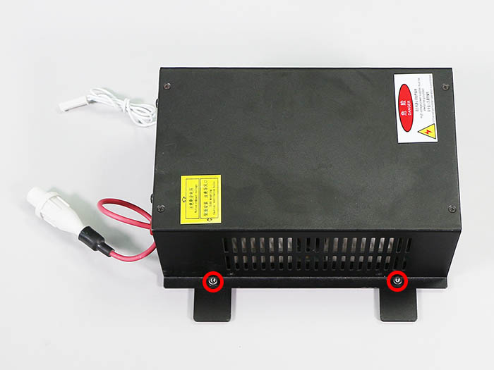