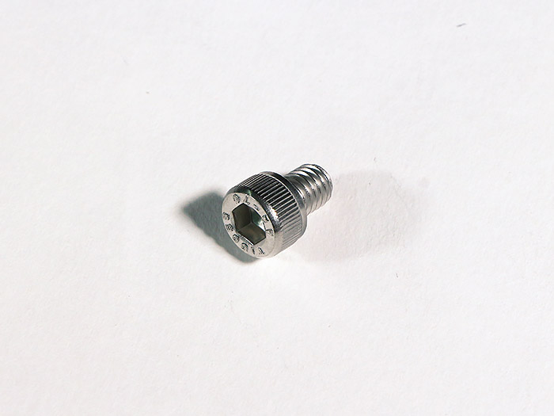
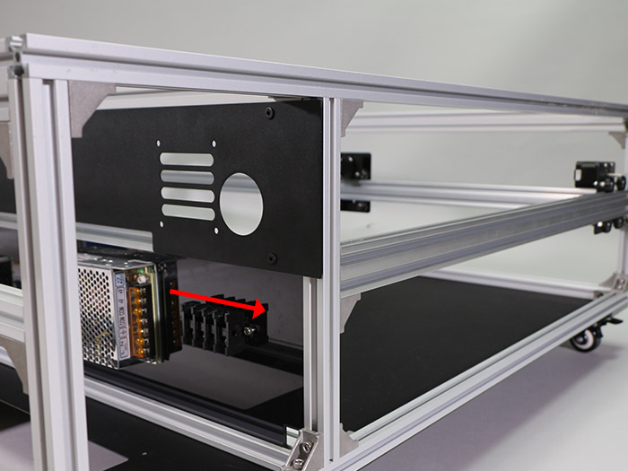
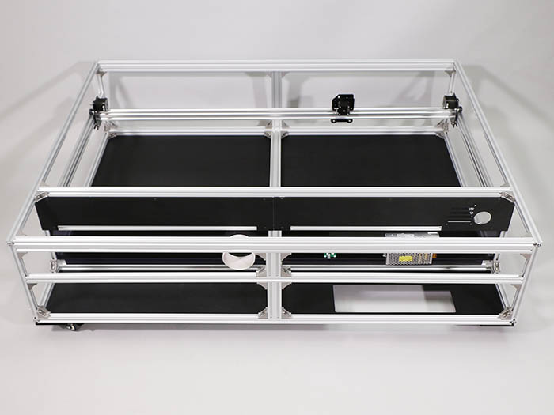

<table class="packing-list">
    <tbody>
        <tr>
            <td>部品名</td>
            <td>備考</td>
            <td class="packing-img">画像</td>
            <td>個数</td>
        </tr>
        <tr>
            <td>キャスタープレート</td>
            <td></td>
            <td></td>
            <td>4</td>
        </tr>
        <tr>
            <td>キャスター</td>
            <td></td>
            <td></td>
            <td>4</td>
        </tr>
        <tr>
            <td>M6ワッシャー</td>
            <td></td>
            <td></td>
            <td>16</td>
        </tr>
        <tr>
            <td>M6x8六角穴付ボルト</td>
            <td></td>
            <td></td>
            <td>16</td>
        </tr>
    </tbody>
</table>

## 工程手順

### キャスター組み立て

キャスタープレートには取り付ける向きがあるので注意して下さい。

キャスタープレートにキャスターを載せて、M6ワッシャー4個とM6x8六角穴付ボルト4個で取り付けます。

2セット組み立てます。

残りのキャスタープレートも取り付ける向きがあるので注意して下さい。

キャスタープレートにキャスターを載せて、M6ワッシャー4個とM6x8六角穴付ボルト4個で取り付けます。

2セット組み立てます。

