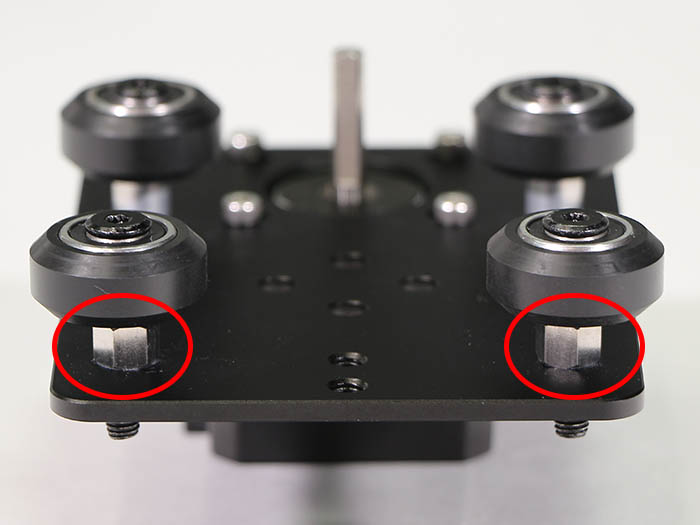
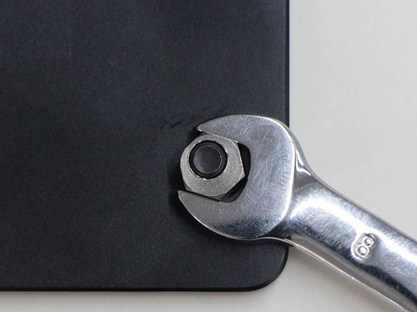
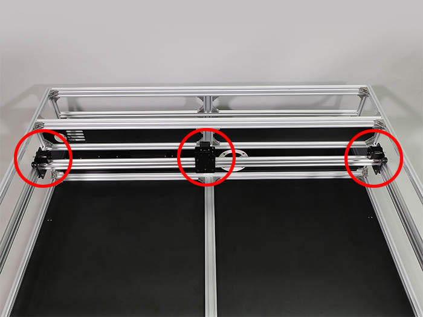

## 工程手順

### 偏心スペーサー調整 動画

    <iframe allowfullscreen="" frameborder="0" height="315" src="//www.youtube-nocookie.com/embed/NLk_4KXsxtQ" width="560">
    </iframe>

### 偏心スペーサー調整 手順

偏心スペーサーはXY軸ユニットの下段部分に取り付けてあります。

XY軸ユニットの偏心スペーサーを回し、フレームにホイール部分が触れる程度に調整してください。

XY軸ユニット1個につき下段の2個のホイールを調整します。合計で6か所のホイールを調整します。

