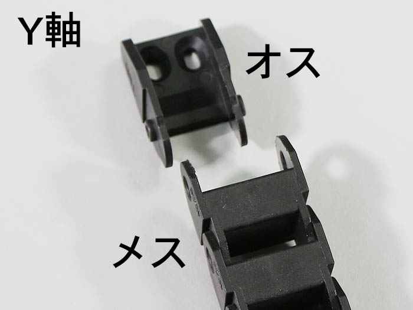

<table class="packing-list">
    <tbody>
        <tr>
            <td>部品名</td>
            <td>備考</td>
            <td class="packing-img">画像</td>
            <td>個数</td>
        </tr>
        <tr>
            <td>Inner R</td>
            <td></td>
            <td></td>
            <td>1</td>
        </tr>
        <tr>
            <td>Inner L</td>
            <td></td>
            <td></td>
            <td>1</td>
        </tr>
        <tr>
            <td>M5x8低頭ボルト</td>
            <td></td>
            <td></td>
            <td>10</td>
        </tr>
        <tr>
            <td>M5後入ナット</td>
            <td></td>
            <td></td>
            <td>10</td>
        </tr>
    </tbody>
</table>

## 工程手順

### Inner R 取り付け

Inner Rには取り付ける向きがあるので注意して下さい。

本体フレーム背面から図のように合わせます。

Inner RをM5後入ナット5個とM5x8低頭ボルト5個で取り付けます。

### Inner L 取り付け

Inner Lには取り付ける向きがあるので注意して下さい。

本体フレーム背面から図のように合わせます。

Inner LをM5後入ナット5個とM5x8低頭ボルト5個で取り付けます。

