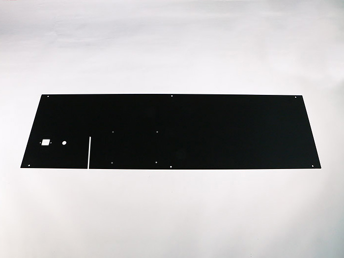
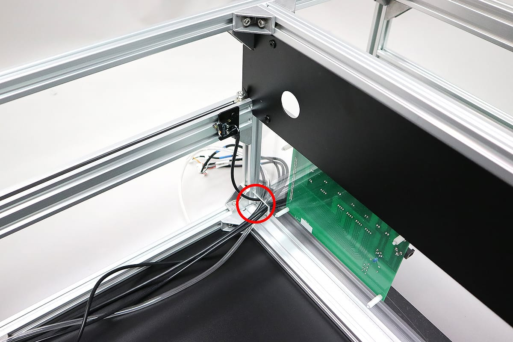

<table class="packing-list">
    <tbody>
        <tr>
            <td>部品名</td>
            <td>備考</td>
            <td class="packing-img">画像</td>
            <td>個数</td>
        </tr>
        <tr>
            <td>FLD L</td>
            <td></td>
            <td></td>
            <td>1</td>
        </tr>
        <tr>
            <td>FLD R</td>
            <td></td>
            <td></td>
            <td>1</td>
        </tr>
        <tr>
            <td>Cover Left</td>
            <td></td>
            <td></td>
            <td>1</td>
        </tr>
        <tr>
            <td>Cover Right</td>
            <td></td>
            <td></td>
            <td>1</td>
        </tr>
        <tr>
            <td>AC-Mainケーブル</td>
            <td></td>
            <td></td>
            <td>1</td>
        </tr>
        <tr>
            <td>Y1-Limitケーブル</td>
            <td></td>
            <td></td>
            <td>1</td>
        </tr>
        <tr>
            <td>Switchケーブル</td>
            <td></td>
            <td></td>
            <td>1</td>
        </tr>
        <tr>
            <td>Relayケーブル</td>
            <td></td>
            <td></td>
            <td>1</td>
        </tr>
        <tr>
            <td>AC-Switchケーブル</td>
            <td></td>
            <td></td>
            <td>1</td>
        </tr>
        <tr>
            <td>PCBケース</td>
            <td></td>
            <td></td>
            <td>1</td>
        </tr>
        <tr>
            <td>パネルタッチコネクタ</td>
            <td>色違いの場合あり</td>
            <td></td>
            <td>1</td>
        </tr>
        <tr>
            <td>M3後入ナット</td>
            <td></td>
            <td></td>
            <td>21</td>
        </tr>
        <tr>
            <td>M4x6低頭ボルト</td>
            <td></td>
            <td></td>
            <td>4</td>
        </tr>
        <tr>
            <td>M5x8低頭ボルト</td>
            <td></td>
            <td></td>
            <td>24</td>
        </tr>
        <tr>
            <td>M5後入ナット</td>
            <td></td>
            <td></td>
            <td>24</td>
        </tr>
        <tr>
            <td>M3x6六角穴付ボルト</td>
            <td></td>
            <td></td>
            <td>20</td>
        </tr>
        <tr>
            <td>M3x10六角穴付皿ボルト</td>
            <td></td>
            <td></td>
            <td>2</td>
        </tr>
        <tr>
            <td>M3x12六角穴付ボルト</td>
            <td></td>
            <td></td>
            <td>1</td>
        </tr>
        <tr>
            <td>M2x8六角穴付ボルト</td>
            <td></td>
            <td></td>
            <td>4</td>
        </tr>
        <tr>
            <td>M3ナット</td>
            <td></td>
            <td></td>
            <td>2</td>
        </tr>
        <tr>
            <td>結束バンド固定具</td>
            <td></td>
            <td></td>
            <td>20</td>
        </tr>
        <tr>
            <td>結束バンド</td>
            <td></td>
            <td></td>
            <td>8</td>
        </tr>
    </tbody>
</table>

## 工程手順

### Cover 取り付け

Cover Rightを本体フレーム正面右側にM5x8低頭ボルト6個とM5後入ナット6個で取り付けます。

Cover Leftを本体フレーム正面左側にM5x8低頭ボルト6個とM5後入ナット6個で取り付けます。

### ケーブル 取り付け

写真を参考にSwitchケーブルのスイッチをM2x8六角穴付ボルト2個でリミットマウントに、マグネットをM3x12六角穴付ボルト1個とM3後入ナット1個で取り付けます。

写真を参考にY1-LimitケーブルをM2x8六角穴付ボルト2個で、リミットマウントに取り付けます。

Inner Leftの赤丸の位置から装置背面側に向かって以下を通します。
- Y1-Limitケーブル
- Switchケーブル

Cover RightにAC-Switchケーブルを取り付けます。写真の向きで挿入します。

Cover Rightに固定するため、奥までしっかりと入れて下さい。 ※写真の状態がOFFです。組立時はOFFの状態にしてください。

Inner Rightの赤丸の位置から装置背面側に向かってAC-Switchケーブルを通します。

### 結束バンド固定具取り付け

本体フレームに、結束バンド固定具をM3x6六角穴付ボルトとM3後入ナットで取り付けます。取付方法は写真を参考にして下さい。

本体背面側に結束バンド固定具6個をM3x6六角穴付ボルト6個とM3後入ナット6個で取り付けます。中継基板左上の結束バンド固定具は横向きに取り付けてください。

本体背面中段に、結束バンド固定具3個をM3後入ナット3個とM3x6六角穴付ボルト3個で取り付けます。

本体背面下段に、結束バンド固定具3個をM3後入ナット3個とM3x6六角穴付ボルト3個で取り付けます。

本体右側に、結束バンド固定具3個をM3後入ナット3個とM3x6六角穴付ボルト3個で取り付けます。

本体左側に、結束バンド固定具3個をM3後入ナット3個とM3x6六角穴付ボルト3個で取り付けます。

V-slot 1348mmの下側の溝に、結束バンド固定具2個をM3後入ナット2個とM3x6六角穴付ボルト2個で取り付けます。

本体右側に取り付けた結束バンド固定具に、結束バンドで以下ケーブルを固定します。ケーブルキャリアに接触しないように配線してください。

&lt;左側2ヶ所&gt;
- AC-Switchケーブル

&lt;右側1ヶ所&gt;
- AC-Switchケーブル
- Y-Motor-Rケーブル

V-slot 1348mmに取り付けた結束バンド固定具に、結束バンドで以下ケーブルを固定します。
&lt;V-slot 1348mm&gt;
- ポリウレタンチューブ
- X-Motorケーブル

本体左側に取り付けた結束バンド固定具に、結束バンドで以下ケーブルを固定します。

&lt;左側1ヶ所&gt;
- ポリウレタンチューブ
- X-Motorケーブル
- Y-Motor-Lケーブル
- Switchケーブル

&lt;右側2ヶ所&gt;
- Switchケーブル

### カバー 取り付け 続き

FLD Rを本体フレーム右側にM5x8低頭ボルト6個とM5後入ナット6個で取り付けます。

RelayケーブルをPCBケースに差し込みます。 差込口の中心に出っ張りがある方をPCBケースに差し込みます。このとき、ピンクのラインが下にくる向きにしてください。

RelayケーブルをCover leftの隙間に差し込みます。

FLD Lを本体フレーム左側にM5x8低頭ボルト6個とM5後入ナット6個で取り付けます。

パネルタッチコネクタのナットを1個外します。

FLD LにAC-MainケーブルをM3x10六角穴付皿ボルト2個とM3ナット2個で取り付け、パネルタッチコネクタも取り付けます。ポリウレタンチューブをパネルタッチコネクタに奥まで接続します。レーザーヘッド側のポリウレタンチューブが365mm出ているか確認し、パネルタッチコネクタ側のポリウレタンチューブが中継基板側に弛む場合はカットして長さを調整してください。

FLD LにM4x6低頭ボルト4個でPCBケースを取り付けます。

RelayケーブルPCBケースに差し込みます。

Relayケーブルを奥まで差し込み、両端の爪が立つことを確認してください。

