<table class="packing-list">
    <tbody>
        <tr>
            <td>部品名</td>
            <td>備考</td>
            <td class="packing-img">画像</td>
            <td>個数</td>
        </tr>
        <tr>
            <td>ケーブルキャリア X軸</td>
            <td>取付ブラケット取り外し済み</td>
            <td>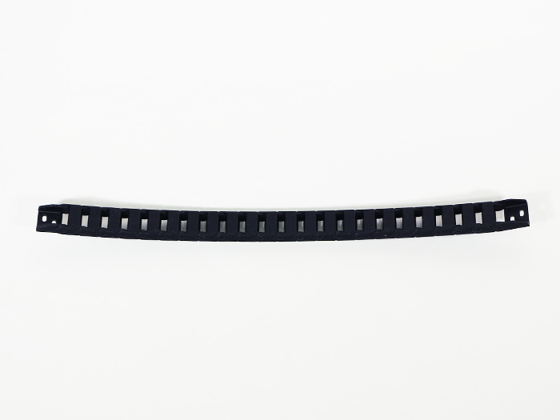</td>
            <td>1</td>
        </tr>
        <tr>
            <td>ケーブルキャリア Y軸</td>
            <td>取付ブラケット取り外し済み</td>
            <td>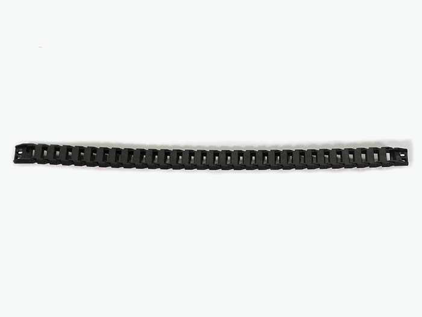</td>
            <td>2</td>
        </tr>
        <tr>
            <td>X-Motorケーブル</td>
            <td></td>
            <td>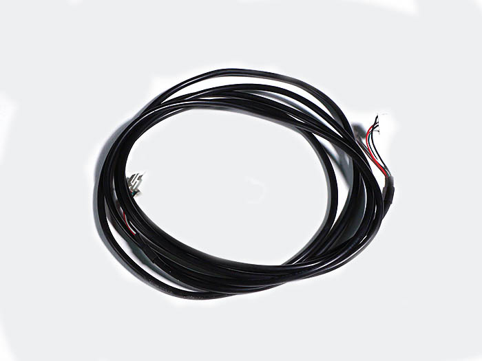</td>
            <td>1</td>
        </tr>
        <tr>
            <td>Y-Motor-Rケーブル</td>
            <td></td>
            <td>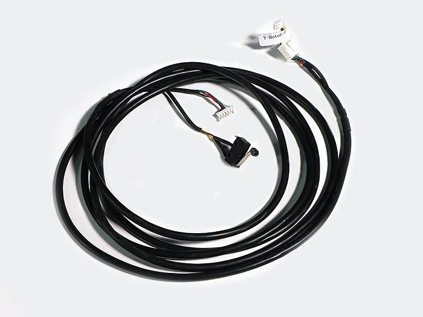</td>
            <td>1</td>
        </tr>
        <tr>
            <td>Y-Motor-Lケーブル</td>
            <td></td>
            <td></td>
            <td>1</td>
        </tr>
        <tr>
            <td>ポリウレタンチューブ</td>
            <td></td>
            <td>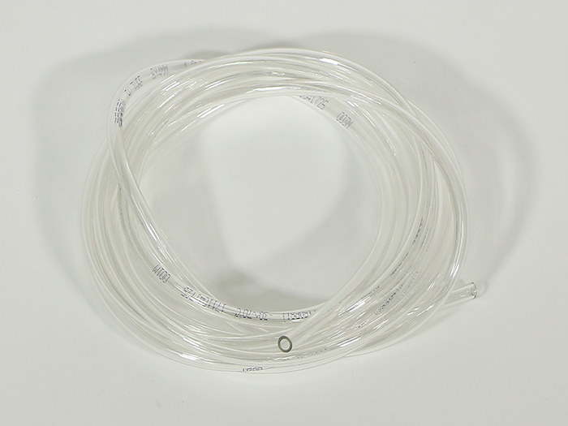</td>
            <td>1</td>
        </tr>
        <tr>
            <td>M2x8六角穴付ボルト</td>
            <td></td>
            <td></td>
            <td>4</td>
        </tr>
    </tbody>
</table>

## 工程手順

### ケーブルキャリア配線

ポリウレタンチューブとX-Motorケーブルをテープ等でまとめます。
X-Motorケーブルには取り付ける向きがあるので注意して下さい。

ケーブルキャリアX軸のオス側から通します。
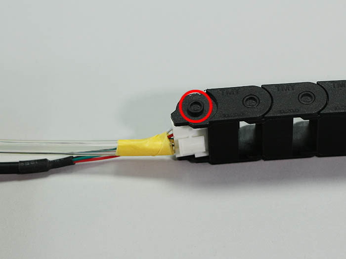
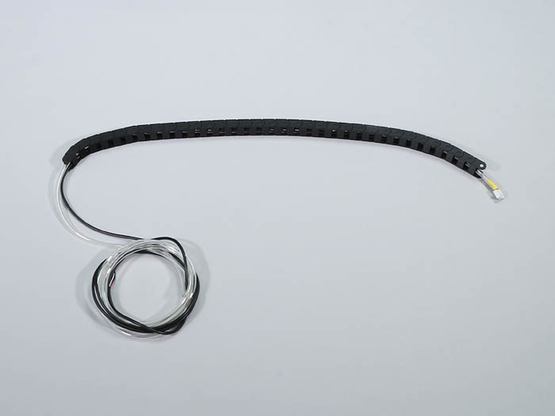

ポリウレタンチューブとX-MotorケーブルにY-Motor-Lケーブルをテープ等でまとめます。Y-Motor-Lケーブルには取り付ける向きがあるので注意して下さい。
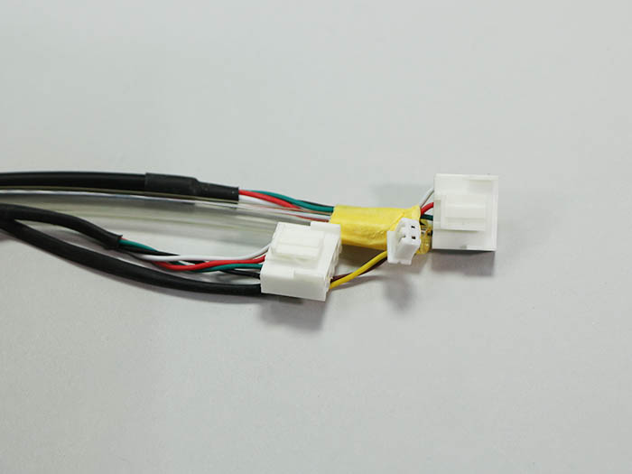
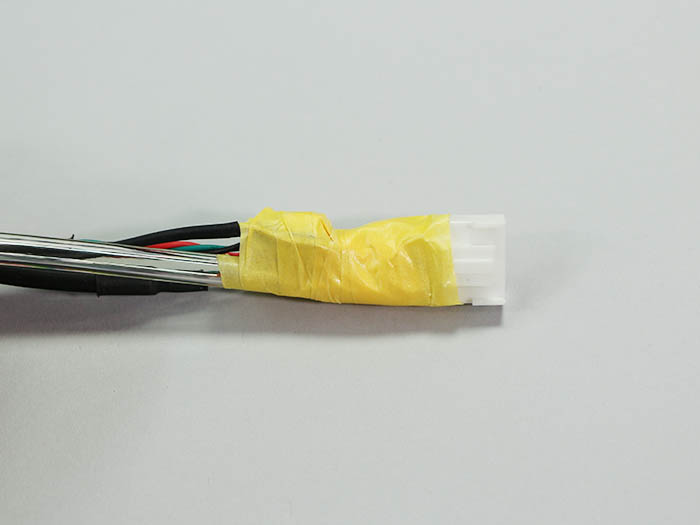

ケーブルキャリアY軸のオス側から通します。
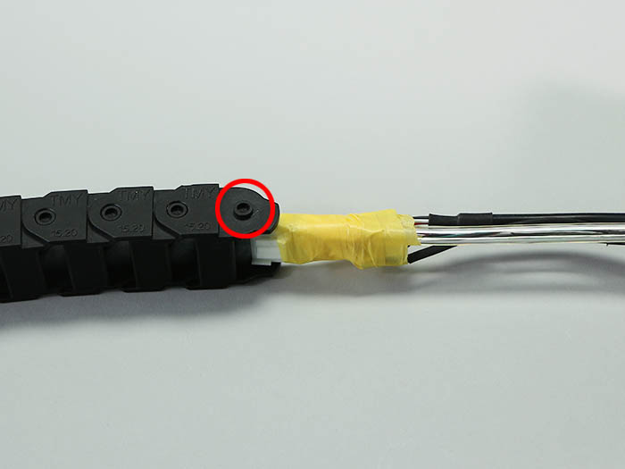

A~Dの順にケーブルキャリアを取り付けます。
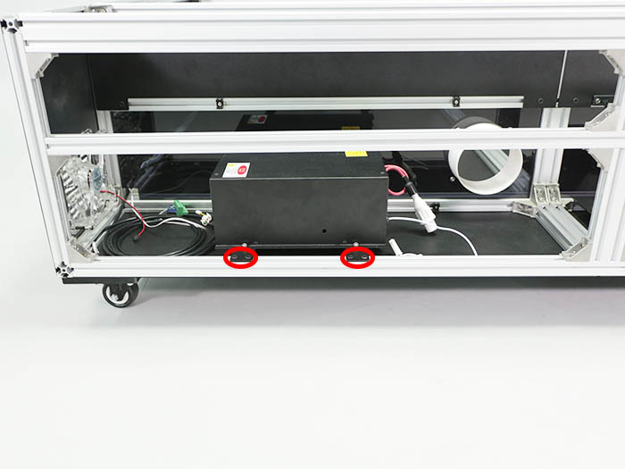
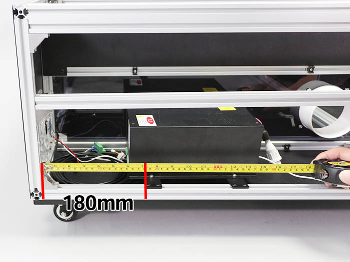

ポリウレタンチューブを写真のようにケーブルキャリアx軸から約365mm出してください。

X軸のステッピングモーターにX-Motorケーブルのコネクタを取り付けます。
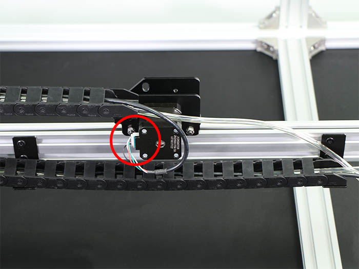

リミットマウントにY-Motor-LケーブルのスイッチをM2x8六角穴付ボルト2個で取り付けます。
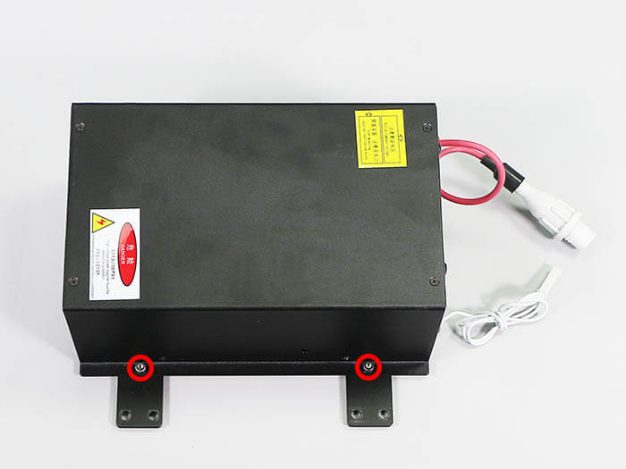

Y軸LのステッピングモーターにY-Motor-Lケーブルのコネクタを取り付けます。
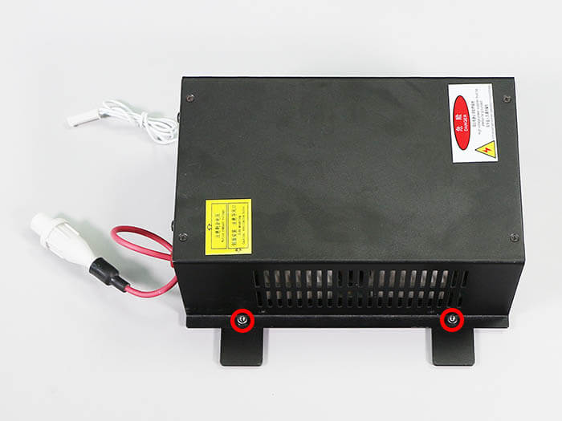

Y-Motor-Rケーブルをテープ等でまとめます。
Y-Motor-Rケーブルには取り付ける向きがあるので注意して下さい。
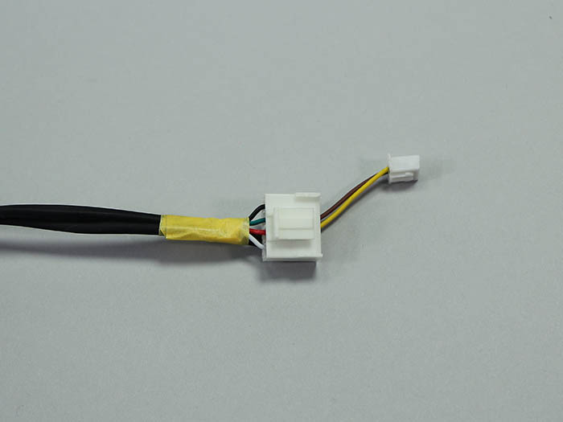

ケーブルキャリアY軸のオス側から通します。
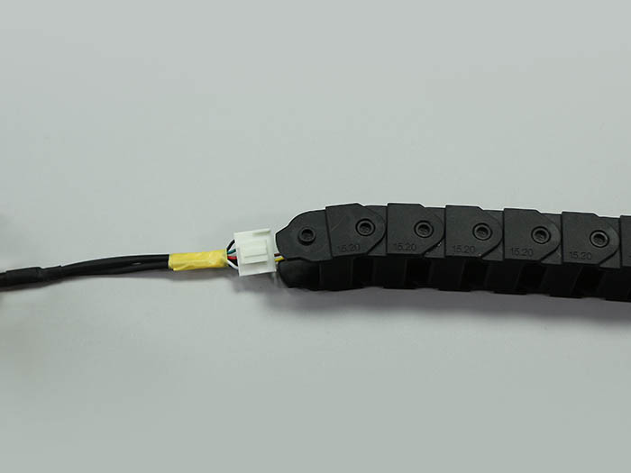

E・Fの順にケーブルキャリアY軸を取り付けます。
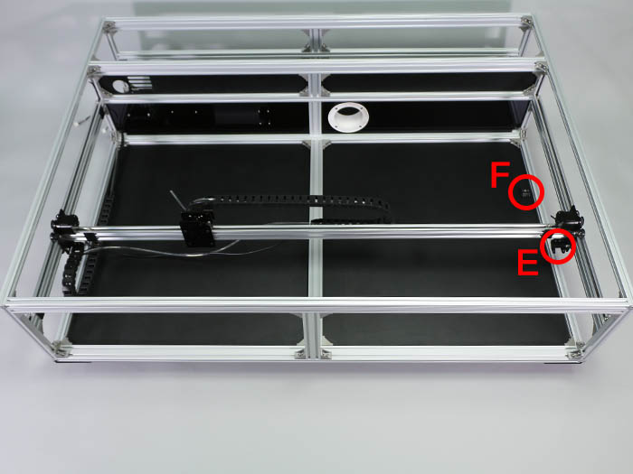
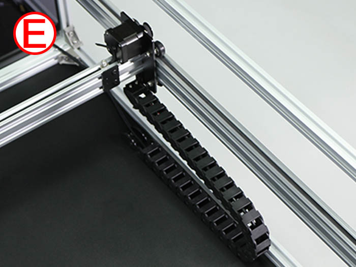
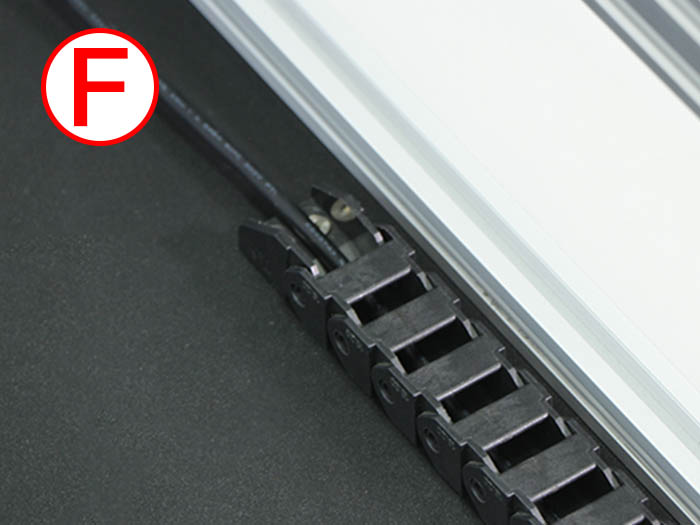
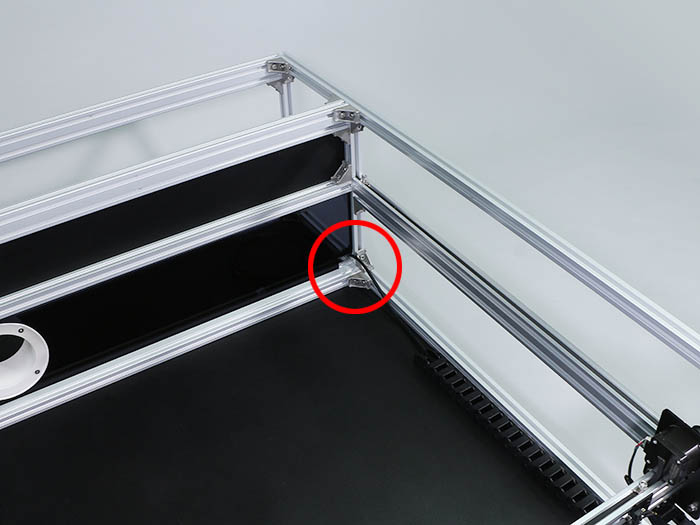

リミットマウントにY-Motor-RケーブルのスイッチをM2x8六角穴付ボルト2個で取り付けます。
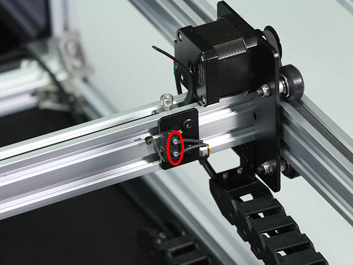

Y軸RのステッピングモーターにY-Motor-Rケーブルのコネクタを取り付けます。
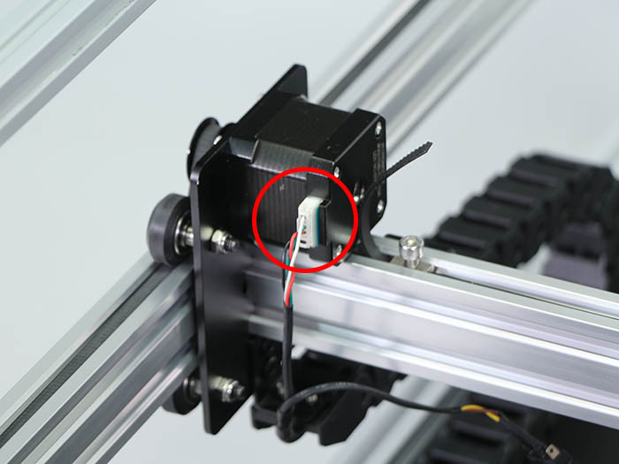