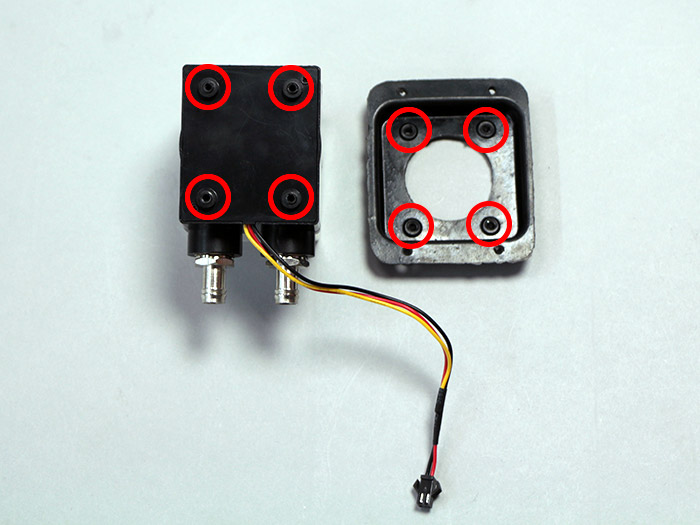

<table class="packing-list">
    <tbody>
        <tr>
            <td>部品名</td>
            <td>備考</td>
            <td class="packing-img">画像</td>
            <td>個数</td>
        </tr>
        <tr>
            <td>水冷ポンプ</td>
            <td></td>
            <td></td>
            <td>1</td>
        </tr>
        <tr>
            <td>タッピングネジ</td>
            <td></td>
            <td></td>
            <td>1</td>
        </tr>
        <tr>
            <td>ラジエーターユニット</td>
            <td></td>
            <td></td>
            <td>1</td>
        </tr>
        <tr>
            <td>レーザー電源</td>
            <td></td>
            <td></td>
            <td>1</td>
        </tr>
        <tr>
            <td>Utility BKT 1</td>
            <td></td>
            <td></td>
            <td>2</td>
        </tr>
        <tr>
            <td>アダプタマウント</td>
            <td></td>
            <td></td>
            <td>1</td>
        </tr>
        <tr>
            <td>M5x8低頭ボルト</td>
            <td></td>
            <td></td>
            <td>4</td>
        </tr>
        <tr>
            <td>M5後入ナット</td>
            <td></td>
            <td></td>
            <td>4</td>
        </tr>
        <tr>
            <td>M4x6六角穴付ボルト</td>
            <td></td>
            <td></td>
            <td>12</td>
        </tr>
    </tbody>
</table>

## 工程手順

### 水冷ポンプ 取り付け
タッピングネジ4個で水冷ポンプに付属しているゴムの台座を取り付けます。

### 水冷装置 取り付け
ラジエータ―ユニットをBottom-BLにM4x6六角穴付ボルト4個で取り付けます。

水冷ポンプ をBottom-BLにM4x6六角穴付ボルト4個で取り付けます。

写真を参考に中心のフレームから約150mmの位置に、アダプタマウントをM5後入ナット2個とM5x6低頭ボルト2個で取り付けます。

### レーザー電源 取り付け

Utility BKT 1と80Wレーザー電源には取り付ける向きがるので注意して下さい。

Utility BKT 1に80Wレーザー電源をM4x6六角穴付ボルト4個で取り付けます。

取り付け注意

レーザー電源ユニットを本体フレームにM5x8低頭ボルト4個とM5後入ナット4個で取り付けます。

写真を参考に左フレーム内側から210mmの位置に80Wレーザー電源を取り付けてください。

レーザー電源にLaserケーブルを接続します。

以下のケーブルを、レーザー電源ユニットの下を通して、取り付けておいた結束バンド固定具に結束バンドで固定して下さい。
- Y-Motor-Rケーブル
- Laserケーブル

水冷ポンプにPumpケーブルを接続します。

以下のケーブルを、取り付けておいた結束バンド固定具に結束バンドで固定して下さい。
- Y-Motor-Rケーブル
- Laserケーブル
- Pumpケーブル

