<table class="packing-list">
    <tbody>
        <tr>
            <td>部品名</td>
            <td>備考</td>
            <td class="packing-img">画像</td>
            <td>個数</td>
        </tr>
        <tr>
            <td>AC-Laserケーブル</td>
            <td></td>
            <td>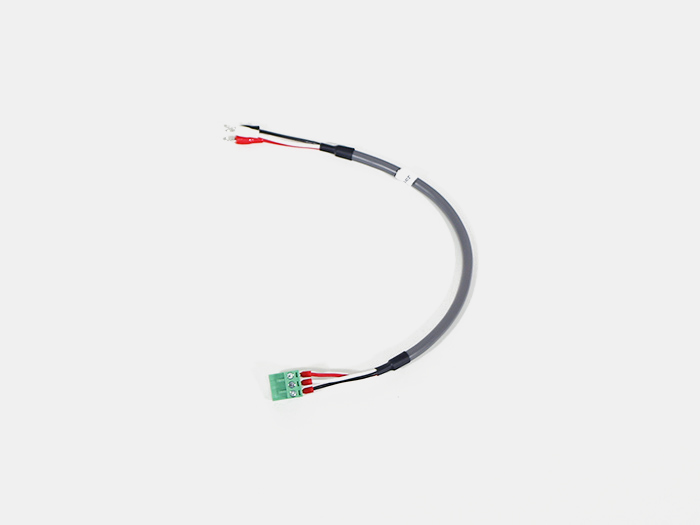</td>
            <td>1</td>
        </tr>
        <tr>
            <td>Ground(S)ケーブル</td>
            <td></td>
            <td>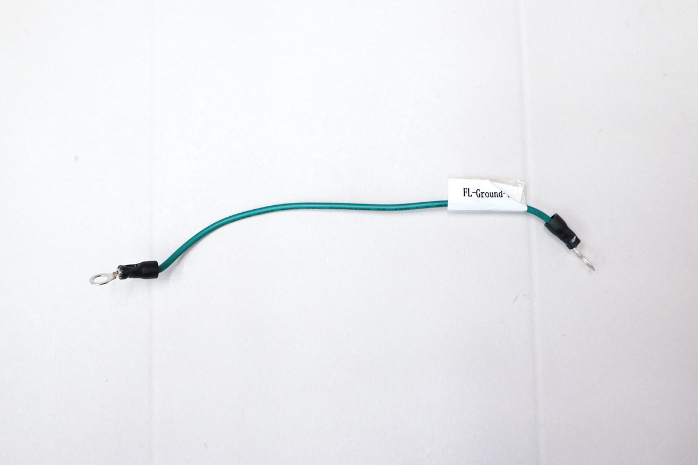</td>
            <td>1</td>
        </tr>
        <tr>
            <td>ACアダプタ</td>
            <td></td>
            <td></td>
            <td>1</td>
        </tr>
        <tr>
            <td>M5x8六角穴付ボルト</td>
            <td></td>
            <td></td>
            <td>1</td>
        </tr>
        <tr>
            <td>M5後入ナット</td>
            <td></td>
            <td></td>
            <td>1</td>
        </tr>
        <tr>
            <td>歯付きワッシャー</td>
            <td></td>
            <td>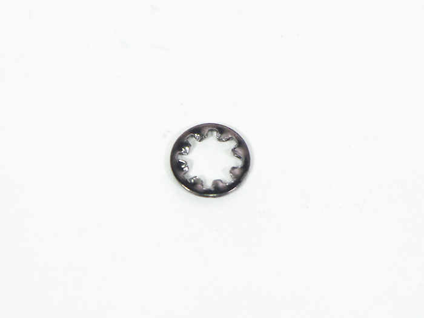</td>
            <td>1</td>
        </tr>
        <tr>
            <td>M5ワッシャー</td>
            <td></td>
            <td></td>
            <td>1</td>
        </tr>
        <tr>
            <td>結束バンド</td>
            <td></td>
            <td></td>
            <td>5</td>
        </tr>
    </tbody>
</table>

## 工程手順

### ACライン 配線

レーザー電源にAC-Laserケーブルを接続します。
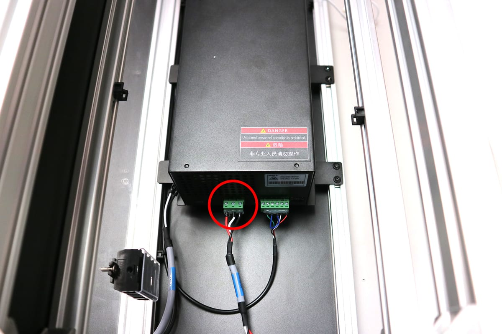

写真を参考に、取り付けた結束バンド固定具にAC-Mainケーブルを結束バンドで固定します。
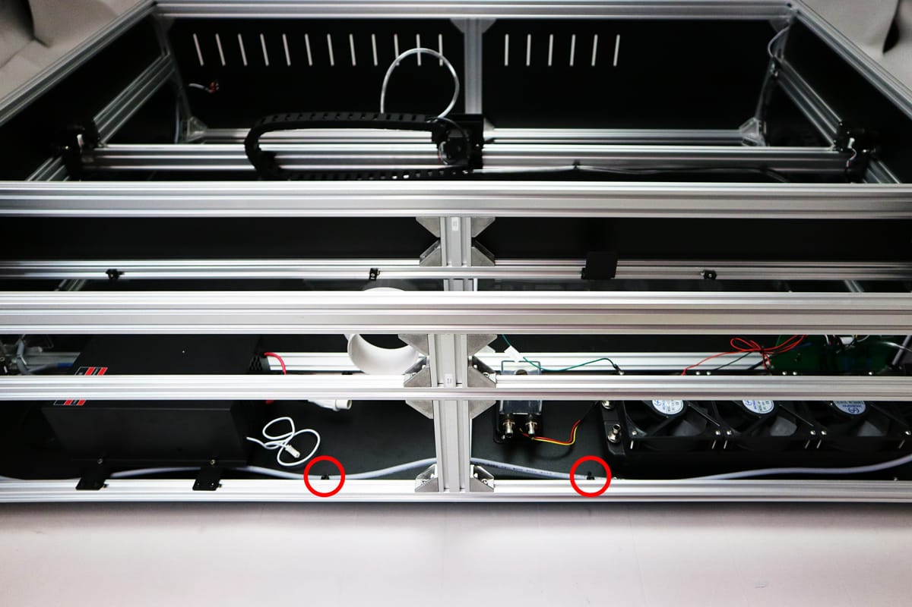
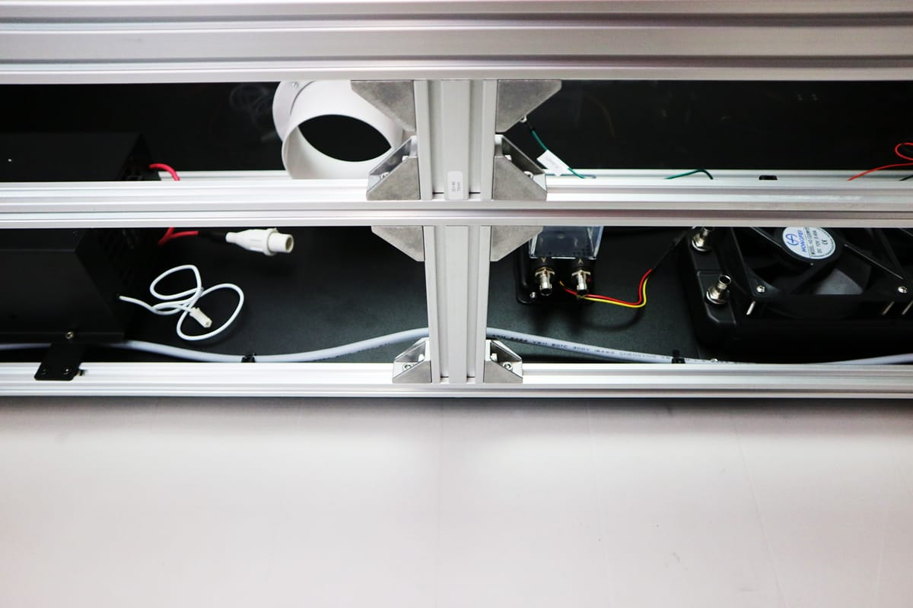

写真の通りに端子台に各ケーブルを取り付けます。線の色を参考にして下さい。
※こちらの配線が間違えていた場合、通電時に本体が破損する可能性があります。
※Ground(S)ケーブルには取り付ける向きがあるので注意して下さい。
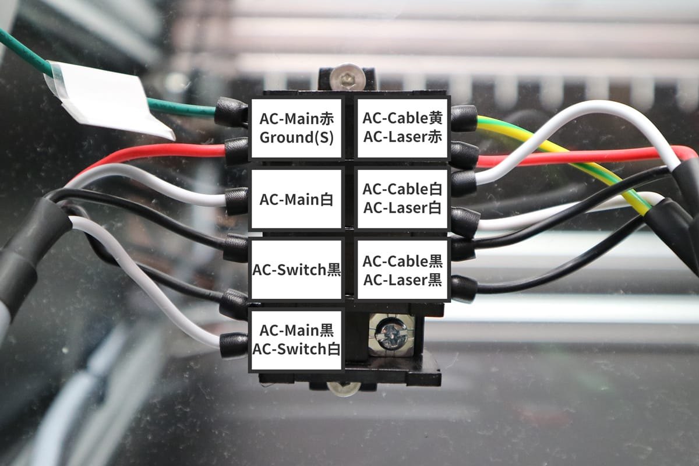
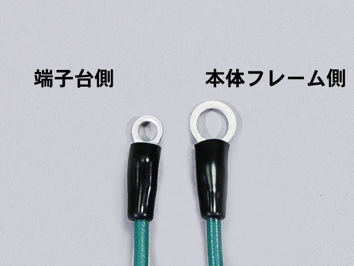

Ground-Sケーブルを写真の順番で本体に取り付けます。
- M5x8六角穴付ボルト
- Ground-Sケーブル
- M5ワッシャー
- 歯付ワッシャー
- M5後入ナット
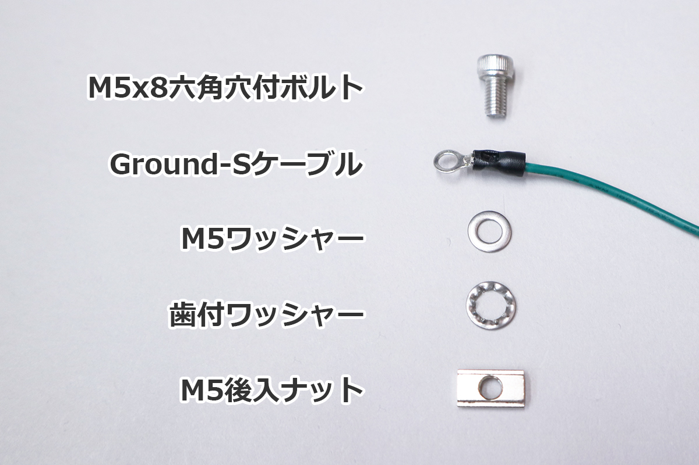

※アルミフレームに傷がつくように取り付けてください。
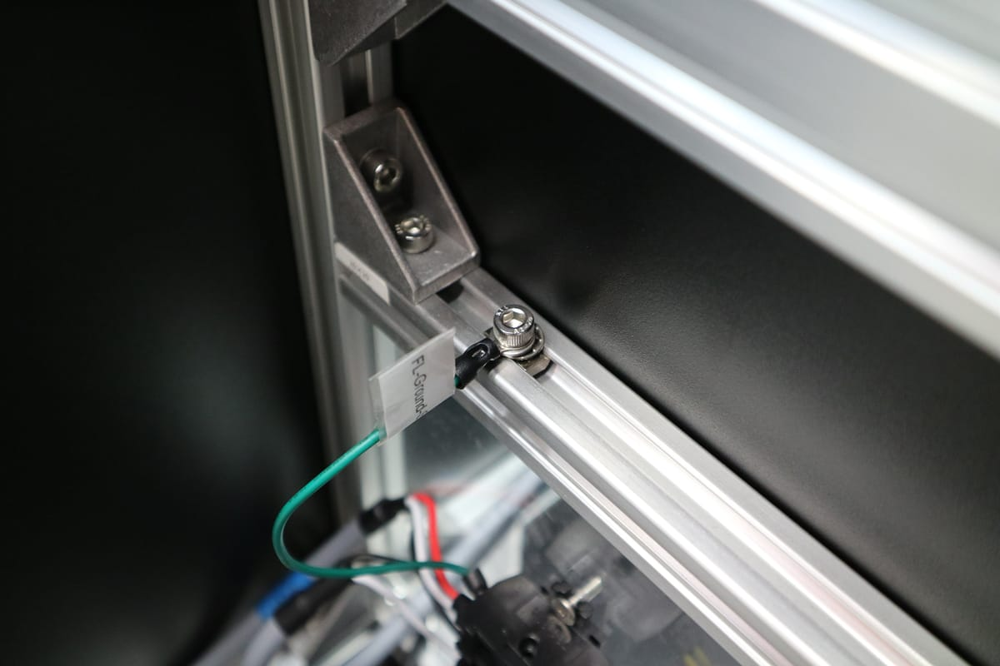

ACアダプタをアダプタマウントに取り付けます。
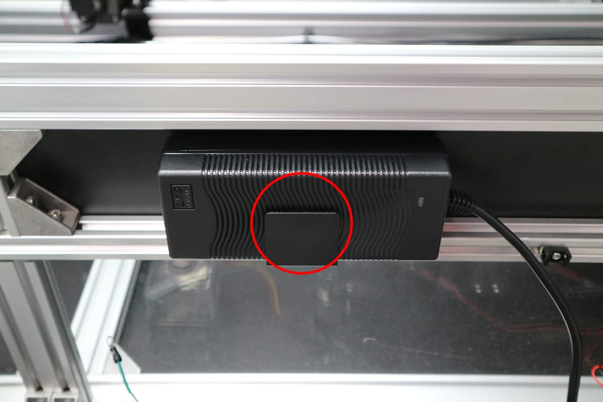

ACアダプタの端子を中継基板の「+12V IN」へ差し込んでください。
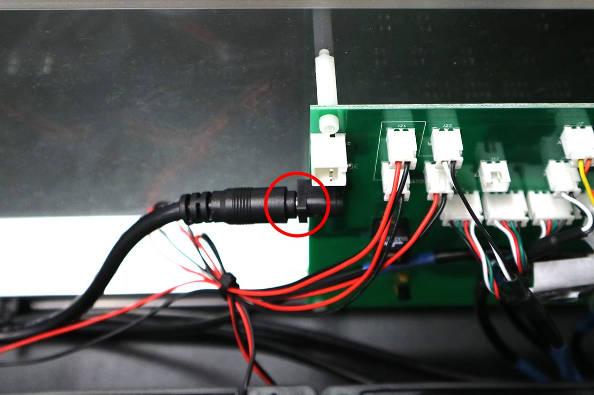

AC-CabelをACアダプタに差し込み、あらかじめ取り付けておいた結束バンド固定具に結束バンドで固定します。
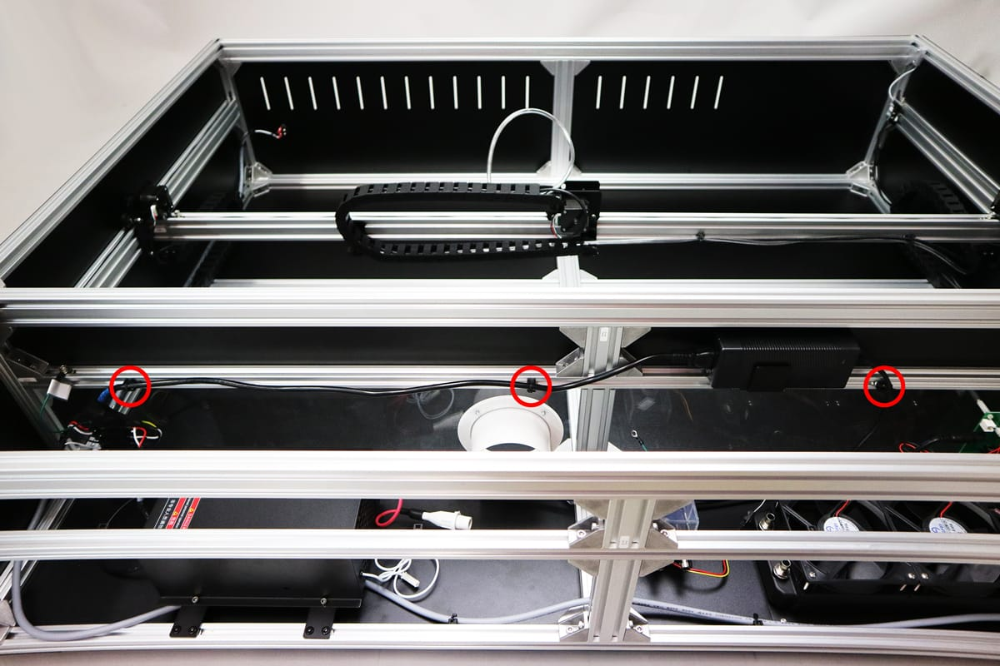

ラジエーターユニットに取り付いているGroundLケーブルを写真の順番で本体に取り付けます。
- M5x8六角穴付ボルト
- Ground-Sケーブル
- M5ワッシャー
- 歯付ワッシャー
- M5後入ナット

