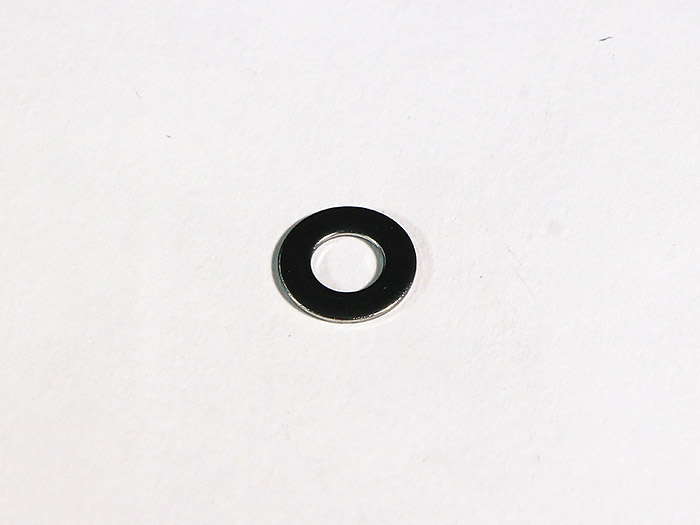
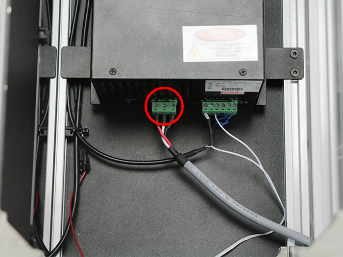
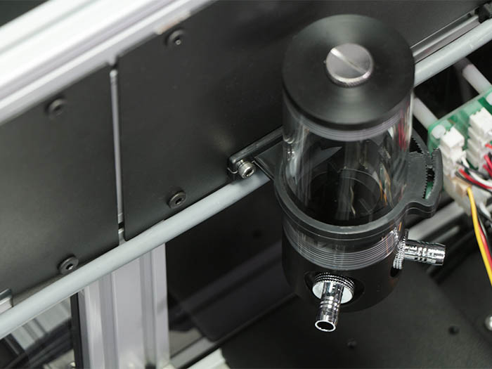
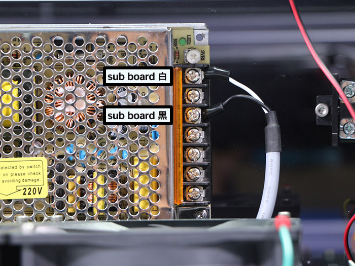
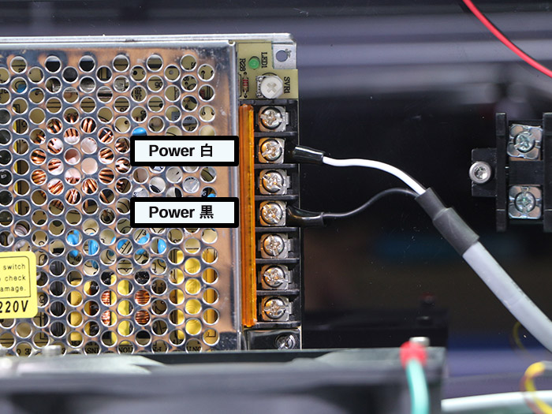
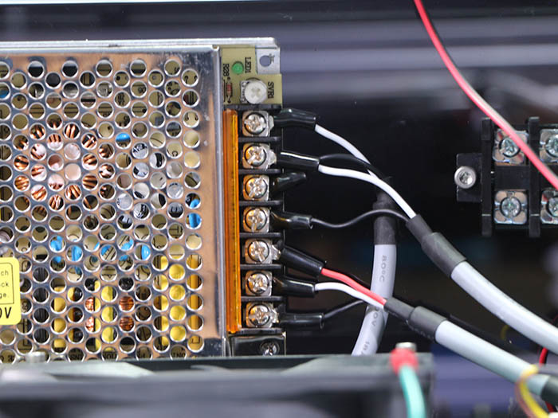
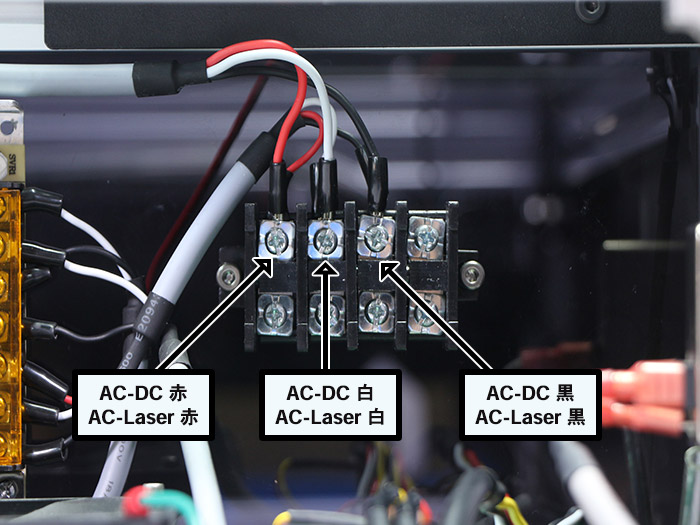

<table class="packing-list">
    <tbody>
        <tr>
            <td>部品名</td>
            <td>備考</td>
            <td class="packing-img">画像</td>
            <td>個数</td>
        </tr>
        <tr>
            <td>AC-DCケーブル</td>
            <td></td>
            <td></td>
            <td>1</td>
        </tr>
        <tr>
            <td>AC-Laserケーブル</td>
            <td></td>
            <td></td>
            <td>1</td>
        </tr>
        <tr>
            <td>Ground(L)ケーブル</td>
            <td></td>
            <td></td>
            <td>1</td>
        </tr>
        <tr>
            <td>M5x8六角穴付ボルト</td>
            <td></td>
            <td></td>
            <td>1</td>
        </tr>
        <tr>
            <td>M5後入ナット</td>
            <td></td>
            <td></td>
            <td>1</td>
        </tr>
        <tr>
            <td>歯付きワッシャー</td>
            <td></td>
            <td></td>
            <td>1</td>
        </tr>
        <tr>
            <td>M5ワッシャー</td>
            <td></td>
            <td></td>
            <td>1</td>
        </tr>
        <tr>
            <td>結束バンド</td>
            <td></td>
            <td></td>
            <td>4</td>
        </tr>
    </tbody>
</table>

## 工程手順

### ACライン 配線

80Wレーザー電源にAC-Laserケーブルを接続します。

写真を参考に、取り付けた結束バンド固定具にAC-Laserケーブルを結束バンドで固定します。AC-Laserケーブルを結束バンドで固定する際、タンクホルダーの下を通して配線してください。

写真を参考にスイッチング電源に各ケーブルを取り付けます。線の色を参考にして下さい。
※こちらの配線が間違えていた場合、通電時に本体が破損する可能性があります。

sub boardケーブル

Powerケーブル

AC-DCケーブル

完成写真

AC-Laserケーブル
AC-DCケーブル

AC-Mainケーブル
Ground(L)ケーブル
※Ground(L)ケーブルには取り付ける向きがあるので注意して下さい。

EMSケーブル

完成写真

2種類のGroundケーブルを写真の順番で本体に取り付けます。
- M5x8六角穴付きボルト
- ラジエーターユニット取付済みGround線
- Ground (L)ケーブル
- M5ワッシャー
- 歯付ワッシャー
- M5後入ナット

※アルミフレームが傷がつくように取り付けてください。

