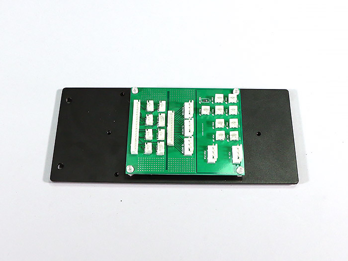
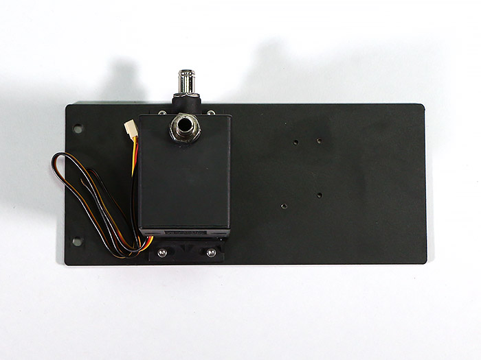
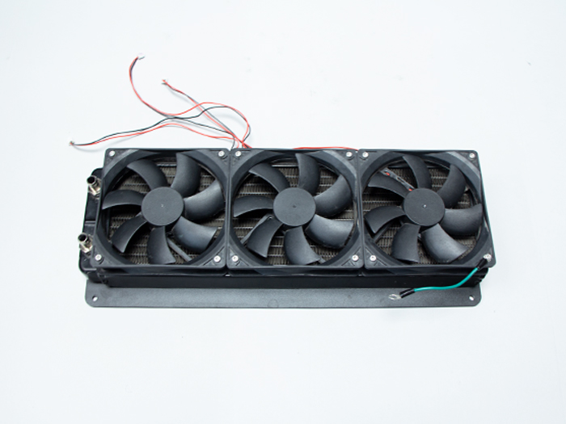
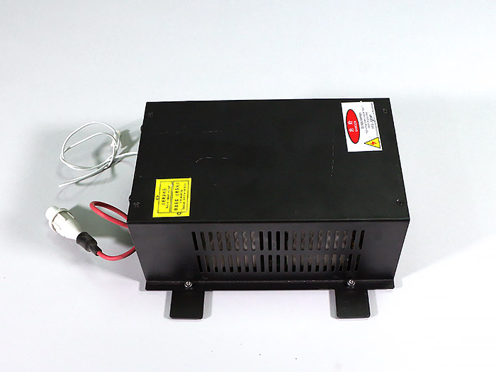
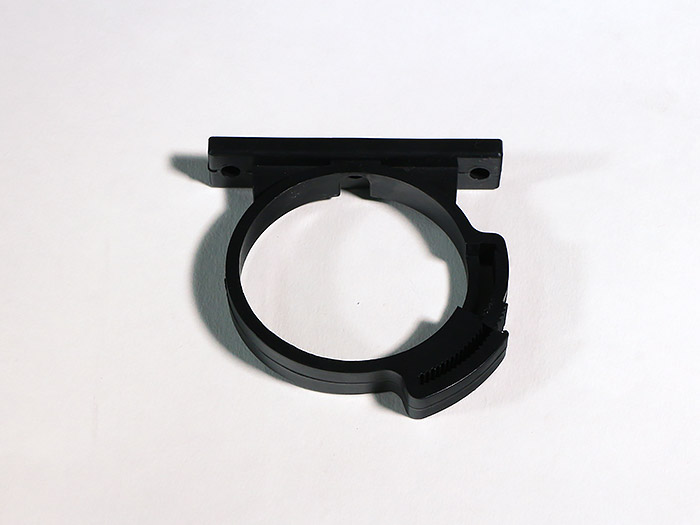
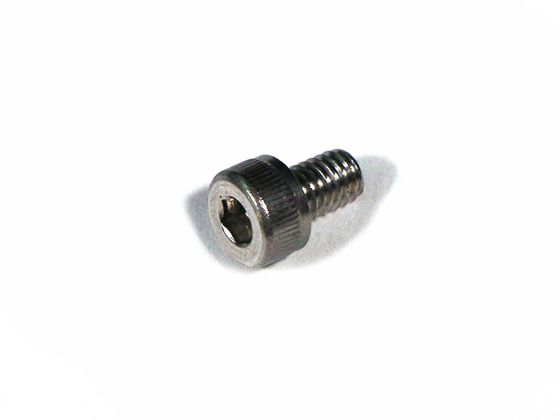
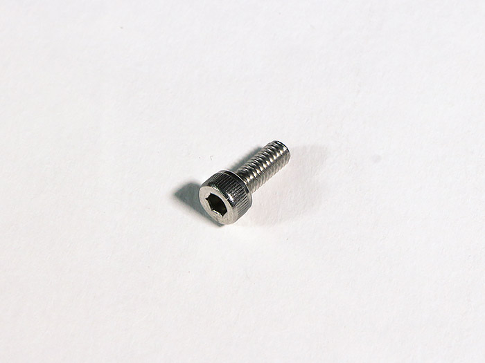
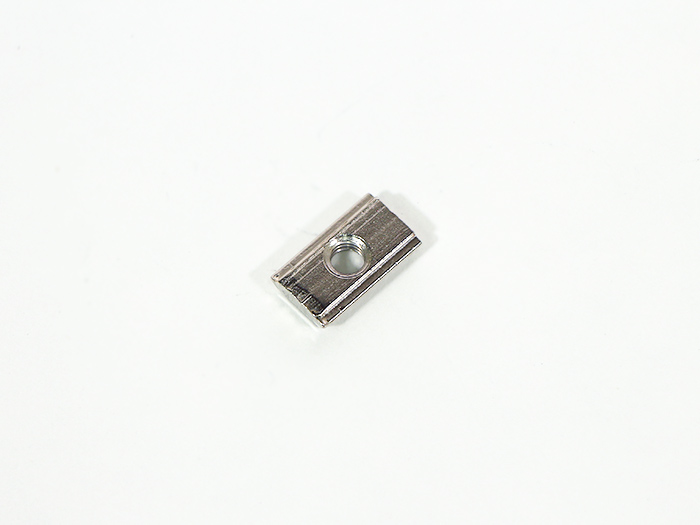
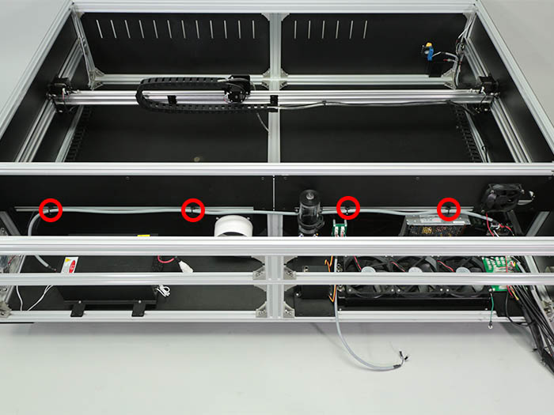
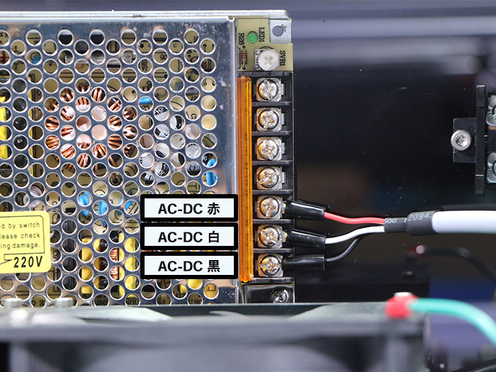

<table class="packing-list">
    <tbody>
        <tr>
            <td>部品名</td>
            <td>備考</td>
            <td class="packing-img">画像</td>
            <td>個数</td>
        </tr>
        <tr>
            <td>中継基板</td>
            <td>Utility BKT2取り付け済み</td>
            <td></td>
            <td>1</td>
        </tr>
        <tr>
            <td>水冷ポンプ</td>
            <td>Utility BKT2取り付け済み</td>
            <td></td>
            <td>1</td>
        </tr>
        <tr>
            <td>ラジエーターユニット</td>
            <td></td>
            <td></td>
            <td>1</td>
        </tr>
        <tr>
            <td>80Wレーザー電源</td>
            <td>Utility BKT1取り付け済み</td>
            <td></td>
            <td>1</td>
        </tr>
        <tr>
            <td>タンク</td>
            <td></td>
            <td></td>
            <td>1</td>
        </tr>
        <tr>
            <td>タンクホルダー</td>
            <td></td>
            <td></td>
            <td>1</td>
        </tr>
        <tr>
            <td>M5x8低頭ボルト</td>
            <td></td>
            <td></td>
            <td>8</td>
        </tr>
        <tr>
            <td>M5後入ナット</td>
            <td></td>
            <td></td>
            <td>8</td>
        </tr>
        <tr>
            <td>M4x6六角穴付ボルト</td>
            <td></td>
            <td></td>
            <td>4</td>
        </tr>
        <tr>
            <td>M4x10六角穴付ボルト</td>
            <td></td>
            <td></td>
            <td>2</td>
        </tr>
        <tr>
            <td>M4後入ナット</td>
            <td></td>
            <td></td>
            <td>2</td>
        </tr>
    </tbody>
</table>

## 工程手順

### 取り付け注意

### 中継基板 取り付け

「[中継基板・レーザー電源組み立て](https://support.smartdiys.com/hc/ja/articles/360007527632" rel="noopener" target="_blank)」で組み立てた中継基板をM5x8低頭ボルト2個とM5後入ナット2個で取り付けます。

### 水冷装置 取り付け

写真を参考にラジエータ―ユニットをBottom-BLにM4x6六角穴付ボルト4個で取り付けます。

「[水冷装置組み立て](https://support.smartdiys.com/hc/ja/articles/360007525312" rel="noopener" target="_blank)」で組み立てた水冷ポンプを本体フレームにM5x8低頭ボルト2個とM5後入ナット2個で取り付けます。

タンクホルダーをM4x10六角穴付ボルト2個とM4後入ナット2個で取り付けます。

タンクホルダーにタンクを取り付けます。

※締めすぎると破損する恐れがあります。

### 80Wレーザー電源 取り付け

「[中継基板・80Wレーザー電源組み立て](https://support.smartdiys.com/hc/ja/articles/360007527632" rel="noopener" target="_blank)」で組み立てた80Wレーザー電源を本体フレームにM5x8低頭ボルト4個とM5後入ナット4個で取り付けます。

写真を参考に本体フレーム内側から約180mmの位置に80Wレーザー電源を取り付けてください。
