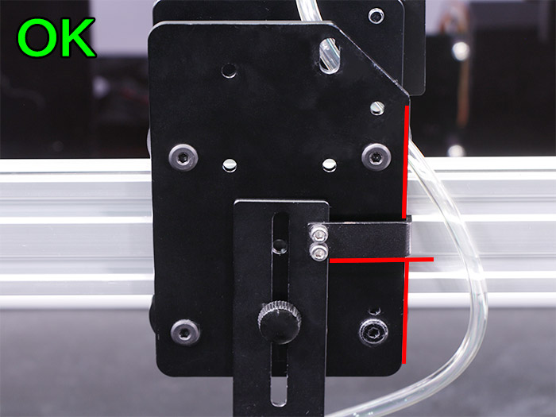

<table class="packing-list">
    <tbody>
        <tr>
            <td>部品名</td>
            <td>備考</td>
            <td class="packing-img">画像</td>
            <td>個数</td>
        </tr>
        <tr>
            <td>RELAY DC POWERケーブル</td>
            <td></td>
            <td></td>
            <td>1</td>
        </tr>
        <tr>
            <td>RELAY MOTORケーブル</td>
            <td></td>
            <td></td>
            <td>1</td>
        </tr>
        <tr>
            <td>RELAY SIGNALケーブル</td>
            <td></td>
            <td></td>
            <td>1</td>
        </tr>
        <tr>
            <td>Powerケーブル</td>
            <td></td>
            <td></td>
            <td>1</td>
        </tr>
        <tr>
            <td>sub boardケーブル</td>
            <td></td>
            <td></td>
            <td>1</td>
        </tr>
        <tr>
            <td>FAN1ケーブル</td>
            <td></td>
            <td></td>
            <td>1</td>
        </tr>
        <tr>
            <td>FAN2ケーブル</td>
            <td></td>
            <td></td>
            <td>1</td>
        </tr>
        <tr>
            <td>80mmDCファン</td>
            <td></td>
            <td></td>
            <td>1</td>
        </tr>
        <tr>
            <td>M4x30低頭ボルト</td>
            <td></td>
            <td></td>
            <td>4</td>
        </tr>
        <tr>
            <td>M4ナット</td>
            <td></td>
            <td></td>
            <td>4</td>
        </tr>
        <tr>
            <td>結束バンド</td>
            <td></td>
            <td></td>
            <td>3</td>
        </tr>
    </tbody>
</table>

## 工程手順

### DCライン配線

FAN1ケーブルをLED DCファンに接続します。

80Wレーザー電源にLaserケーブルを接続します。

以下のケーブルを、80Wレーザー電源を取り付けたUtility BKT1の下を通して、取り付けておいた結束バンド固定具に結束バンドで固定して下さい。
- FAN1ケーブル
- Y-Motor-Rケーブル
- Laserケーブル

水冷ポンプを取り付けたUtility BKT2の下を通して取り付けておいた結束バンドに取り付けます。

### 80mm DCファン取り付け

Inner Lに80mm DCファンをM4x30低頭ボルト4個とM4ナット4個で取り付けます。
80mm DCファンには取り付ける向きがあるので注意して下さい。

加工エリア側に型式が記載されたシールが張ってある面が向くように取り付けてください。

FAN2ケーブルを80mm DCファンに接続します。

### 中継基板配線

完成写真

Powerケーブル

RELAY DC POWERケーブル

X-Motorケーブル

Y-Motor-Rケーブル

Y-Motor-Lケーブル

RELAY MOTORケーブル

Y1-Limitケーブル

Y2-Limitケーブル

Laserケーブル

FAN2ケーブル

RELAY SIGNALケーブル

RELAY DC POWERケーブルとRELAY MOTORケーブル、RELAY SIGNALケーブルを本体の外に出して下さい。

### sub board配線

完成写真

水冷ポンプ

ラジエーターユニットDCファン

FAN1ケーブル

LEDケーブル

sub boardケーブル
