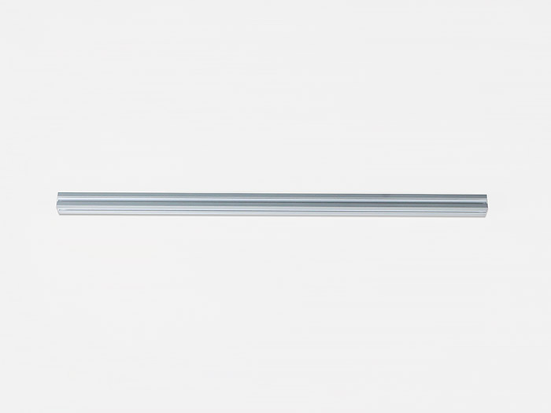
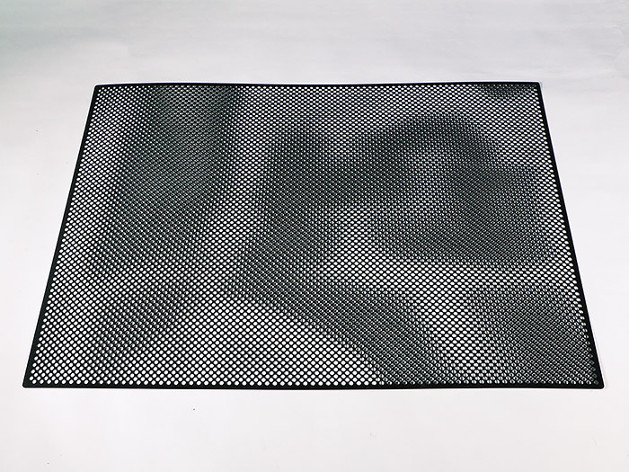
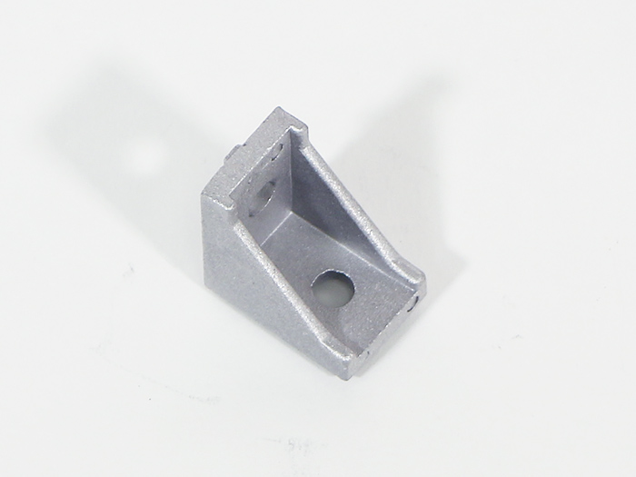
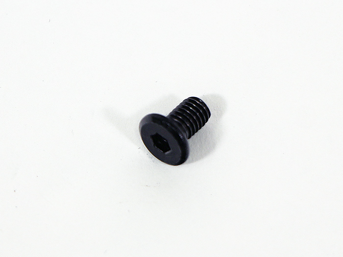
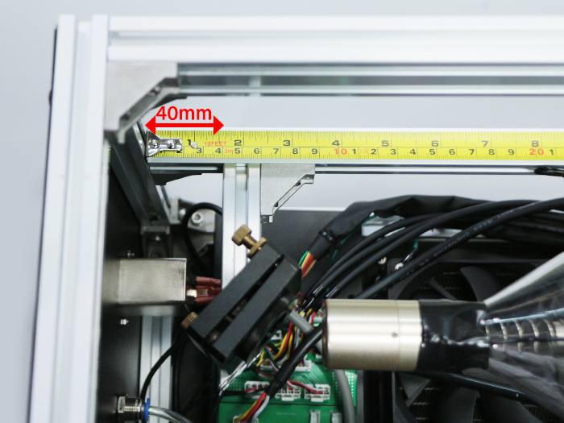
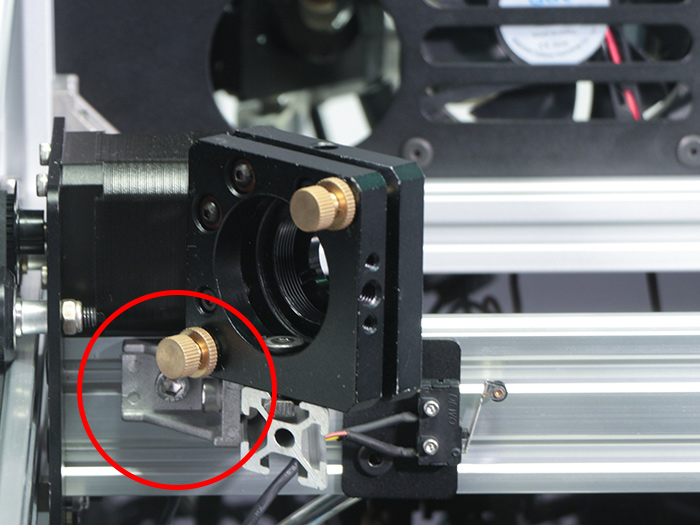
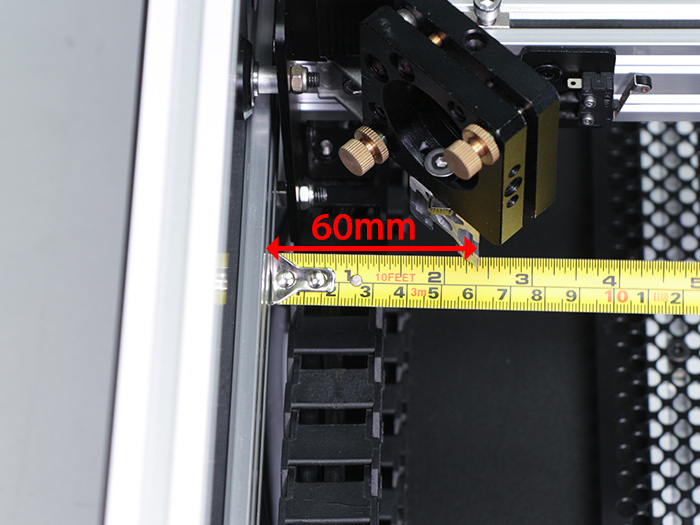

<table class="packing-list">
    <tbody>
        <tr>
            <td>部品名</td>
            <td>備考</td>
            <td class="packing-img">画像</td>
            <td>個数</td>
        </tr>
        <tr>
            <td>アルミフレーム20x20mm 530mm</td>
            <td></td>
            <td></td>
            <td>4</td>
        </tr>
        <tr>
            <td>アルミフレーム20x20mm 644mm</td>
            <td></td>
            <td></td>
            <td>4</td>
        </tr>
        <tr>
            <td>Prefated Metal</td>
            <td></td>
            <td></td>
            <td>2</td>
        </tr>
        <tr>
            <td>直角ブラケット</td>
            <td></td>
            <td></td>
            <td>8</td>
        </tr>
        <tr>
            <td>M5x8六角穴付ボルト</td>
            <td></td>
            <td></td>
            <td>16</td>
        </tr>
        <tr>
            <td>M5x8低頭ボルト</td>
            <td></td>
            <td></td>
            <td>14</td>
        </tr>
        <tr>
            <td>M5後入ナット</td>
            <td></td>
            <td></td>
            <td>30</td>
        </tr>
    </tbody>
</table>

## 工程手順

### 加工ベッド組み立て

写真を参考にアルミフレーム20x20mm 530mm2本とアルミフレーム20x20mm 644mm2本、M5後入ナット8個とM5x8六角穴付ボルト8個と直角ブラケット4個で取り付けます。
※アルミフレーム同士の合わせ方に注意してください。

図を参考にPrefated Metalを載せます。
※厳密な位置合わせは必要ありません。

Prefated MetalをM5後入ナット7個とM5x8低頭ボルト7個で取り付けます。

同様の手順で加工ベッドをもう1個作ります。

加工エリア中央のフレームに寄せて配置してください。
※ネジ止めされていない部分を中央に向けてください
