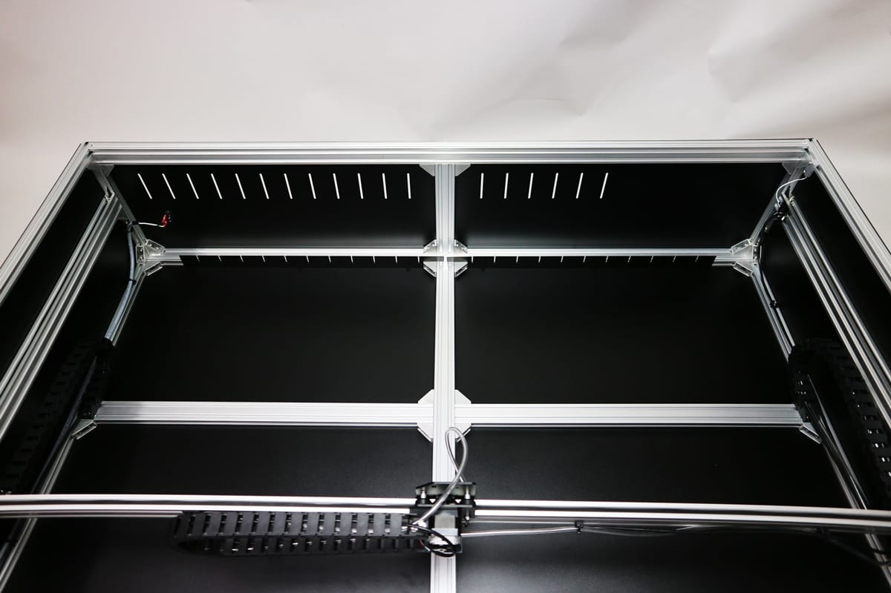

<table class="packing-list">
    <tbody>
        <tr>
            <td>部品名</td>
            <td>備考</td>
            <td class="packing-img">画像</td>
            <td>個数</td>
        </tr>
        <tr>
            <td>Bed-LR</td>
            <td></td>
            <td></td>
            <td>6</td>
        </tr>
        <tr>
            <td>フラットバー</td>
            <td></td>
            <td></td>
            <td>22</td>
        </tr>
        <tr>
            <td>フラットバー5mm</td>
            <td></td>
            <td></td>
            <td>1</td>
        </tr>
        <tr>
            <td>M5x8低頭ボルト</td>
            <td></td>
            <td></td>
            <td>18</td>
        </tr>
    </tbody>
</table>

## 工程手順

### 加工ベッド組み立て

写真を参考に、Bed-LR2個を中央アルミフレームに合わせて、M5x8低頭ボルト6個で取り付けます。

中央・背面側も同様に、Bed-LR4個をM5x8低頭ボルト12個で取り付けます。

フラットバーを溝に挿入しながら固定してください。

フラットバー5mmを加工ベッドの中心に挿入してください。

