<table class="packing-list">
    <tbody>
        <tr>
            <td>部品名</td>
            <td>備考</td>
            <td class="packing-img">画像</td>
            <td>個数</td>
        </tr>
        <tr>
            <td>アルミフレーム20x20mm 1300mm</td>
            <td></td>
            <td></td>
            <td>2</td>
        </tr>
        <tr>
            <td>アルミフレーム20x20mm 730mm</td>
            <td></td>
            <td></td>
            <td>2</td>
        </tr>
        <tr>
            <td>アルミフレーム20x40mm 730mm</td>
            <td></td>
            <td></td>
            <td>1</td>
        </tr>
        <tr>
            <td>アルミフレーム20x20mm 610mm</td>
            <td></td>
            <td></td>
            <td>2</td>
        </tr>
        <tr>
            <td>Top Panel</td>
            <td></td>
            <td></td>
            <td>2</td>
        </tr>
        <tr>
            <td>取手</td>
            <td></td>
            <td>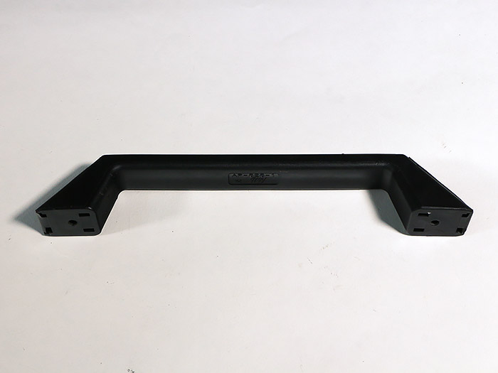</td>
            <td>1</td>
        </tr>
        <tr>
            <td>薄型ブラケット</td>
            <td></td>
            <td></td>
            <td>2</td>
        </tr>
        <tr>
            <td>蝶番</td>
            <td></td>
            <td></td>
            <td>3</td>
        </tr>
        <tr>
            <td>ガススプリング</td>
            <td></td>
            <td></td>
            <td>2</td>
        </tr>
        <tr>
            <td>直角ブラケット</td>
            <td></td>
            <td></td>
            <td>16</td>
        </tr>
        <tr>
            <td>M5x8低頭ボルト</td>
            <td></td>
            <td></td>
            <td>20</td>
        </tr>
        <tr>
            <td>M5x8六角穴付ボルト</td>
            <td></td>
            <td>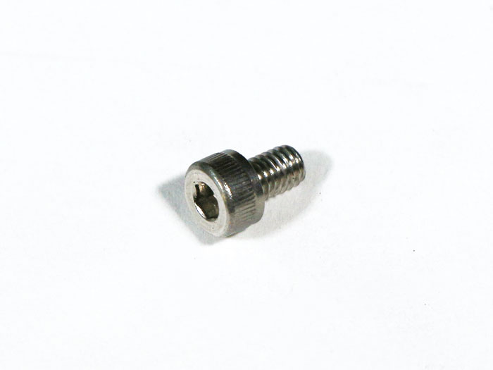</td>
            <td>32</td>
        </tr>
        <tr>
            <td>M5x8六角穴付皿ボルト</td>
            <td></td>
            <td></td>
            <td>12</td>
        </tr>
        <tr>
            <td>M5x18六角穴付ボルト</td>
            <td></td>
            <td></td>
            <td>2</td>
        </tr>
        <tr>
            <td>M5x30低頭ボルト</td>
            <td></td>
            <td></td>
            <td>4</td>
        </tr>
        <tr>
            <td>M5後入ナット</td>
            <td></td>
            <td></td>
            <td>70</td>
        </tr>
        <tr>
            <td>12mmスペーサー</td>
            <td></td>
            <td></td>
            <td>4</td>
        </tr>
        <tr>
            <td>M5ワッシャー</td>
            <td></td>
            <td></td>
            <td>12</td>
        </tr>
        <tr>
            <td>マグネット</td>
            <td>
                Laserケーブル同梱x1 
                ケース3に梱包x1
            </td>
            <td></td>
            <td>2</td>
        </tr>
        <tr>
            <td>M3後入ナット</td>
            <td></td>
            <td>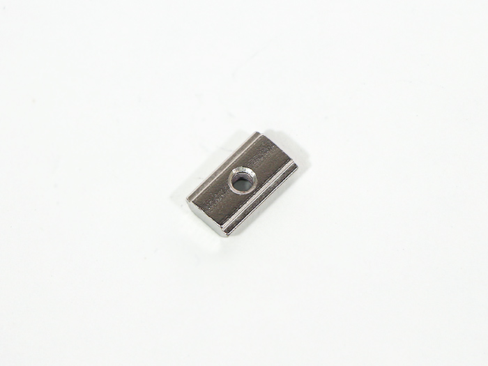</td>
            <td>2</td>
        </tr>
        <tr>
            <td>M3x12六角穴付ボルト</td>
            <td></td>
            <td></td>
            <td>2</td>
        </tr>
    </tbody>
</table>

## 完成図

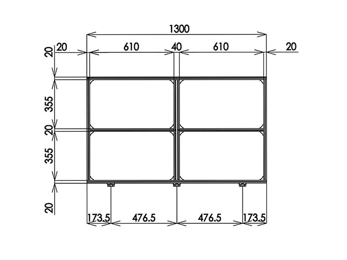

## 工程手順

### トップカバー 組み立て

アルミフレーム20x20mm 1300mmとアルミフレーム20x20mm 730mmをM5後入ナット2個とM5x8六角穴付ボルト2個と直角ブラケットで取り付けます。
※アルミフレーム同士の合わせ方に注意してください。

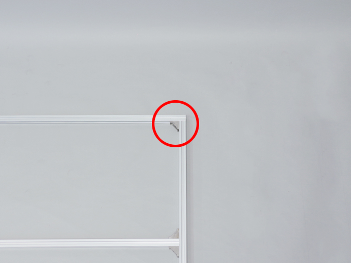

アルミフレーム20x20mm 1300mmの反対側にアルミフレーム20x20mm730mmをM5後入ナット2個とM5x8六角穴付ボルト2個と直角ブラケットで取り付けます。
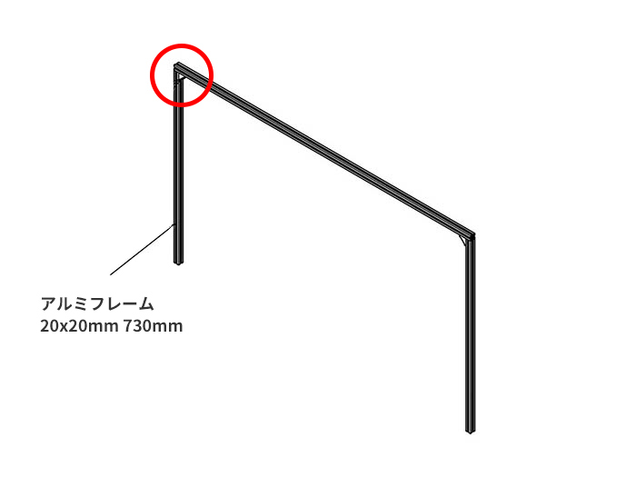

アルミフレーム20x20mm 730mmの中心にアルミフレーム20x20mm 610mmをM5後入ナット4個とM5x8六角穴付ボルト4個と直角ブラケットで2個で取り付けます。
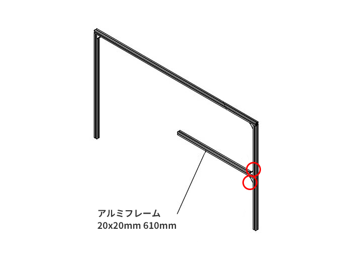

アルミフレーム20x20mm 1300mmの中央にアルミフレーム20x40mm 730mmをM5後入ナット4個とM5x8六角穴付ボルト4個と直角ブラケット2個で取り付けます。

アルミフレーム20x40mm 730mmと前工程で取り付けたアルミフレーム20x20mm 610mmをM5後入ナット4個とM5x8六角穴付ボルト4個と直角ブラケット2個で取り付けます。

アルミフレーム20x20mm 610mmをM5後入ナット4個とM5x8六角穴付ボルト4個と直角ブラケット2個でアルミフレーム20x40mm 730mmに取り付けます。
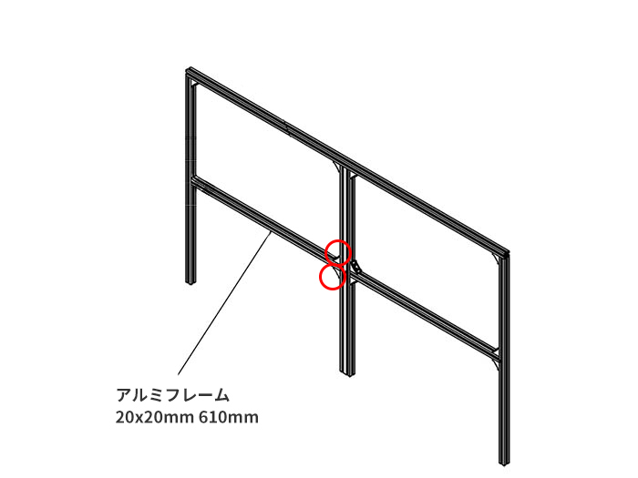

アルミフレーム20x20mm 610mmをM5後入ナット4個とM5x8六角穴付ボルト4個と直角ブラケット2個でアルミフレーム20x20mm 730mmに取り付けます。
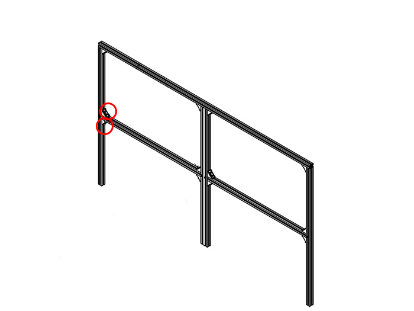

アルミフレーム20x20mm 1300mmをM5後入ナット8個とM5x8六角穴付ボルト8個と直角ブラケット4個で取り付けます。
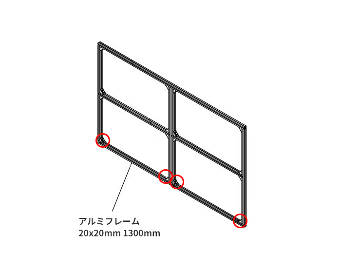

前工程で組み立てたフレームにTop Panel2枚をM5後入ナット16個とM5x8低頭ボルト16個で取り付けます。
※次工程で取手を取り付けますのであらかじめ取り付け位置を確認してから作業を行ってください。
※Top Panelには向きがありますので図を参考に取り付けてください。
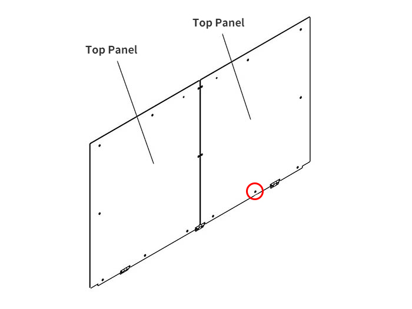

取手をM5後入ナット2個とM5x18六角穴付ボルト2個で取り付けます。

組み立てたトップカバーに蝶番3個をM5後入ナット6個とM5x8六角穴付皿ボルト6個でTop Panelの切りかけ部分に取り付けます。
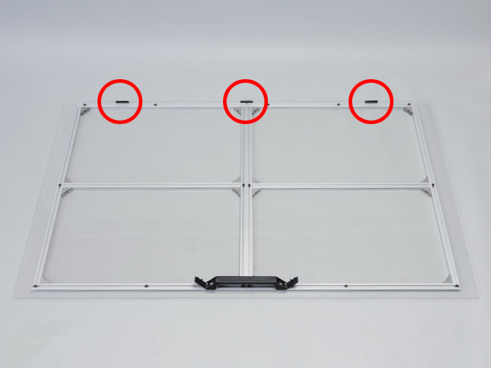
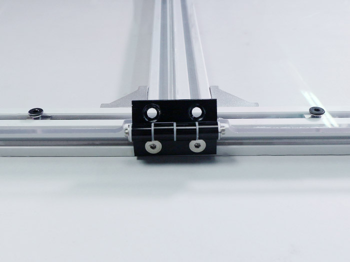

薄型ブラケット2個をM5後入ナット4個とM5x8低頭ボルト4個で中心から400mmの位置に取り付けます。
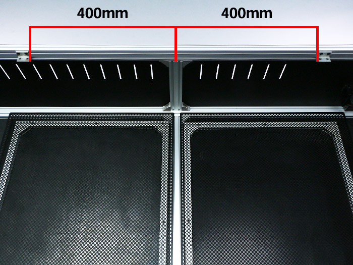
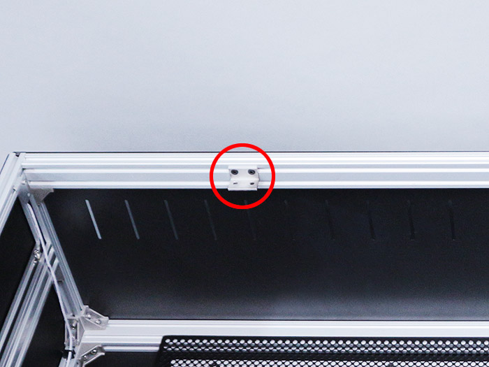

### トップカバー 取り付け

トップカバーに取り付けた蝶番を本体フレームにM5後入ナット6個とM5x8六角穴付皿ボルト6個で取り付けます。
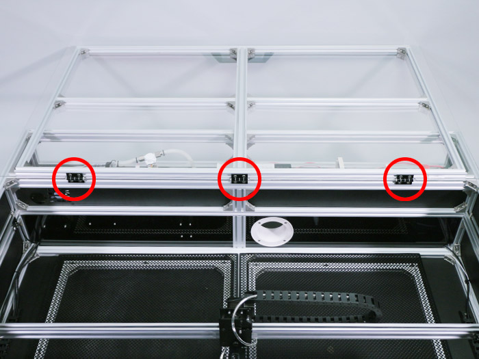

写真を参考にガススプリング2個を本体フレームとトップカバーの間にM5後入ナット4個とM5x30低頭ボルト4個とM5ワッシャー12個と12mmスペーサー4個で取り付けます。
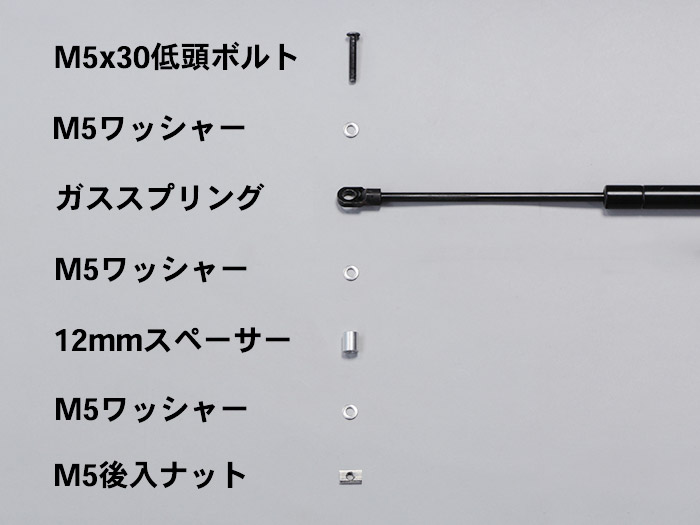

トップカバー側はアルミフレーム20x20mm 610mmの赤いラインを目安に取り付けます。
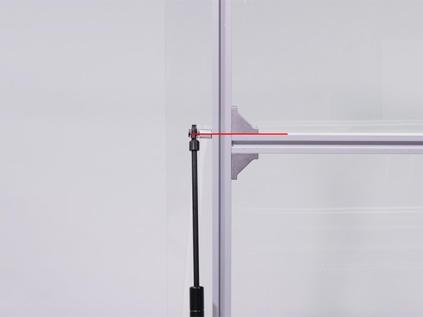

右側も同様の手順で取り付けます。

本体フレーム側は蝶番を取り付けたフレームから115mmの位置に取り付けます。

右側も同様の手順で取り付けます。
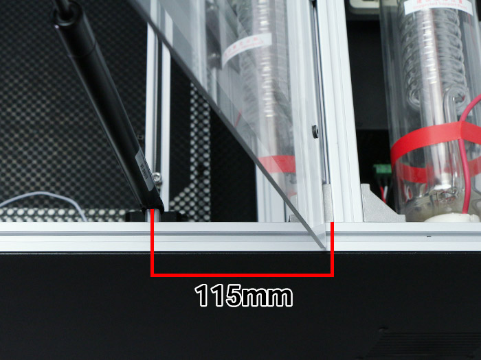

トップカバーを閉じて開閉の確認をします。
※閉まらない場合は、トップカバー側の取り付け位置を調整してください。

### マグネット 取り付け

マグネットをトップカバー左側面のフレームにM3後入ナットとM3x12六角穴付ボルトで取り付けます。後工程にて微調整をするので仮止めにします。
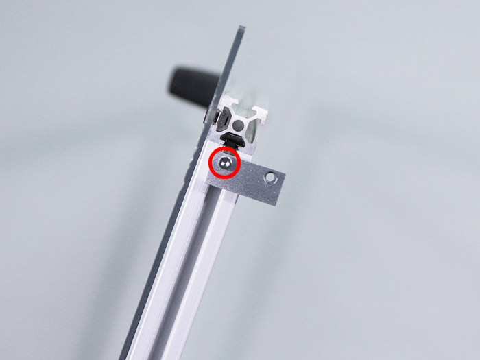

トップカバーを閉めてY2-limitケーブルのマグネットスイッチに一番近くなるように調整して下さい。
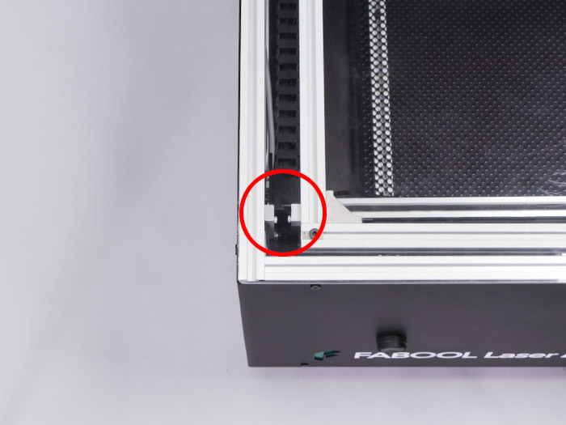

右側も同様の手順で取り付けます。
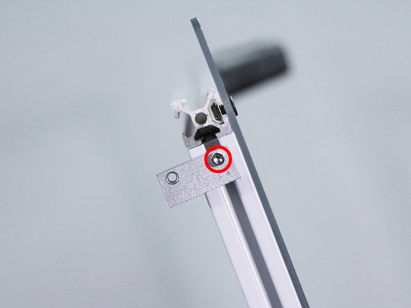

トップカバーを閉めてLaserケーブルのマグネットスイッチに一番近くなるように調整して下さい。

