<table class="packing-list">
    <tbody>
        <tr>
            <td>部品名</td>
            <td>備考</td>
            <td class="packing-img">画像</td>
            <td>個数</td>
        </tr>
        <tr>
            <td>テスター</td>
            <td></td>
            <td></td>
            <td>1</td>
        </tr>
        <tr>
            <td>電池</td>
            <td>テスターの箱に同梱</td>
            <td>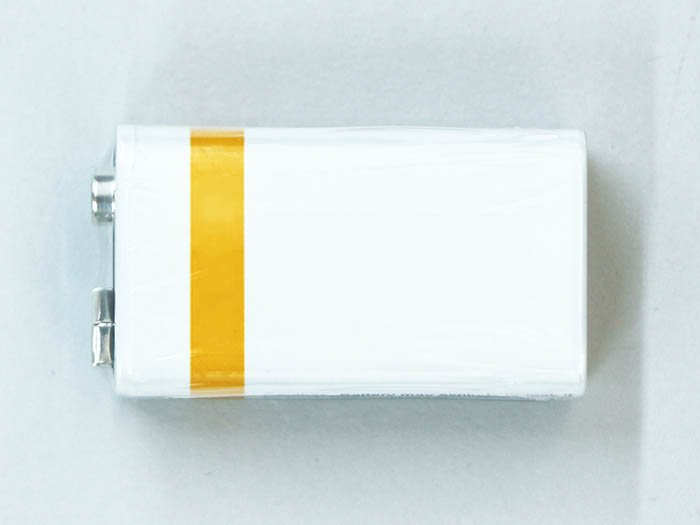</td>
            <td>1</td>
        </tr>
    </tbody>
</table>

## 工程手順

### テスター使用準備

テスターを箱から出します。
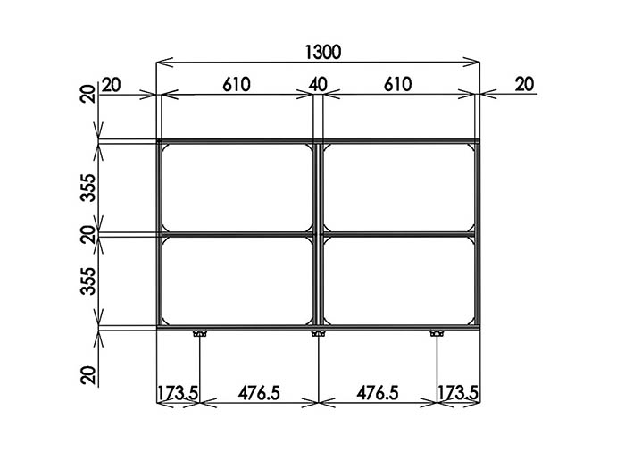

プラスドライバーでネジを外します。
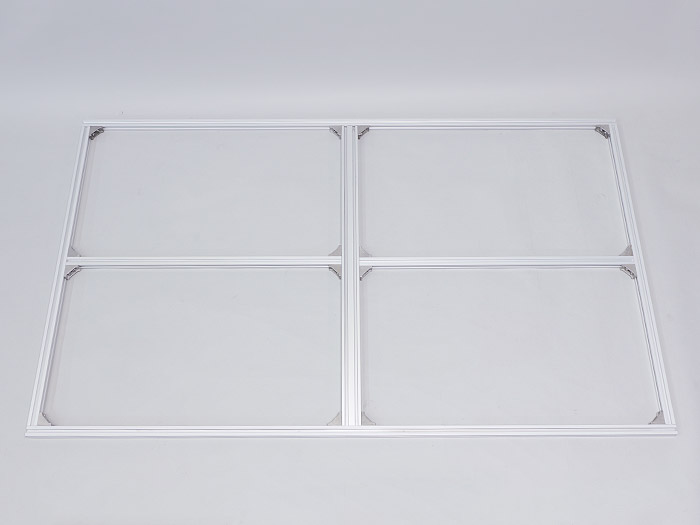

電池の取り付けケーブルを出します。
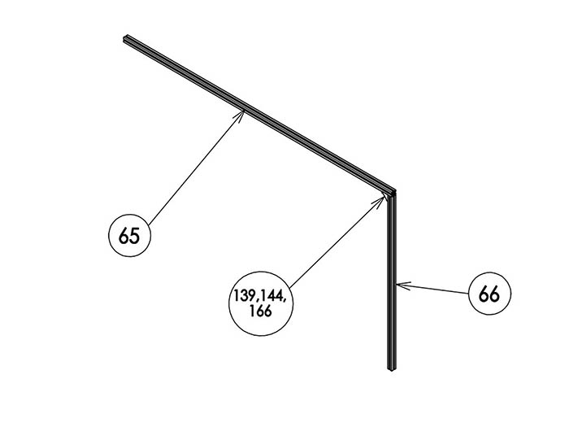

電池を取り付けます。
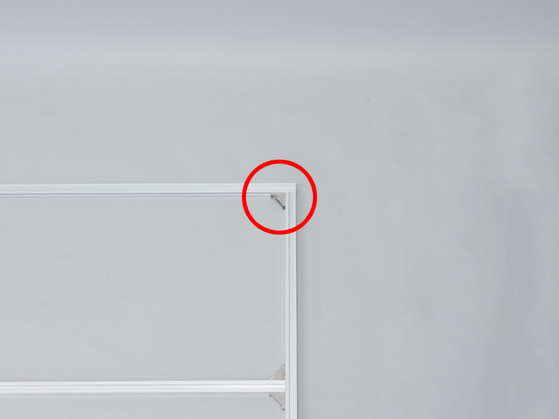

電池を収納します。
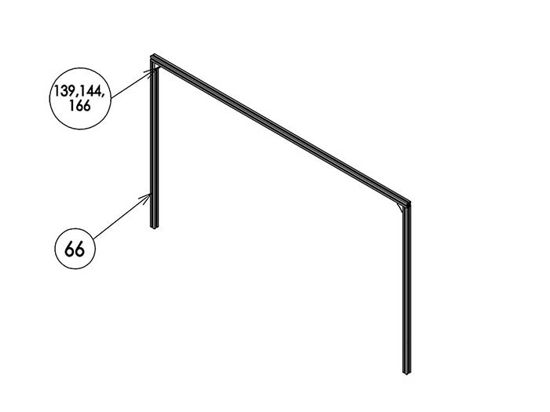

プラスドライバーで蓋を閉めます。

テスターのテスト棒を取り付けます。黒色はCOM、赤色はVΩｍAに取り付けます。
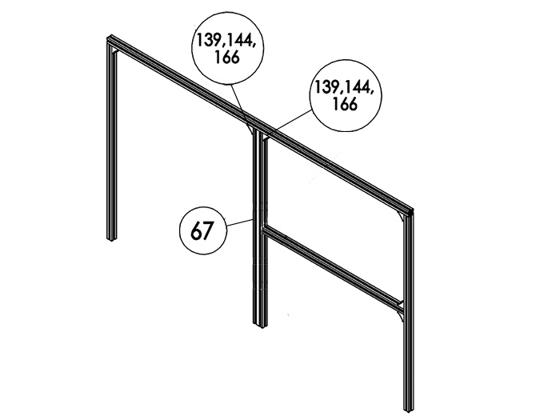

テスターの中央のダイアルを赤丸のブザーまで回します。
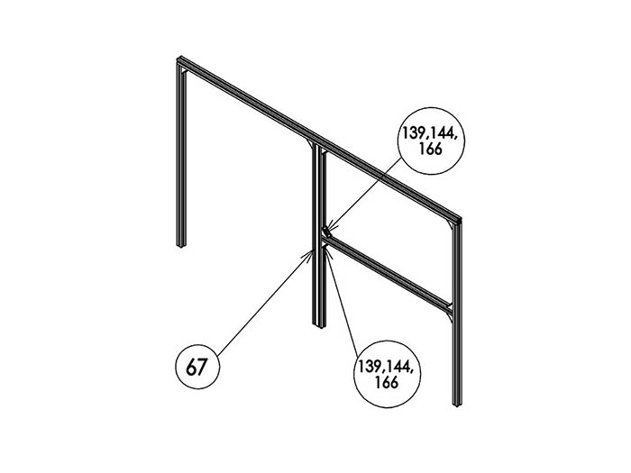

テスト棒先端のテストピン同士を当ててブザー音が鳴るか確認してください。
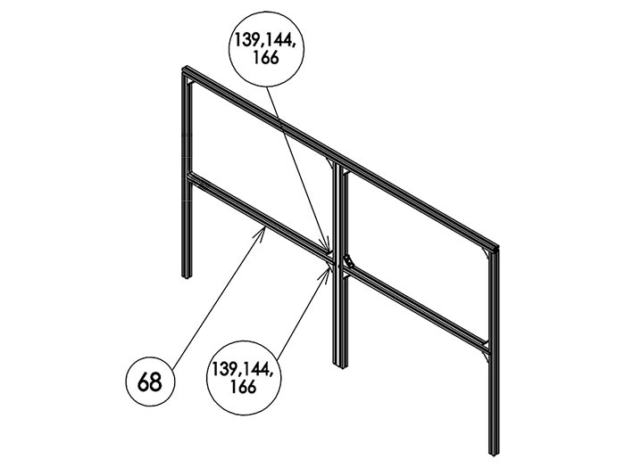

テスターを写真のように当ててご使用ください。
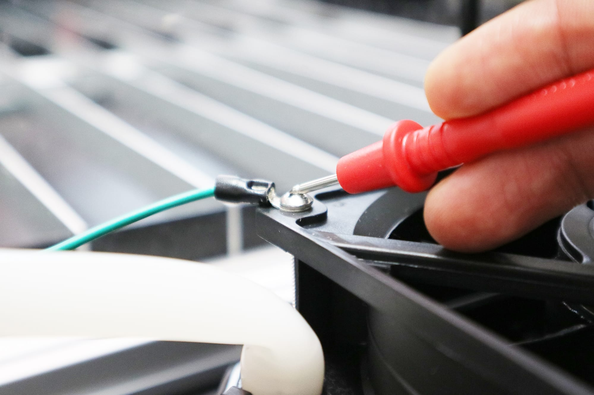

本体正面のスイッチをONにしてください。
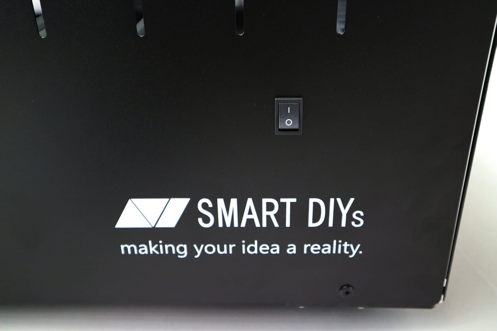

AC-Mainケーブルの端子にテストピンを当てて確認をします。

- Aの端子にテストピンを当て、音がならないことを確認してください。
- Bの端子にテストピンを当て、音がならないことを確認してください。
- Cの端子にテストピンを当て、音がならないことを確認してください。

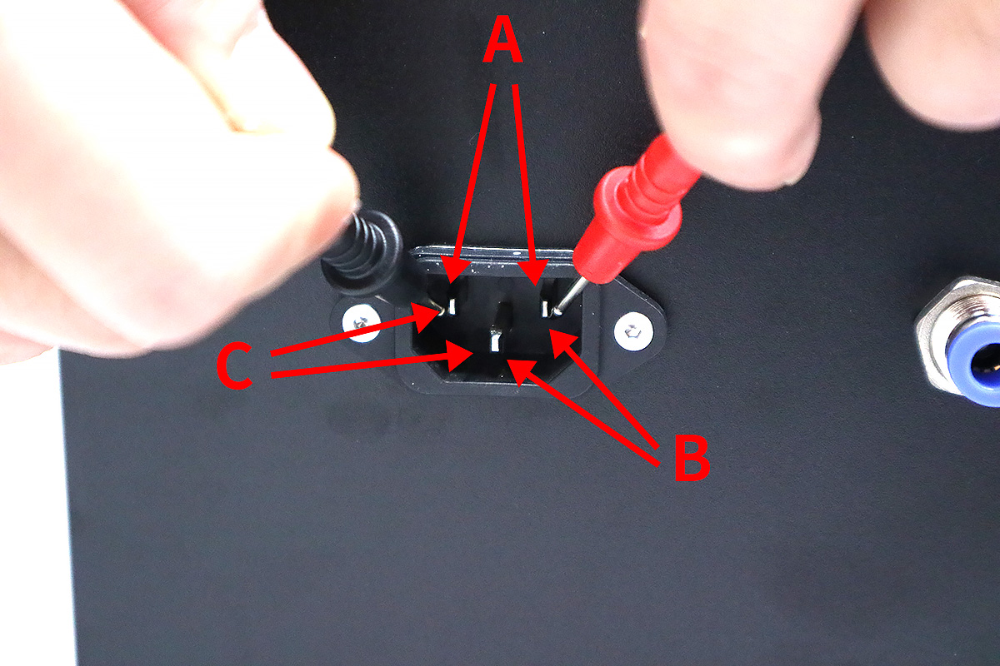

端子台にテストピンを当てて確認をします。
写真で示した端子にテストピンを当て下記を確認してください。

- 本体正面のスイッチがONのとき音がなること
- 本体正面のスイッチがOFFのとき音がなならないこと

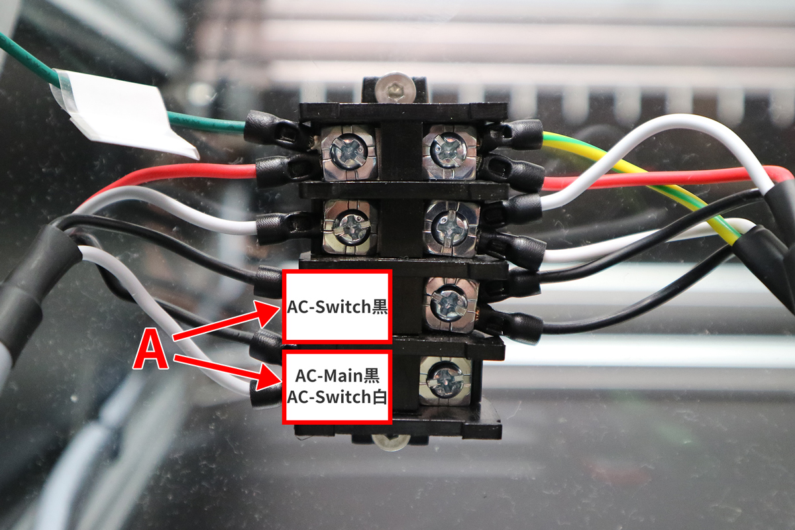

上記2つのテストがうまくいかない場合は配線が間違っている可能性があります。
[ACライン配線〜まとめ](https://www.smartdiys.com/manual/fabool-laser-ds-ver4-wiring-ac-line/)の端子台のケーブル取り付けをご確認ください。

ラジエーターGroundLケーブルのねじとAC-Mainケーブルのアース部分にテストピンを当て、音がなること
を確認してください。

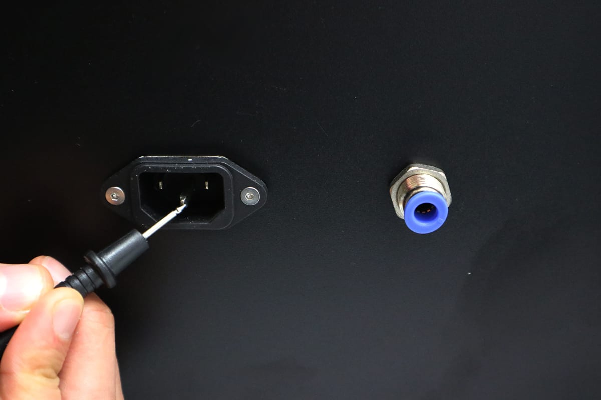

音がならない場合は、ラジエーターGround(L)ケーブルとGround(S)ケーブルがアルミフレームにしっかりと接地されているか、端子台のケーブル取り付けが間違っていないか確認してください。
