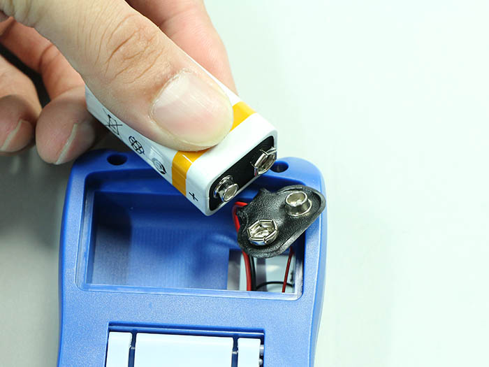
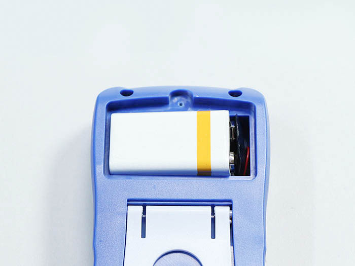

<table class="packing-list">
    <tbody>
        <tr>
            <td>部品名</td>
            <td>備考</td>
            <td class="packing-img">画像</td>
            <td>個数</td>
        </tr>
        <tr>
            <td>テスター</td>
            <td></td>
            <td></td>
            <td>1</td>
        </tr>
        <tr>
            <td>電池</td>
            <td>テスターの箱に同梱</td>
            <td></td>
            <td>1</td>
        </tr>
    </tbody>
</table>

## 工程手順

### テスター使用準備

テスターを箱から出します。

プラスドライバーでネジを外します。

電池の取り付けケーブルを出します。

電池を取り付けます。

電池を収納します。

プラスドライバーで蓋を閉めます。

テスターのテスト棒を取り付けます。黒色はCOM、赤色はVΩｍAに取り付けます。

テスターの中央のダイアルを赤丸のブザーまで回します。

テスト棒先端のテストピン同士を当ててブザー音が鳴るか確認してください。

テスターを写真のように当ててご使用ください。

①端子台GroundSケーブルのネジと、アルミフレームGroundSケーブルのネジ

②アルミフレームGroundSケーブルのネジとラジエーターGroundLケーブルのねじ

③ラジエーターGroundLケーブルのねじとAC-Mainケーブルのアース部分

