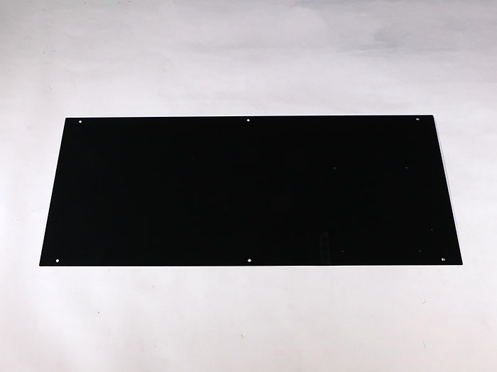
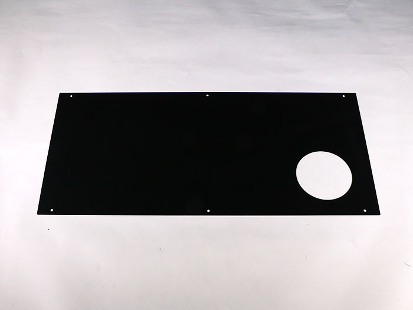
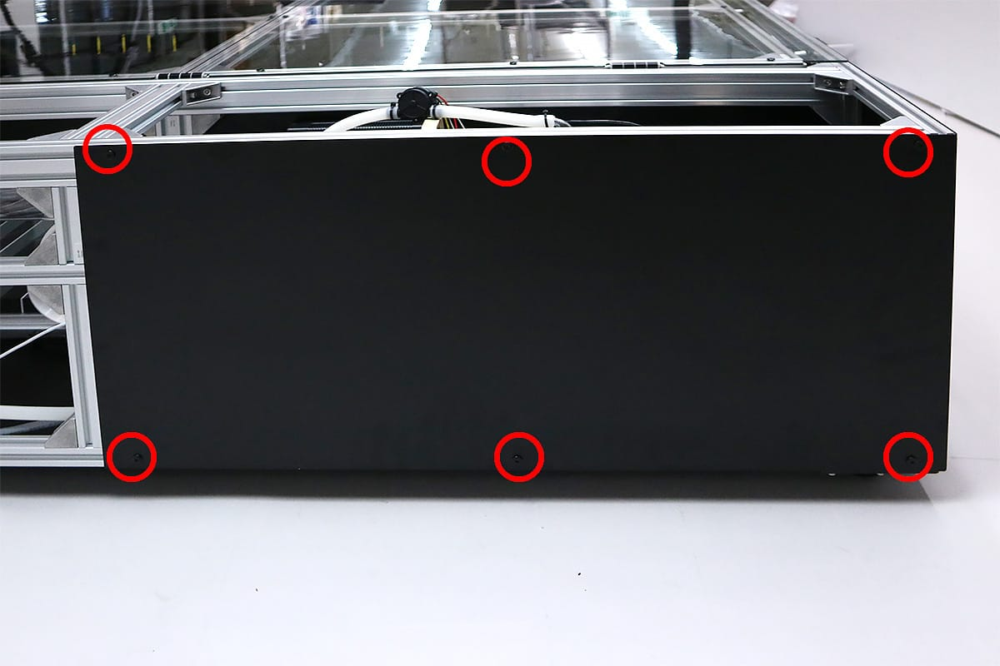
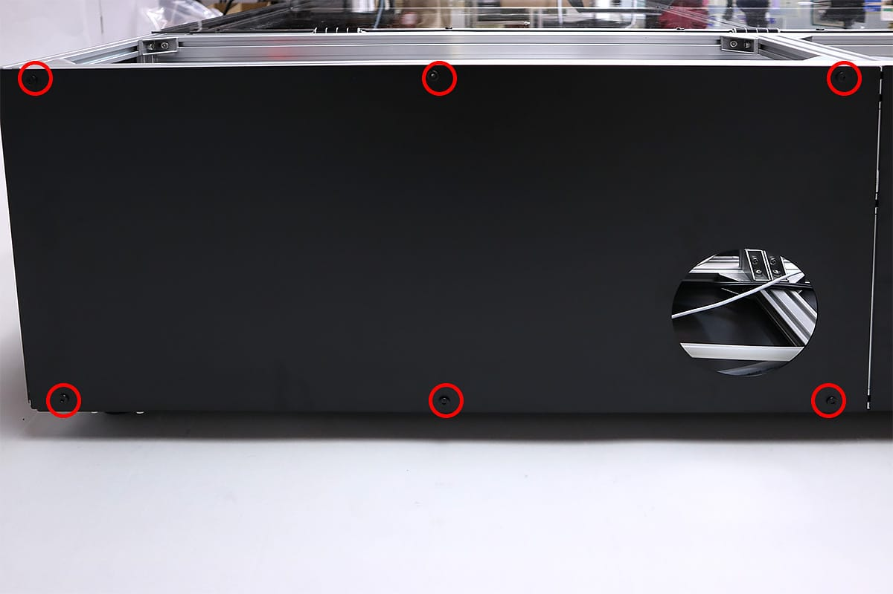
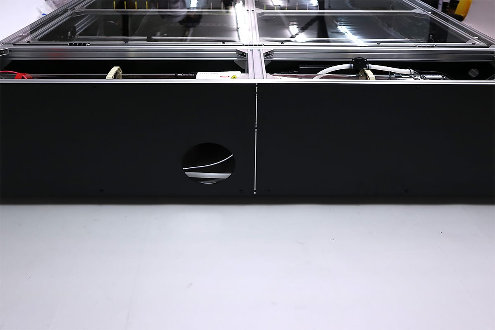

<table class="packing-list">
    <tbody>
        <tr>
            <td>部品名</td>
            <td>備考</td>
            <td class="packing-img">画像</td>
            <td>個数</td>
        </tr>
        <tr>
            <td>Top back-L</td>
            <td></td>
            <td></td>
            <td>1</td>
        </tr>
        <tr>
            <td>Top back-R</td>
            <td></td>
            <td></td>
            <td>1</td>
        </tr>
        <tr>
            <td>M5x8低頭ボルト</td>
            <td></td>
            <td></td>
            <td>12</td>
        </tr>
        <tr>
            <td>M5後入ナット</td>
            <td></td>
            <td></td>
            <td>12</td>
        </tr>
    </tbody>
</table>

## 工程手順

### Top back-LR 取り付け
Top-back-LをM5x8低頭ボルト6個とM5後入ナット6個で取り付けます。

Top-back-RをM5x8低頭ボルト6個とM5後入ナット6個で取り付けます。

