<table class="packing-list">
    <tbody>
        <tr>
            <td>部品名</td>
            <td>備考</td>
            <td class="packing-img">画像</td>
            <td>個数</td>
        </tr>
        <tr>
            <td>USBケーブル</td>
            <td></td>
            <td>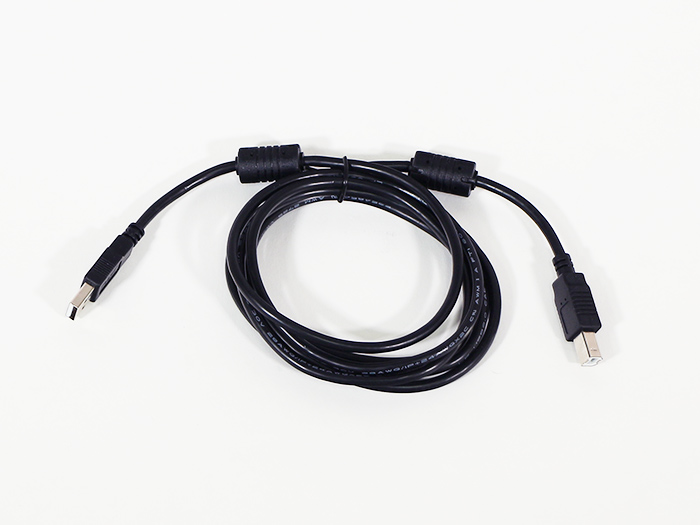</td>
            <td>1</td>
        </tr>
        <tr>
            <td>ACケーブル</td>
            <td></td>
            <td>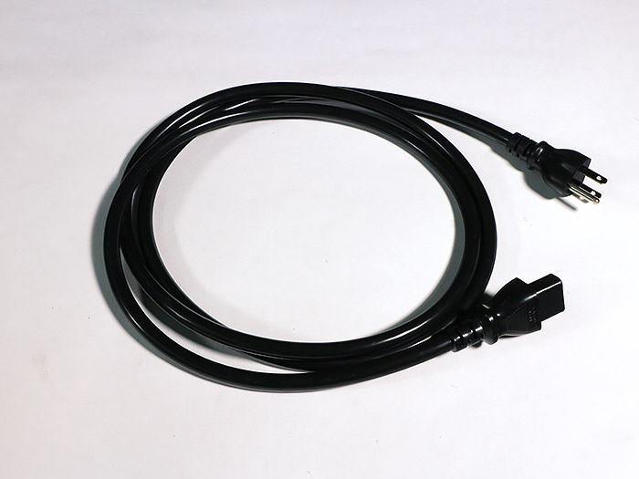</td>
            <td>1</td>
        </tr>
        <tr>
            <td>保護メガネ</td>
            <td></td>
            <td>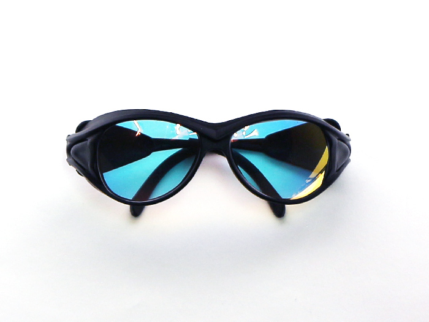</td>
            <td>1</td>
        </tr>
    </tbody>
</table>

## 注意事項

下記事項をよくお読みいただき光軸調整を行ってください。

### レーザーの取り扱いに関して
- レーザーから発せられる光は大変危険です。火災、やけど、目の損傷など十分注意してください。
- 組み立てがすべて完了するまではレーザーの電源をONにしないでください。
- レーザ光が直接あるいは鏡面体に反射して目に入らないようにご使用ください。
- レーザーの取り扱いの際には使用レーザーの波長に対応した保護眼鏡を必ず着用してください。
- 低強度であっても保護眼鏡を着用していても絶対にレーザー光を直接見ることは避けてください。
- 反射率の高い物体はレーザーの周囲に置かないようにしてください。
- 衣服の上からでも身体のどの部分にもレーザー光をさらさないでください。
- レーザー光を加工対象物以外のモノや人に向けての照射は行わないでください。

### 調整中に関して
- マスキングテープなどを焦がして調整を行います。その際レーザーの出力が強すぎると燃え上がる危険が御座いますので、弱めの出力で調整を行ってください。
- 反射ミラーを取り付けた状態でマスキングテープなどを使用して調整を行う場合は、テープの素材が反射ミラーに付着しないように注意して下さい。ミラーのが劣化してまう恐れがあります。

### 運用上の取り扱いに関して
- レーザー加工機は可燃性、爆発性、もしくは揮発性溶剤が存在しない場所で使用してください。
- 有毒なガスを発生する材料の加工は行わないでください。ポリ塩化ビニル、ポリウレタンなど。
- 加工による煙の排気対策を行ってください。
- レーザー加工機は幼児・子供が周りにいないことを確認して運用してください。
- レーザー加工機の加工中は絶対に動かさないでください。

## 工程手順

### 光軸調整 準備

タンクに水を150ml程度入れてください。
※水が筐体内へこぼれなように注意してください。
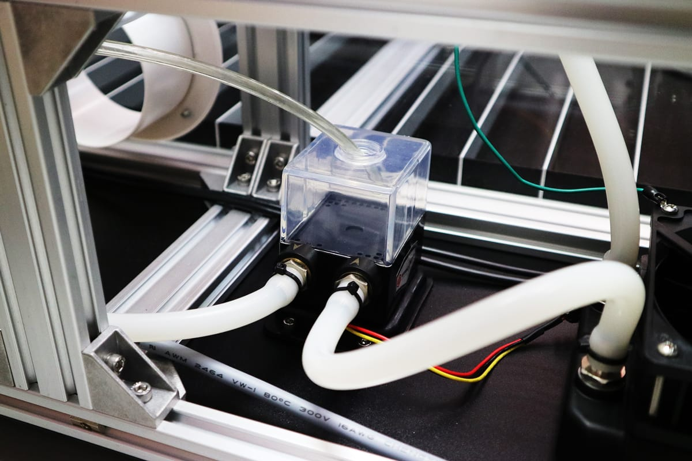

AC-MainケーブルのスイッチをONにしてくださいがOFF担っていることを確認し、ACケーブルを接続します。
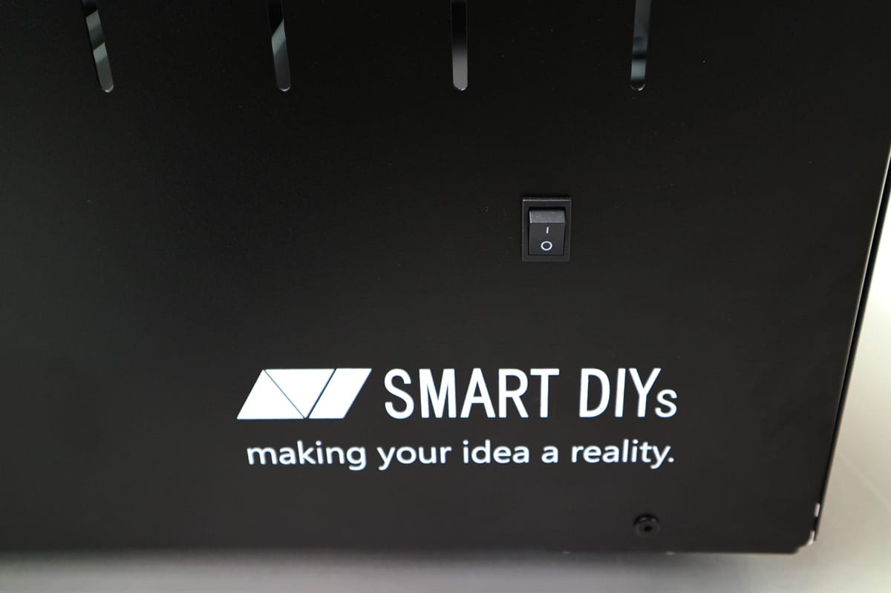
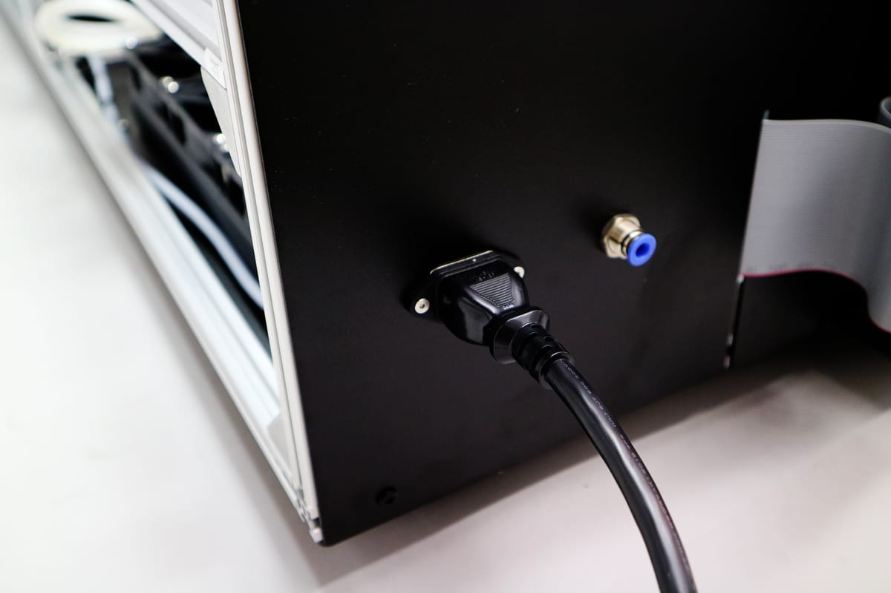

AC-MainケーブルのスイッチをONにしてください。
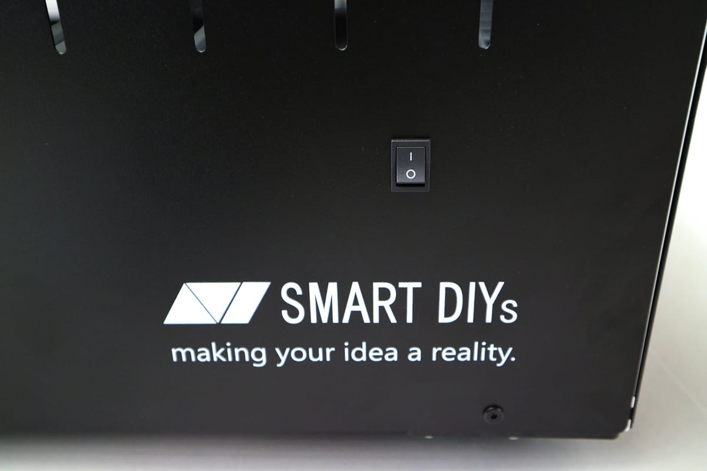

電源が入ると、水冷装置が動作し、タンク内の水が減るので再度タンクの8割程度になるまで水を追加してください。最終的に全部で850ml程度入れます。

**【水漏れの確認を行ってください】**

**水が循環しはじめてから数分置いて各ホース接続部から水が漏れてないか確認します。特にフローセンサーとラジエーターユニットと水冷ポンプを注視してください。 水が漏れていた場合は、 シールテープ等で水漏れ対策を行ってください。**

### 光軸調整 レーザー管

電源を入れるとレーザー照射口から位置確認用のレーザーポインターが点灯します。マスキングテープ等を利用して確認してください。
※筐体内に直接人体の一部を入れて確認することは絶対にやめてください。
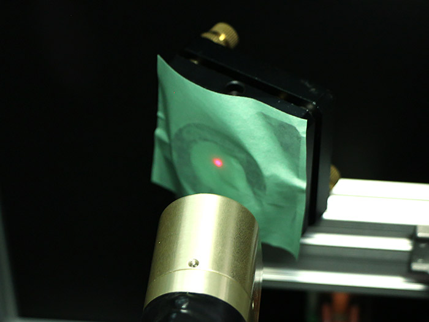

80Wレーザー管の高さの調整を行います。写真内赤丸印のネジを緩めてください。
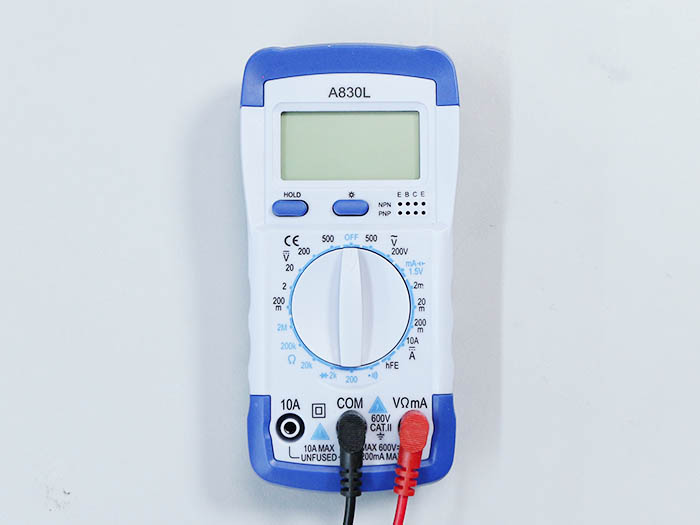

写真内赤四角印のダイヤルを回すことで80Wレーザー管の高さを変えることができます。
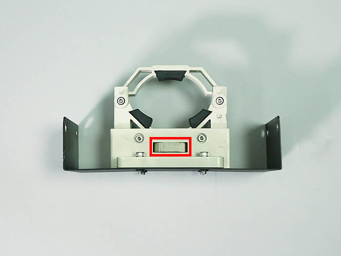

水平器などを用いて、80Wレーザー管を水平にしてください。
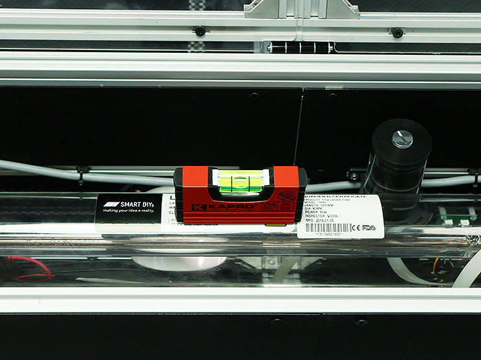

赤丸印のネジを緩めて、レーザー管マウント上部を押しながら赤丸印のネジを締めます。
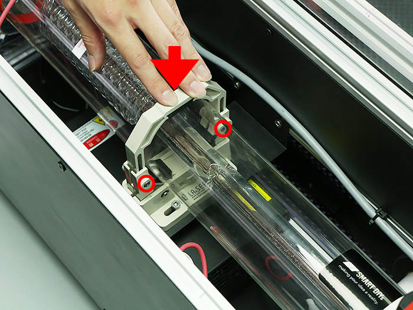

80Wレーザー管が固定されていることを確認してください。
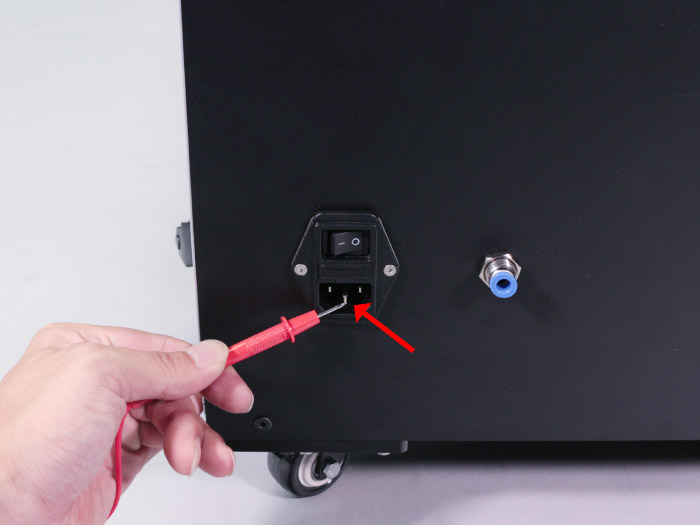

ミラーマウントの中心に位置確認用のレーザーポインターが当たるように調整してください。
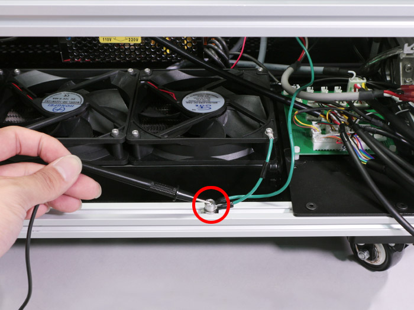

ミラーマウント固定用のネジにネジロックを付けることで調整後のがたつきを防止することが出来ます。

振動等で80Wレーザー管の高さが変わらないよう赤丸印のネジを締めてください。

80Wレーザー電源の赤丸印のボタンがテストボタンです。
※こちら押すとレーザー光が出ますので十分注意しながら作業を行ってしてください。
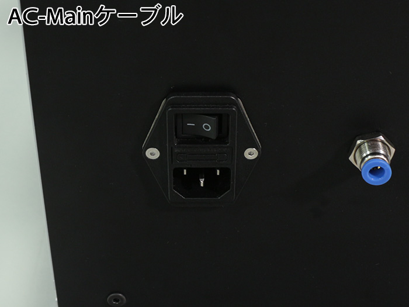

光軸調整用ボタンをお買い求め頂いた方は次の工程から使用します。
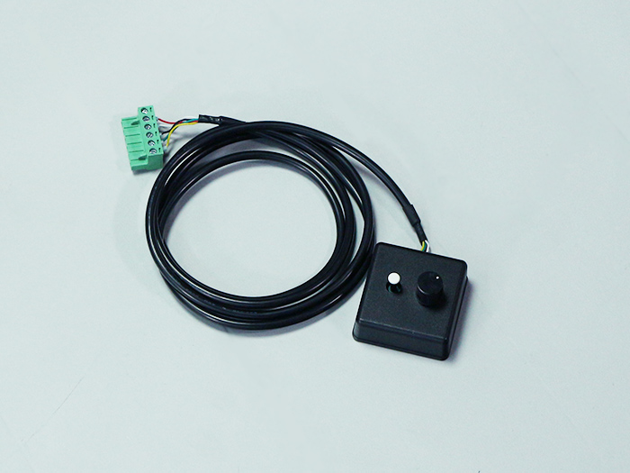

Laserケーブルを外して光軸調整用ボタンを取り付けます。
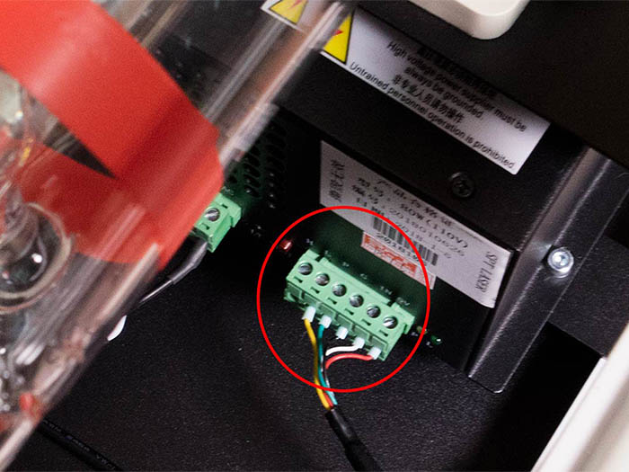

左回り（反時計回り）で出力が強くなります。なるべく弱い出力で調整を行ってください。
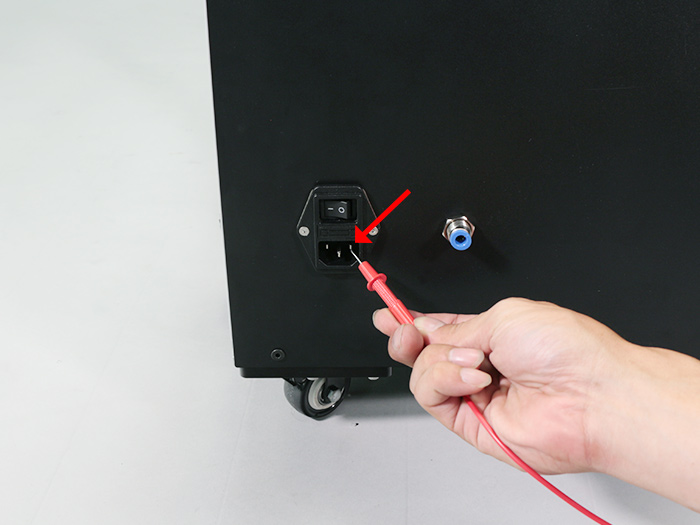

ここからレーザーを照射しますので保護メガネを着用してください。

レーザー照射前に再度ミラーマウントの中心にレーザーポインターが来ていることを確認してください。

レーザーを照射してレーザー光とレーザーポインターの光路が同じことを確認してください。

