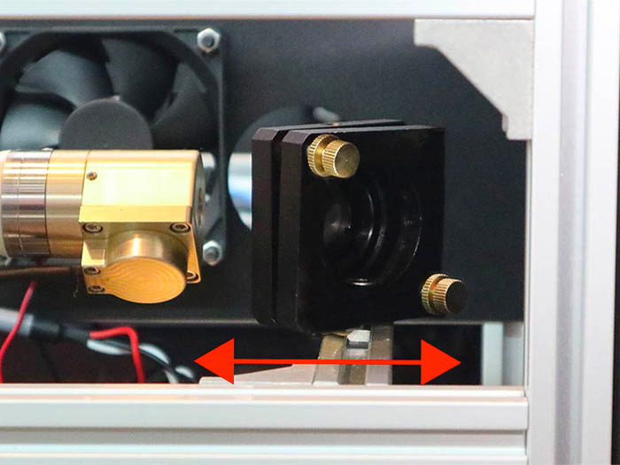

<table class="packing-list">
    <tbody>
        <tr>
            <td>部品名</td>
            <td>備考</td>
            <td class="packing-img">画像</td>
            <td>個数</td>
        </tr>
        <tr>
            <td>反射ミラー</td>
            <td>Φ25mm</td>
            <td></td>
            <td>1</td>
        </tr>
    </tbody>
</table>

## 工程手順

### ミラー取り付け

ミラーマウント前面部分を取り外します。

ミラー固定ネジを取り外します。
※手で取れない場合は、マイナスドライバーなどを使って回しながら取り外してください。

反射ミラーを写真を参考に入れます。
※写真上反射ミラーは裏側が見えております。

ミラー固定用リングを取り付けます。反射ミラーがガタつかないように取り付けてください。

反射ミラーが写真のように取り付いていることを確認してください。取付時に指等で触れて汚れた場合には、汚れをふき取ってください。

### ミラーマウント調整ネジ 使い方

ミラーマウントには2箇所合計4個の調整ネジがあります。ミラーの傾きの微調整を行います。 青で囲んだネジは2枚のプレートの間を縮める方向に、赤で囲んだネジは広げる方向に作用します。使い方としては「青を緩めて赤で押し出す」方法と、「赤を緩めて青で縮める」方法があります。レーザー光の傾きによって使い分けます。
※調整ネジを使った具体的な調整例は、本工程の後段で説明します。

### 第1ミラー調整

第1ミラーにマスキングを貼った後、周囲および自身の安全を確認した上で、レーザーを瞬間的に照射します。写真では右側にずれているのでミラーマウント自体を写真右側に中心からずれている分移動します(ミラーマウントとアルミフレームとを固定しているネジを少し緩めて移動します)。

inner coverのレーザー光路穴にマスキングテープを貼り、レーザーを照射してください。

中心から横方向にずれている場合はミラーマウントの傾きを調整してください。少しの傾きで大きく移動します。いきなり大きく調整してしまうと危険ですので少しずつ調整してください。

### 第2ミラーへ照射

第2ミラーマウントが第1ミラーマウントと最も近い位置に来るように手動でXY軸を動かします。
※手動で軸を移動させる際には、絶対のレーザーを照射させないでください。
第2ミラーの位置が遠い場合、中心から大きく外れてしまうことが考えられますのでまずは近い距離から試してください。
※この時点で大きくずれている場合は、傾き調整を行ってから下に進んでください。

次にY軸方向の加工エリア中央でもう一度照射します。
※この時点で大きくずれている場合は、傾き調整を行ってから下に進んでください。

最後にY軸方向の加工エリアギリギリの端で照射します。
上の写真の例だと左方向に第1ミラーが傾いているのが分かります。

ミラーマウントの調整ネジを使用して少しずつ傾きを修正していきます。

### 調整方法例

中心に光軸を合わせた状態を基準とします。

青丸のネジを緩めて赤丸のネジを押し出します。

横軸方向右側に傾きます。引っ張った場合は左方向に傾きます。

縦軸方向に傾ける場合は、もう1つのネジを動かします。
赤で囲んだネジを押し出すと上側に傾きます。

赤で囲んだネジを引っ張った場合は下方向に傾きます。

### 第2ミラーへ照射・続き

Y軸方向の複数の位置でレーザーを照射しても横方向のズレが少なくなるように調整していきます。(縦軸のずれも同じくミラーマウントの調整ネジを使用して調整してください。)写真の場合は原点Aから遠くなるにつれて左に光軸が動いているのでCの光軸をA方向に調整します。

その場合は第1ミラーをアルミフレームごと横方向に少しずつ動かし調整します。アルミフレームは平行に動かしてください。
※第1ミラー用アルミフレームが傾いたりしますと大幅に光軸がずれますので注意してください。

再度、レーザー光がミラーの中心に来ているかY軸の手前と奥でレーザー照射を行って確認します。

