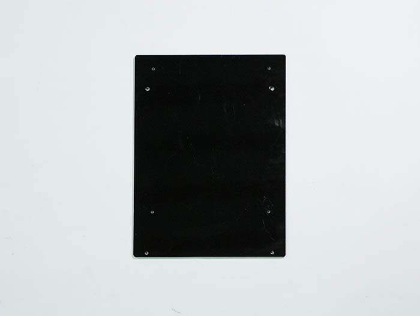
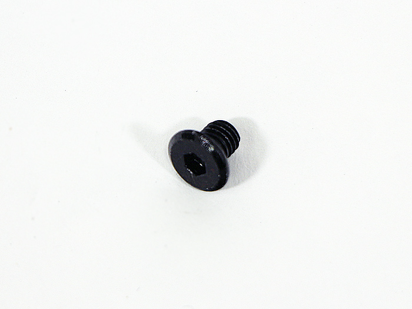
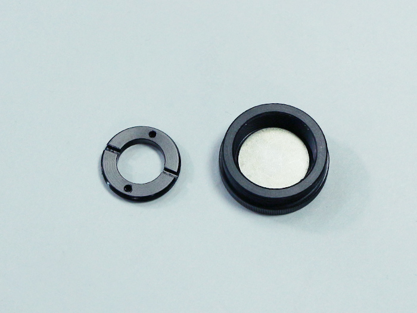
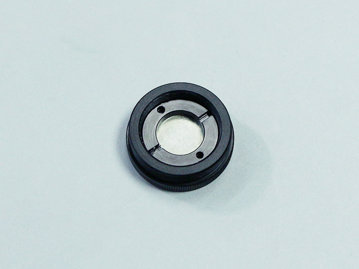
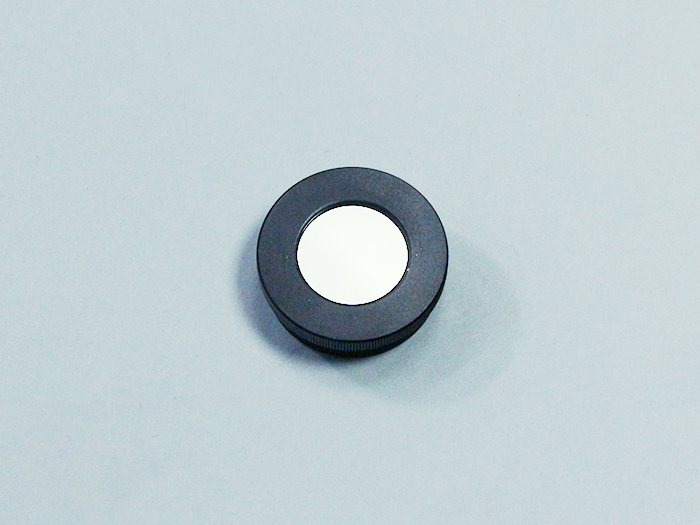

<table class="packing-list">
    <tbody>
        <tr>
            <td>部品名</td>
            <td>備考</td>
            <td class="packing-img">画像</td>
            <td>個数</td>
        </tr>
        <tr>
            <td>Back L</td>
            <td></td>
            <td></td>
            <td>1</td>
        </tr>
        <tr>
            <td>Back R</td>
            <td></td>
            <td></td>
            <td>1</td>
        </tr>
        <tr>
            <td>PCBケース</td>
            <td></td>
            <td></td>
            <td>1</td>
        </tr>
        <tr>
            <td>PCBケース取付プレート</td>
            <td></td>
            <td></td>
            <td>1</td>
        </tr>
        <tr>
            <td>M5x8低頭ボルト</td>
            <td></td>
            <td></td>
            <td>12</td>
        </tr>
        <tr>
            <td>M5後入ナット</td>
            <td></td>
            <td></td>
            <td>12</td>
        </tr>
        <tr>
            <td>M3x5低頭ボルト</td>
            <td></td>
            <td></td>
            <td>4</td>
        </tr>
        <tr>
            <td>M4x4六角穴付ボルト</td>
            <td></td>
            <td></td>
            <td>4</td>
        </tr>
        <tr>
            <td>M2.5x6 六角穴付ボルト</td>
            <td></td>
            <td></td>
            <td>2</td>
        </tr>
    </tbody>
</table>

## 工程手順

### PCBケース 取り付け

Back LにPCBケース取付プレートを、Back Lの裏側からM3x5低頭ボルト4個で取り付けます。

PCBケースをPCBケース取付プレートにM4x4六角穴付ボルト4個で取り付けます。

### Back Cover 取り付け

Back Lを本体フレームにM5後入れナット6個とM5x8低頭ボルト6個で取り付けます。
取り付け時にRELAY DC POWERケーブルとRELAY MOTORケーブルとRELAY SIGNALケーブルをBack Lの切りかけから本体の外に出します。

### RELAY 配線

RELAY DC POWERケーブルをPCBケースに矢印のナットを回して取り付けます。

RELAY SIGNALケーブルをPCBケースにM2.5x6六角穴付ボルト2個で取り付けます。

RELAY MOTORケーブルをPCBケースにコネクタに取り付いているネジで取り付けます。

Back Rを本体フレームにM5後入れナット6個とM5x8低頭ボルト6個で取り付けます。

