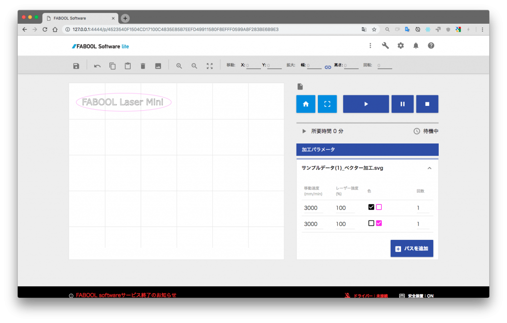
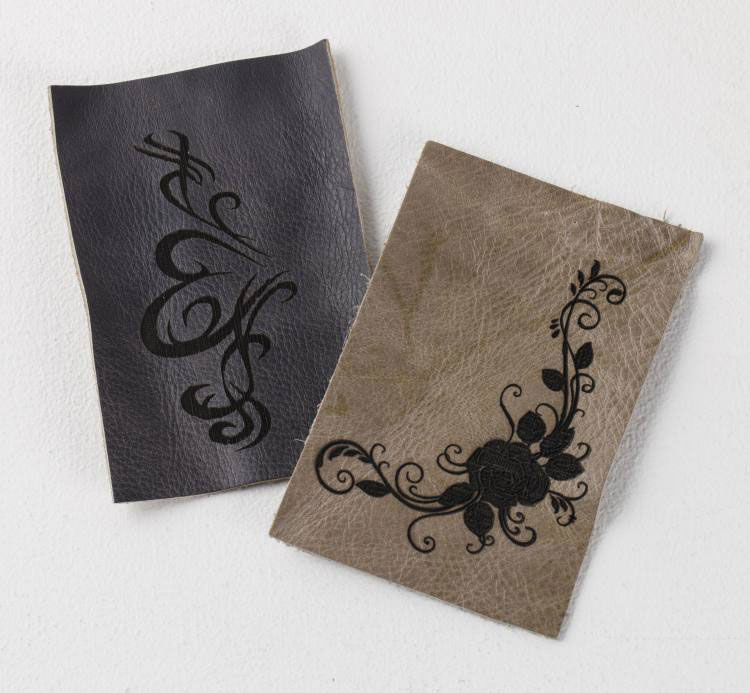

## 概要

FABOOL Software lite は Smart Laserシリーズ 及び FABOOL Laserシリーズ 対応の加工用ソフトウェアです。 
画像データを取り込んでレイアウトを編集し、レーザパラメータを設定して加工を行うことができます。

<strong>FABOOL Software lite</strong> は <strong>FABOOL Software</strong> のオフライン版ソフトウェアです。 
FABOOL Software（オンライン版ソフトウェア）は2018年9月を以てサービスの提供を終了致しました。 
オンライン版とオフライン版では利用できる機能や仕様に差異はありません。

## 製品仕様

### 対応製品
Smart Laser Mini / Smart Laser CO2 / FABOOL Laser Mini / FABOOL Laser CO2

### 対応ファイル
SVG、DXF、JPEG、BMP、PNG、TIF、GIF

### 対応OS
Windows7 / Windows8 / Windows8.1 / Windows10 / Mac OS X / Linux / Raspberry Pi

### 対応ブラウザ
Chrome / FireFox

## ご注意
- 本マニュアルのスクリーンショット等は実際のソフトウェアの表示と異なる場合がございます。
- 内容に関しては予告無しに更新されることがあります。
- 本製品の運用を理由とする損失、逸失利益などの請求につきましては、いかなる責任も負いかねますのであらかじめご了承ください。
- Microsoft Windowsは、米国 Microsoft Corporation の米国およびその他の国における登録商標または商標です。
- Apple、App Store、Apple ロゴ、Mac、Mac OS、OS X、macOS、iPad、iPhoto、iPod touch、および iTunes は、Apple Inc. の商標です。
- Adobe、Adobe Illustrator および Photoshop は、 Adobe Systems Incorporatedの米国およびその他の国における登録商標または商標です。

## 本ソフトの主な機能
1. 別途外部描画ソフトなどで作成した加工データを読み込んだ上で、加工パラメーター（レーザー出力とヘッド移動速度）を設定し加工を行うことができます。
2. 取り込んだ加工データはソフトウェア上で 位置・回転・大きさ を調整することができます。
3. 加工データやパラメータを一括で「プロジェクト」として保存し、管理することができます。

また、FABOOLSoftware liteは下記の加工方法に対応しています。

- ベクタ加工: レーザヘッドがパスに沿って移動し、線や曲線を描きながら加工していきます。（切断または刻印）
- ラスタ加工: レーザヘッドが水平走査をしながら対象範囲をくまなく移動して加工していきます。（刻印）

### ベクタ加工の一例

### ラスタ加工の一例

