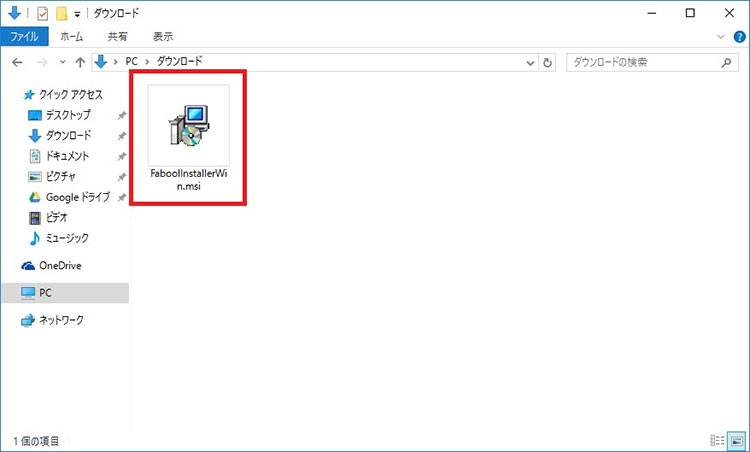
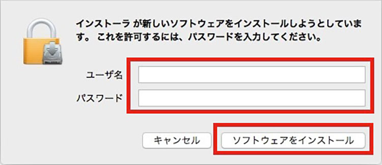

# ドライバーインストール

## FABOOL Softwareドライバーのインストール

この章では、FABOOL Software lite を利用して加工機本体を動作させるために必要なドライバーのインストール方法について説明します。

- Windowsの場合 > https://www.smartdiys.com/data/v280/FaboolInstallerWin.msi
- macOSの場合 > https://www.smartdiys.com/data/v280/FaboolInstallerMac_v280.pkg
- linux/RaspberryPiの場合 > https://www.smartdiys.com/data/v280/FaboolLinux_v280.zip

## Windowsの場合

Smart Laserシリーズをお使いの方へ

 
Smart Laser Mini/Co2をお使いの場合、下記のドライバ以外に「コントロールボード接続用のドライバ」が必要となります。
インストールされていない場合は以下のURLからドライバをダウンロードしてください。
<a href="https://www.smartdiys.com/manual/wp-content/uploads/2015/02/windows_driver.zip">https://www.smartdiys.com/manual/wp-content/uploads/2015/02/windows_driver.zip</a>

ダウンロードしたファイルは解凍し、64bitOSの場合には「dpinst-amd64.exe」、32bitOSの場合には「dpinst-x86.exe」を実行しWindows PCへインストールしてください。 
インストールが完了しましたら、下記の手順を進めてください。

1. はじめに、FABOOLSoftwareドライバのインストーラをダウンロードします。

Smart Laser シリーズをお使いの方

<a href="https://www.smartdiys.com/data/v290/SmartInstallerWin.msi">Windows用ドライバ (ver.2.9.0)</a>
 
(対応機種: Smart Laser Mini / Smart Laser CO2)

FABOOL Laserシリーズをお使いの方

<a href="https://www.smartdiys.com/data/v280/FaboolInstallerWin.msi">Windows用ドライバ (ver.2.8.0)</a>
 
(対応機種: FABOOL Laser Mini / FABOOL Laser CO2 / FABOOL Laser DS)

2. ダウンロードしたインストールファイルを実行します。

3. セキュリティ警告が表示される場合は、「実行」ボタンをクリックします。 
<strong>※Windows10の場合は、以下の画像のように「実行」ボタンが表示されない場合があります。その場合は、アラートメッセージ内の「詳細情報」をクリックして「実行」ボタンを表示させてください。</strong>

4. インストール画面が表示されるので「次へ」ボタンをクリックします。

5. 「次へ」ボタンをクリックします。

6. １つ目のデバイスドライバー</strong>のインストール画面が表示されるので「次へ」ボタンをクリックします。

7. １つ目のデバイスドライバー</strong>のインストール完了画面が表示されるので、「完了」ボタンをクリックします。

8. 続いて、<strong>２つ目のデバイスドライバー</strong>のインストール画面が表示されるので「次へ」ボタンをクリックします。 
<strong>※デバイスドライバーは２つあり連続してインストールされますので、誤ってキャンセルをしないようにご注意ください。</strong>

9. ２つ目のデバイスドライバー</strong>のインストール完了画面が表示されるので、「完了」ボタンをクリックします。

10. インストール完了画面が表示されるので、「閉じる」ボタンをクリックします。以上で、インストールは完了です。

11. 加工途中にPCがスリープモードになると加工が途中で止まってしまう可能性がありますので、以下を参考にスリープ設定を解除してください。
- <a href="http://www.tipsfound.com/windows10/03005" target="">スリープ設定の解除方法（Win10)</a>
- <a href="http://www.frontier-direct.jp/faq/09/004235.htm" target="">スリープ設定の解除方法（Win7)</a>

12. Google ChromeもしくはFireFoxから、<a href="http://127.0.0.1:4444/">http://127.0.0.1:4444/</a>にアクセスします。

トラブルシューティング

 

<strong>● 各種ドライバーのインストールが完了したにも関わらず、FABOOL Software liteのメイン画面右下の状態表示エリアで「ドライバーなし」と表示されてしまう場合</strong> 
通常はPCにプリインストールされている「Microsoft Visual C++ 2010 再頒布可能パッケージ (x86)」がインストールされていない可能性がございます。以下からインストールの上、再度お試しください。 
<a href="https://www.microsoft.com/ja-jp/download/details.aspx?id=5555" target="">Microsoft Visual C++ 2010 再頒布可能パッケージ (x86)</a>
 
 

<strong>● ブラウザでプロキシサーバーを使用している場合</strong>

※ブラウザでプロキシサーバーを使用している場合は、「ローカル アドレスにはプロキシ サーバーを使用しない」を設定してください。詳細は以下をご確認ください。 
<a href="https://blogs.technet.microsoft.com/jpieblog/2014/10/08/lan/" target="">LAN のプロキシ サーバーの設定について</a>

## macOSの場合

1. はじめに、FABOOLSoftwareドライバのインストーラをダウンロードします。

Smart Laser シリーズをお使いの方

<a href="https://www.smartdiys.com/data/v290/SmartInstallerMac_v290.pkg">macOS用ドライバ (ver.2.9.0)</a>
 
(対応機種: Smart Laser Mini / Smart Laser CO2)

FABOOL Laserシリーズをお使いの方

<a href="https://www.smartdiys.com/data/v280/FaboolInstallerMac_v280.pkg">macOS用ドライバ (ver.2.8.0)</a>
 
(対応機種: FABOOL Laser Mini / FABOOL Laser CO2 / FABOOL Laser DS)

2. ダウンロードしたインストールファイルを実行します。

3. 以下の警告画面が表示される場合は、「OK」ボタンをクリックします。

4. インストールファイルを、Controlキーを押しながらクリックし、「開く」を選択します。

5. 「開く」ボタンをクリックします。

6. インストール画面が表示されるので「続ける」ボタンをクリックします。

7. 「インストール」ボタンをクリックします。

8. 以下の画面が表示される場合は、管理者権限のあるユーザー名、パスワードを入力し、「ソフトウェアをインストール」ボタンをクリックします。

9. インストール完了画面が表示されるので、「閉じる」ボタンをクリックします。以上でインストールは完了です。

10. 加工途中にPCがスリープモードになると加工が途中で止まってしまう可能性がありますので、以下を参考にスリープ設定を解除してください。 
- <a href="http://minto.tech/mac-sleep/" target="">スリープ設定の解除方法（Mac)</a>

11. Google ChromeもしくはFireFoxから、<a href="http://127.0.0.1:4444/">http://127.0.0.1:4444/</a>にアクセスします。

トラブルシューティング

 

<strong>● ブラウザでプロキシサーバーを使用している場合</strong>

※ブラウザでプロキシサーバーを使用している場合は、「特定の IP アドレスでプロキシ設定を使わないようにする」で「127.0.0.1」を設定してください。詳細は以下をご確認ください。 
<a href="https://support.apple.com/ja-jp/HT202232" target="">特定の IP アドレスでプロキシ設定を使わないようにする</a>

## Linux/Raspberry Piの場合

1. はじめに、FABOOLSoftwareドライバのインストーラをダウンロードします。

Smart Laser シリーズをお使いの方

申し訳ございません。SmartLaserには対応しておりません。

FABOOL Laserシリーズをお使いの方

<a href="https://www.smartdiys.com/data/v280/FaboolLinux_v280.zip">macOS用ドライバ (ver.2.8.0)</a>
 
(対応機種: FABOOL Laser Mini / FABOOL Laser CO2 / FABOOL Laser DS)

2. ダウンロードしたZIPファイルを解凍します。
3. 「chmod +x run.sh」コマンドを実行し、解凍したディレクトリの「run.sh」ファイルに実行パーミッションを設定します。
4. `run.sh`を実行します。
5. Google ChromeもしくはFireFoxから、<a href="http://127.0.0.1:4444/">http://127.0.0.1:4444/</a>にアクセスします。

Tips

 

Linux・Raspberry Piの場合、ソフトウェアを手動で起動する必要ございます。 
あらかじめ「run.sh」を実行してから「<a href="http://127.0.0.1:4444/</a>」にアクセスしてください。</strong>

